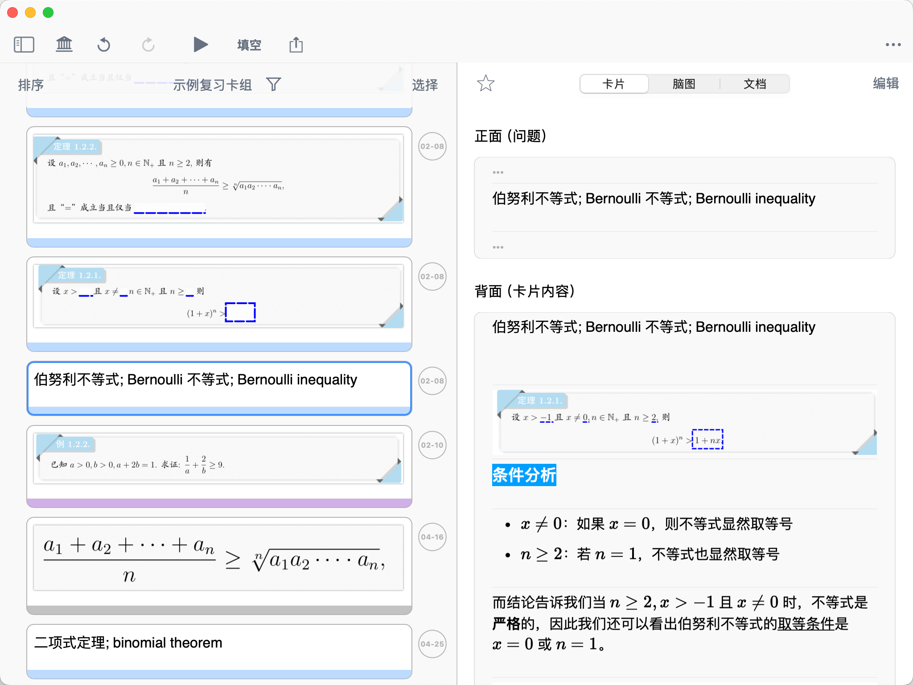
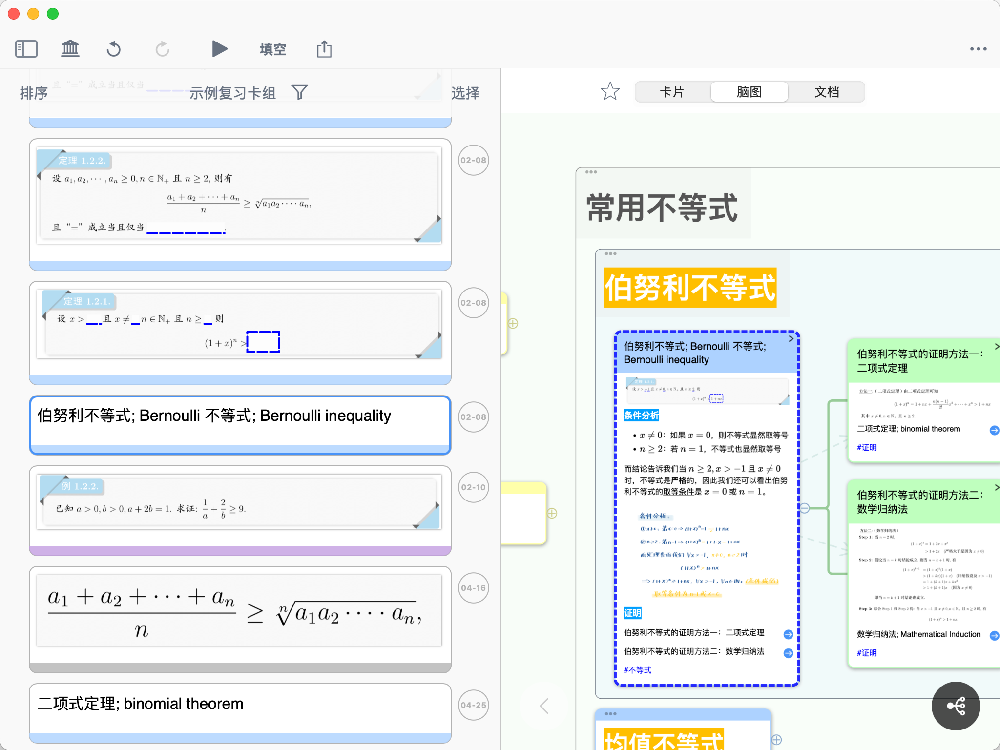
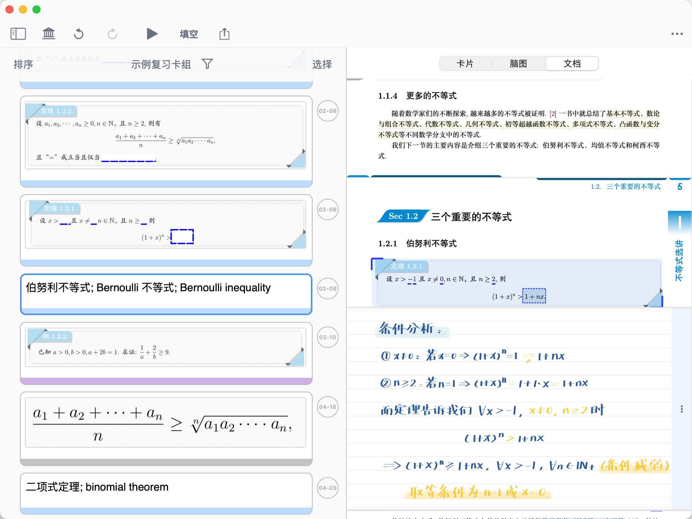

# 闪卡复习②：溯源上下文

> 💡📖 **闪卡系列导航**
> 本系列帮助你掌握 MN4 的闪卡制作和科学复习。
>
> - 制作闪卡：
>   - 新手必读：
>     ① 认识闪卡和复习卡片组
>     ② 添加卡片到复习卡组
>   - 进阶：
>     ③ 设置闪卡正反面
> - 科学复习：
>   - 新手必读：
>     ① 基于FSRS抗遗忘算法的科学复习
>   - 进阶：
>     ② 溯源上下文（本页）

> 💡**本页内容**
>
> 这是一个进阶复习功能。本页将教你：
>
> - 为什么需要查看卡片的上下文
> - 如何在复习时查看卡片在脑图和文档中的位置
> - 何时使用上下文复习功能

# **什么是上下文复习？**

卡片是单独的知识碎片，长时间遗忘后再复习时，你可能对卡片中的概念或表述感到陌生。这时，你需要回到制卡时的上下文场景中辅助回忆和理解。

**上下文包括：**

- **文档上下文：** 卡片在教材中的前后文内容
- **脑图上下文：** 卡片在知识体系中的位置和关联

MN4 支持在复习时同步查看这两种上下文，帮助你理解卡片的"来龙去脉"。

> 💡**何时需要查看上下文？**
>
> 并非每次复习都需要查看上下文。以下场景特别适合：
>
> - ✅**遗忘时间较长**：超过一个月没复习，记忆模糊
> - ✅**概念难以理解**：仅凭卡片本身无法理解含义
> - ✅**需要关联记忆**：需要回忆相关知识点之间的联系
> - ✅**复习错题**：需要回到原题查看解题思路
>
> ⚠️**注意：** 如果你能直接根据卡片内容回忆起答案，无需查看上下文，这样可以提高复习效率。

# 2 两种复习方式对比

在 MN4 中，有两种复习方式，分别适合不同的使用场景：

| 复习方式                   | 是否显示上下文     | 适用场景      | 入口              |
| ---------------------- | ----------- | --------- | --------------- |
| **方式一：复习卡片组**​         | 默认不显示，可切换查看 | 日常快速复习    | MN4主页边栏 → 复习卡片组 |
| **方式二：学习集（脑图+文档）中复习**​ | 始终显示脑图和文档   | 深度复习、理解记忆 | 学习集界面右上角 → 复习按钮 |

💡**如何选择？**

- **日常复习：** 使用方式一（复习卡片组），专注于卡片本身，提高复习效率
- **深度复习：** 使用方式二（学习集），需要理解上下文时更方便
- **混合使用：** 平时用方式一快速复习，遇到难点时切换到方式二查看上下文

# 3 在复习卡片组中查看上下文

这是最常用的复习方式。复习时默认不显示上下文，但你可以随时切换查看。

## 3.1 复习卡片组的三栏布局

在复习卡片组中（非全屏复习模式），界面分为左右两部分：

**左侧：闪卡列表**

- 显示所有卡片的正面（问题）

**右侧：三栏详情**

- **卡片栏：** 显示闪卡的正面和背面
- **脑图栏：** 定位到闪卡在脑图中的位置
- **文档栏：** 定位到闪卡在文档中的位置

> 💡**三栏布局的优势**
>
> 这种设计让你可以：
>
> - 浏览卡片时，**同时看到**脑图和文档位置
> - 快速切换卡片，脑图和文档会**自动定位**到对应位置
> - 在复习时直接编辑卡片、脑图、文档，无需切换界面

> 详见：[闪卡制作①：认识闪卡和复习卡片组](https://www.wolai.com/auMvW4AbuCoxDmYipisYoS "闪卡制作①：认识闪卡和复习卡片组")第3.1节

## 3.2 在全屏复习模式中查看上下文

如果你正在使用全屏复习模式（点击 ▶ 进入的 Anki 式复习），可以在翻转卡片后查看上下文：

**操作步骤：**

1. 在全屏复习模式中，翻转卡片
2. 在卡片顶部切换到脑图和文档
3. 查看完毕后，右滑继续复习下一张卡片

# 4 在学习集的上下文场景中复习（推荐用于深度复习）

这种方式从一开始就显示脑图和文档，适合需要频繁查看上下文的深度复习。

## 4.1 进入学习集复习模式

**操作步骤：**

1. 打开一个学习集
2. 点击学习集视图右上角`复习` 按钮
3. 点击复习视图左上角\*\*▶\*\*，进入复习模式

✅ 进入后，你会看到卡片、脑图、文档同时显示

## 4.2 利用学习集的上下文辅助复习

在学习集复习模式中，你可以：

**查看脑图上下文：**

- 点击复习卡片左下角**定位图标**，可在脑图中高亮显示卡片位置
- 查看卡片在脑图中的上级节点、下级节点、同级节点
- 理解卡片在知识体系中的位置

**查看文档上下文：**

- 点击复习卡片左下角**定位图标**，可定位到对应的文档摘录位置
- 查看卡片在教材中的前后文
- 阅读完整的段落或章节内容

**三位一体联动：**

- 卡片、脑图、文档三者互相联动
- 在任意一栏中点击内容，其他两栏会自动定位
- 实现"卡片-脑图-文档"的无缝对照
  > 💡如需开启或关闭联动，详见：[联动控制](https://www.wolai.com/e2NfttLMBb7xjDTRVMA3jh "联动控制")

> 💡**注意：** 在学习集复习模式中，脑图为只读状态，不可保存编辑。如需编辑，需退出复习模式。

# 5 上下文复习的使用技巧

## 5.1 先尝试回忆，再查看上下文

推荐的复习流程：

1. **第一步：** 看到卡片正面，尝试回忆答案
2. **第二步：** 翻转卡片，查看答案
3. **第三步：** 如果记忆模糊，**再查看上下文**
4. **第四步：** 在脑图或文档中理解完整内容
5. **第五步：** 根据记忆情况选择复习间隔

> ⚠️**避免过度依赖上下文**
>
> 不要一开始就查看上下文，这会降低主动回忆的效果。只有在确实记不起来时，才查看上下文辅助理解。

## 5.2 利用上下文优化卡片

复习时，如果发现某张卡片总是记不住，可以：

1. 查看卡片的脑图和文档上下文
2. 分析为什么难记（是否缺少关键信息？）
3. 直接在三栏布局中编辑卡片，补充必要的上下文信息
4. 或者调整卡片的问题设置（详见：[闪卡制作③：设置闪卡正反面](https://www.wolai.com/pBH9BFrgyZgeWJVf3xLyVA "闪卡制作③：设置闪卡正反面")）

> 💡**优化建议：** 将难记的卡片优化为更容易理解的形式，而不是每次都依赖上下文。

# 6 常见问题

**Q1：两种复习方式哪个更好？**

A：没有绝对的好坏，取决于你的复习目标。日常快速复习用方式一，深度理解复习用方式二。建议根据卡片难度灵活选择。

**Q2：在全屏复习模式中可以查看上下文吗？**

A：可以。翻转卡片后，在卡片顶部切换到脑图、文档栏，查看上下文。

**Q3：查看上下文会影响 FSRS 算法的间隔计算吗？**

A：不会。FSRS 只根据你选择的记忆程度（重复/难/良好/易）来计算间隔，与是否查看上下文无关。

**Q4：为什么在学习集复习模式中，脑图是只读的？**

A：为了防止误操作。复习模式专注于记忆，不建议同时编辑脑图。如需编辑，请退出复习模式。

**Q5：可以只显示文档，不显示脑图吗？**（或者反过来）

A：可以。你可以单独开启脑图或文档视图，或者调整脑图-文档视图的比例，详见：[脑图与文档联动视图](https://www.wolai.com/7PQUHR2ZsY58z128y6KtoW "脑图与文档联动视图")。

**Q6：我的卡片没有对应的文档怎么办？**

A：如果卡片是手动创建的，没有从文档中摘录，文档栏不会自动定位。这种情况下，只能查看脑图上下文。
