# 闪卡制作③：设置闪卡正反面

> 💡📖 **闪卡系列导航**
> 本系列帮助你掌握 MN4 的闪卡制作和科学复习。
>
> - 制作闪卡：
>   - 新手必读：
>     ① 认识闪卡和复习卡片组
>     ② 添加卡片到复习卡组
>   - 进阶：
>     ③ 设置闪卡正反面（本页）
> - 科学复习：
>   - 新手必读：
>     ① 基于FSRS抗遗忘算法的科学复习
>   - 进阶：
>     ② 溯源上下文

> ⚠️**前置条件**
>
> - 你需要先阅读闪卡制作第①②篇，确保你已经有卡片添加到复习卡组。在第②篇，你学会了如何添加卡片。本页将教你如何精细设置闪卡的正反面，让复习更高效
> - 开始前建议先了解`卡片编辑器`的相关功能（详见：[脑图卡片①：新建和编辑卡片](https://www.wolai.com/67hDfmy3SZi4oXmMb2bvcH "脑图卡片①：新建和编辑卡片")）。

***

> 💡闪卡由正面（问题）和背面（答案）组成。背面包含整张笔记卡片的内容（标题+正文），正面可以自定义。为闪卡设置恰当的正反面，有助于提高复习效率和记忆效果。

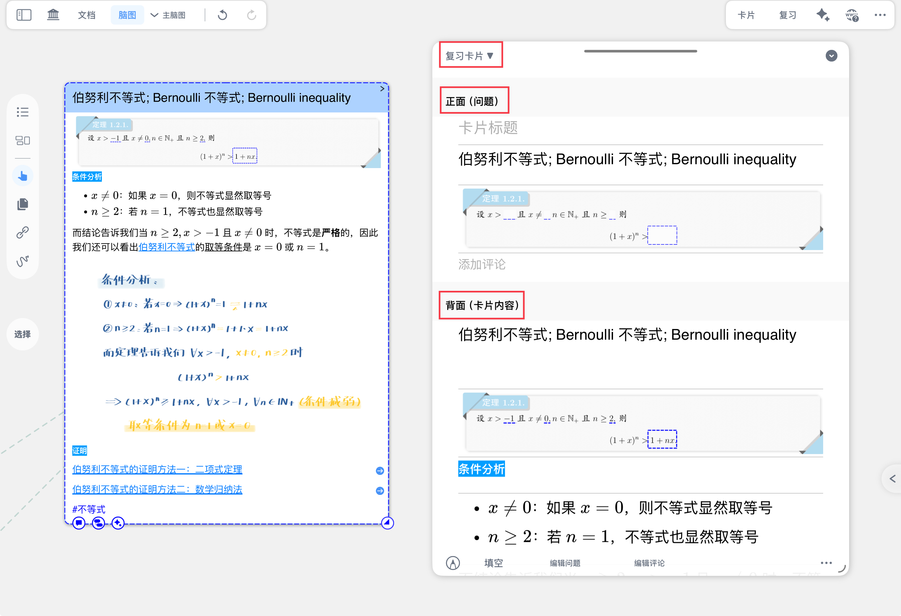

> 💡**为什么要设置闪卡正反面？**
>
> 默认情况下，MN4 使用卡片标题作为闪卡正面（问题），整张卡片作为背面（答案）。但在以下场景中，你可能需要自定义设置：
>
> - ✅ **卡片标题不够具体**：如标题是"定理1.2"，不能作为有效的问题
> - ✅ **需要制作填空题**：将重点内容挖空，制作挖空题型
> - ✅ **需要从长卡片中提取关键问题**：卡片内容很多，只想用其中一部分作为问题
> - ✅ **需要调整问题的难度**：根据记忆情况，调整问题的提示程度
>
> 如果你的卡片标题已经是清晰的问题形式（如"伯努利不等式是什么？"），且不需要挖空，可以跳过本页，直接开始复习。

# 1 两种设置方式对比

在 MN4 中，有两种方式设置闪卡正反面：

| 设置方式         | 操作入口        | 适用场景       | 优点                 |
| ------------ | ----------- | ---------- | ------------------ |
| **卡片编辑器**​   | 点击单张卡片打开编辑器 | 精细调整单张卡片   | 可以看到完整卡片内容，逐张精细设置  |
| **复习卡片组视图**​ | 进入复习卡片组     | 批量统一设置多张卡片 | 可以批量操作，统一调整多张卡片的设置 |

💡**如何选择？**

- 如果你需要为每张卡片单独设置不同的问题 → 使用**卡片编辑器**
- 如果你需要批量设置多张卡片的统一规则 → 使用**复习卡片组视图**

> ⚠️**重要提示**
>
> 对闪卡背面（卡片内容）的修改，会同步到脑图卡片和文档摘录。但对闪卡正面（问题）的设置，只影响复习显示，不会修改原卡片。

# 2 在卡片编辑器中设置闪卡正反面

这种方式适合逐张精细设置单张卡片。

## 2.1 打开复习卡片编辑模式

1. 点击脑图卡片或文档摘录，打开`卡片编辑器`
2. 点击编辑器左上角，切换到`复习卡片`模式

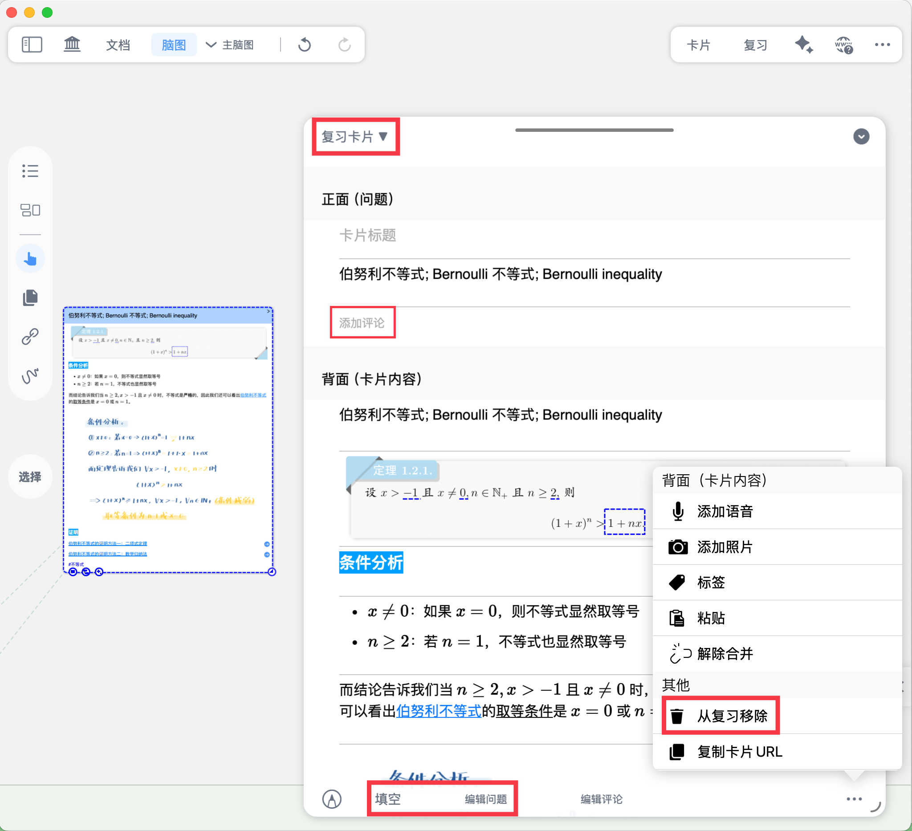

> 💡提示： 关于`卡片编辑器`的基本用法，详见：[脑图卡片①：新建和编辑卡片](https://www.wolai.com/67hDfmy3SZi4oXmMb2bvcH "脑图卡片①：新建和编辑卡片")。

## 2.2 添加评论

闪卡正面和背面均可添加评论，评论支持手写或输入纯文本。

> 💡**使用场景：**
>
> - 在背面添加评论，补充解释、记录记忆技巧
> - 在正面添加评论，增加问题的提示信息

评论内容会显示在闪卡上，帮助理解和记忆

## 2.3 设置填空（挖空）

对闪卡正面进行`填空`（划重点/遮挡），制作填空题。既支持对字符挖空，也支持对局部画面挖空。

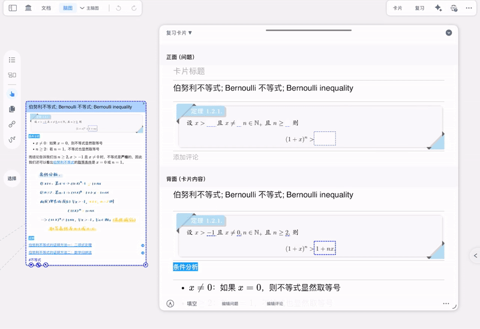

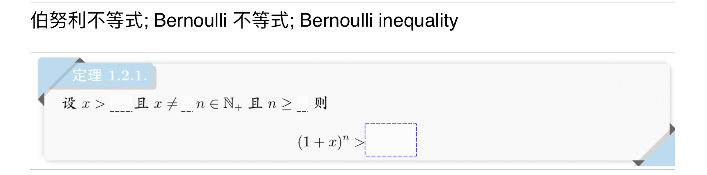

> 💡如何批量设置填空和填空组：[详见本页第3.2节](https://www.wolai.com/pBH9BFrgyZgeWJVf3xLyVA#i1hnyy3t5NFk6jH8waJ6Fy "详见本页第3.2节")

## 2.4 编辑问题

从卡片背面提取内容，作为闪卡正面的问题。

**默认规则：**

- **默认将卡片标题作为闪卡问题**
- 若卡片无标题，默认将第一条摘录/评论作为闪卡问题

**修改单张卡片的默认规则：**

点击`编辑问题`，可以手动编辑该卡片的正面问题。

**修改全局默认设置：**

- 如需将**整个卡片**作为闪卡正面 **：** 进入 MN4 设置 - 复习，开启`默认将整个卡片作为闪卡正面（问题）`
- 如需将**划重点内容**作为闪卡正面：**：** 在复习卡片组中批量设置，详见本页第3.3节

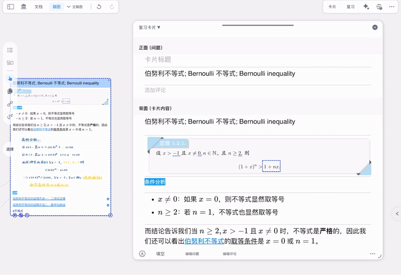

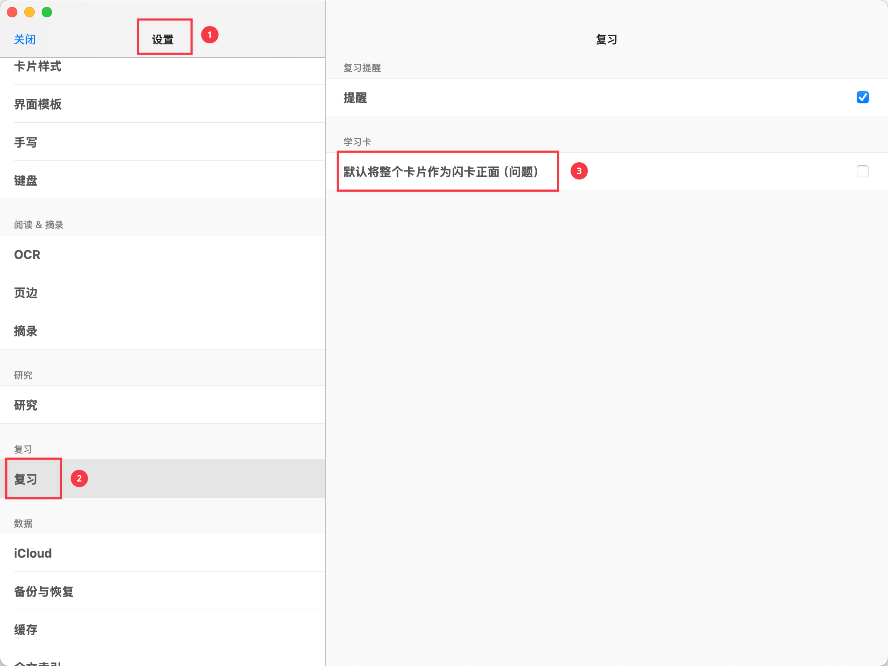

## 2.5 从复习移除

点击`从复习移除`，可以将该卡片从复习卡片组中删除。

> ⚠️**注意：从复习移除**不会删除对应的脑图卡片或文档摘录，只是取消该卡片的复习。

# 3 在复习卡片组中设置闪卡正反面

这种方式适合批量统一设置多张卡片，提高效率。

**进入复习卡片组视图：**

在 MN4 主页点击左侧边栏的`复习卡片组` → 选择目标复习卡片组

## 3.1 编辑器面板

点击右侧`卡片`栏的右上角`编辑`，唤出编辑器面板。

在编辑器面板中，可以进行与[卡片编辑器](https://www.wolai.com/pBH9BFrgyZgeWJVf3xLyVA#vGrAx7YSFWfxZDPapKAPnP "卡片编辑器")类似的操作：

- 点击正面或背面的`...`，可以添加评论
- 其他操作与[第2节](https://www.wolai.com/pBH9BFrgyZgeWJVf3xLyVA#vGrAx7YSFWfxZDPapKAPnP "第2节")基本相同

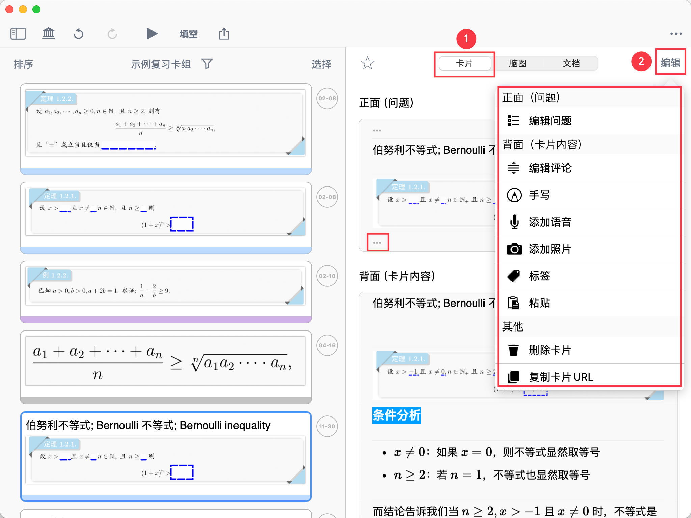

## 3.2 批量填空和编辑填空组

- 点击左侧闪卡列表顶部的`填空`，进入划重点/填空模式，可对闪卡正面（问题）进行快速划重点操作
- **基本操作：**
  - 支持对字符划重点
  - 支持对图片局部划重点
- **高级功能：`编辑填空组`**

  点击已有的矩形划重点（填空），可以为其编组。

> 💡**为什么要编组？**
>
> 在复习填空题时，如果有多处挖空，编组可以控制翻转顺序：
>
> - 每点击一次卡片正面，会同时翻转**同一组别里的所有划重点**
> - 组别的翻转顺序由**组名排序**决定

> **编组示例：**
>
> 某闪卡正面有 10 处划重点，操作如下：
>
> 1. 将其中 5 处划重点编辑为"1"（或"填空组1"）
> 2. 将另外 5 处划重点编辑为"2"（或"填空组2"）
>
> **复习效果**：
>
> - 第一次点击卡片正面 → "1"组的 5 处划重点同时翻转
> - 第二次点击卡片正面 → "2"组的 5 处划重点同时翻转

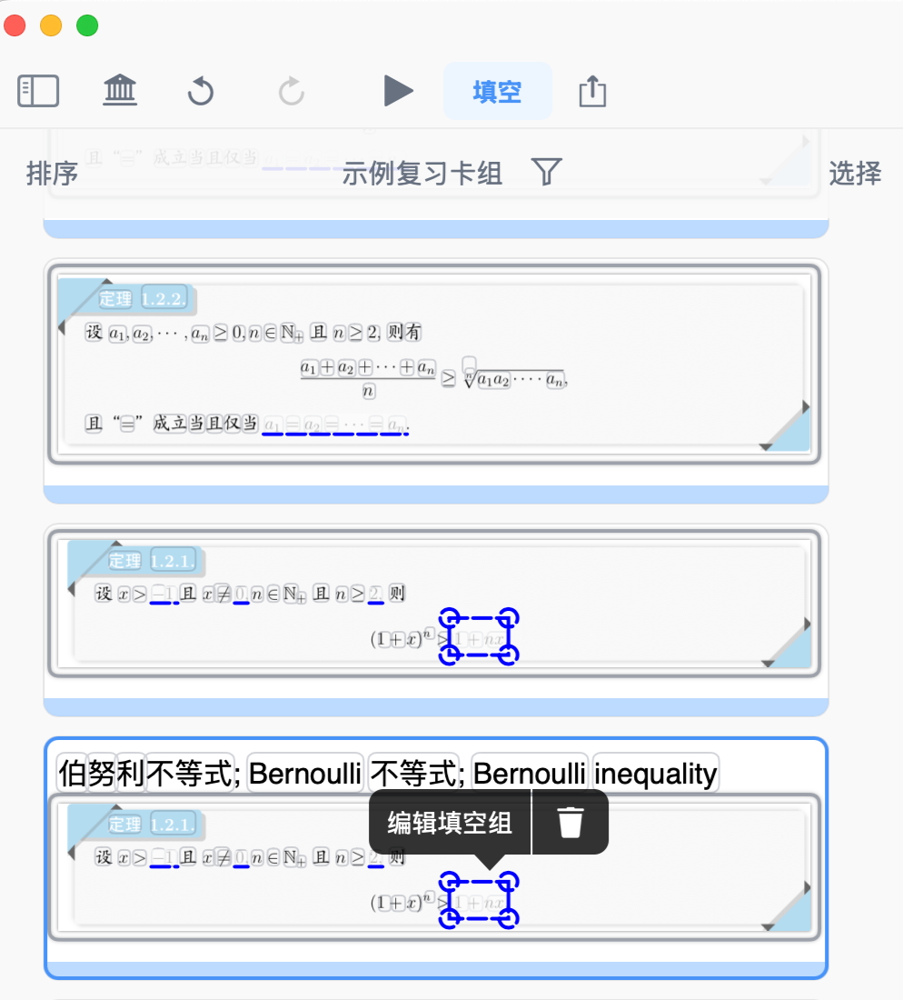

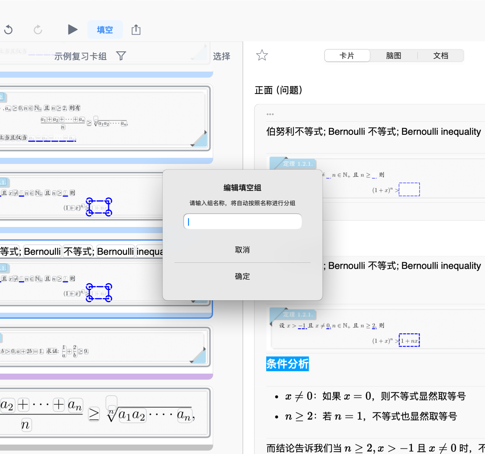

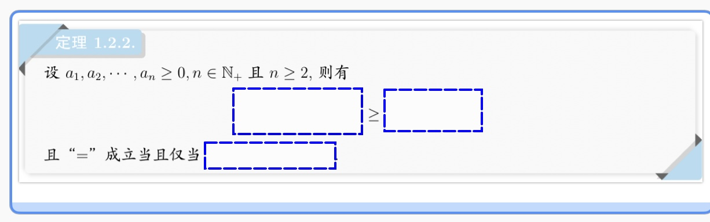

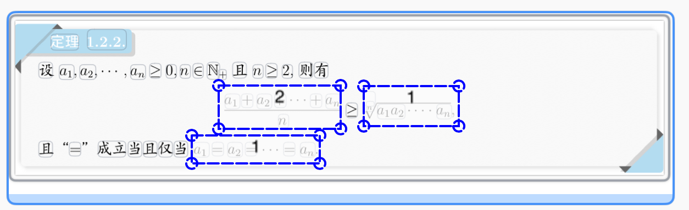

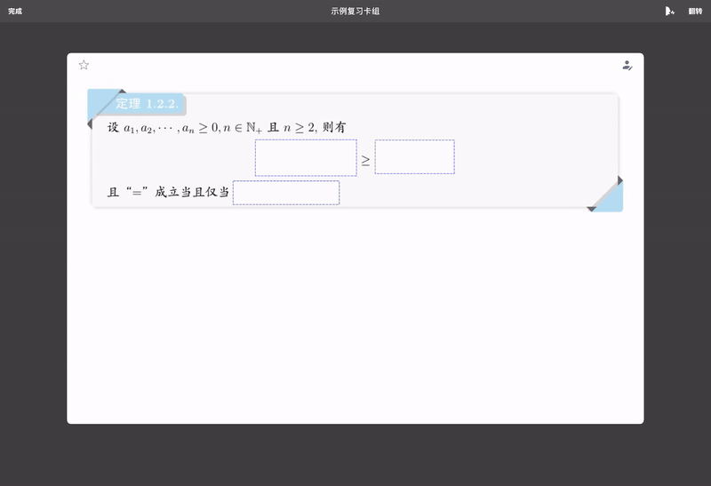

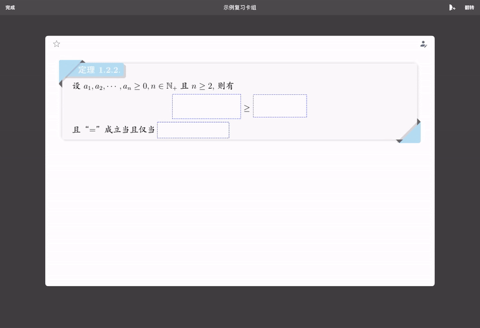

## 3.3 遮挡荧光笔、划重点

点击右上角...，可设置荧光笔、划重点的遮挡规则

- `遮挡文档上的荧光笔`：闪卡正面来自文档的荧光笔笔迹将被挖空
- `遮挡卡片上的荧光笔`：闪卡正面来自脑图卡片的荧光笔笔迹将被挖空
- `遮挡文本中的划重点`：闪卡正面文本摘录中的划重点将被挖空
- `遮挡图片中的划重点`：闪卡正面图片中的划重点将被挖空

> 💡**如何选择遮挡设置？**
>
> 根据你的学习习惯，只开启你会用到的选项：
>
> | 你的操作习惯           | 建议开启        |
> | ---------------- | ----------- |
> | 在文档中用荧光笔标记重点     | ✅ 遮挡文档上的荧光笔 |
> | 在卡片里用荧光笔标记       | ✅ 遮挡卡片上的荧光笔 |
> | 在文本摘录中划重点        | ✅ 遮挡文本中的划重点 |
> | 在图片（矩形/套索）摘录中划重点 | ✅ 遮挡图片中的划重点 |

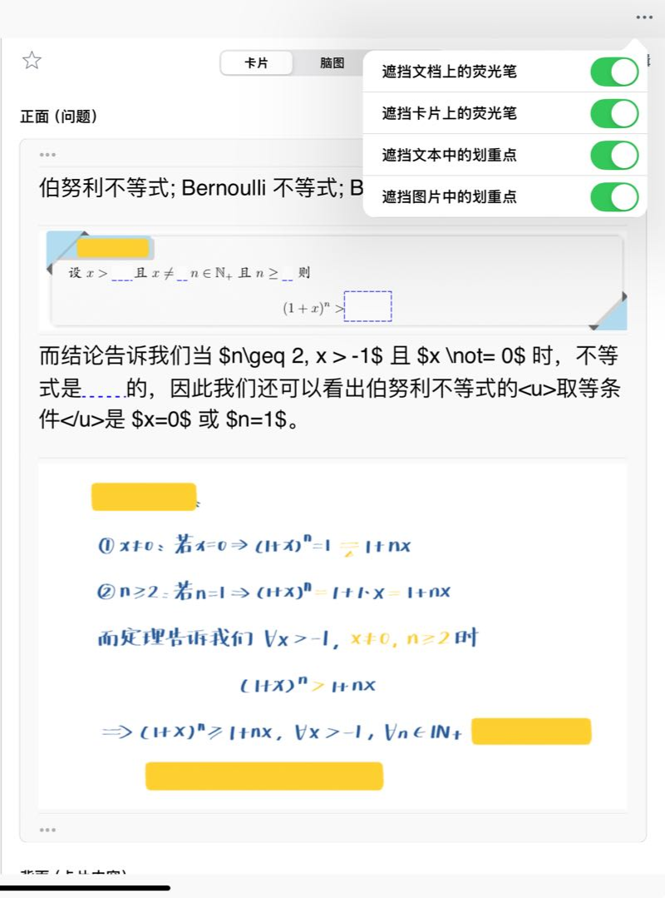

## 3.4 批量提取问题

- 点击左侧闪卡列表顶部的`选择`，**多选**（或全选）目标卡片
- 在底部弹出菜单栏中点击`提取问题`，可快速批量修改卡片正面默认设置

  三种提取方式：
  - `标题作为问题`：将卡片标题作为闪卡正面（正面）
  - `重点作为问题`：将含有划重点/填空的评论作为闪卡正面（正面）
  - `整个卡片作为问题`：讲整个卡片作为闪卡正面（正面）
  > 💡如何选择提取问题的方式？
  >
  > | 提取方式          | 适用场景         | 示例                 |
  > | ------------- | ------------ | ------------------ |
  > | **标题作为问题**​   | 卡片标题已经是问题形式  | 标题："什么是伯努利不等式？"    |
  > | **重点作为问题**​   | 卡片中有划重点的关键内容 | 重点："(1+x)ⁿ ≥ 1+nx" |
  > | **整个卡片作为问题**​ | 需要记忆整段内容     | 整段定理描述             |
  >
  > 推荐： 大多数情况下使用"标题作为问题"，这也是 MN4 的默认设置。
- **其他批量操作：**

  在底部弹出菜单栏中，还可以批量修改：
  - **颜色：** 统一修改卡片颜色
  - **标签：** 统一添加或修改标签
  - 添加到复习卡片组： 将卡片添加到其他复习卡片组（同时将从当前卡片组移出）

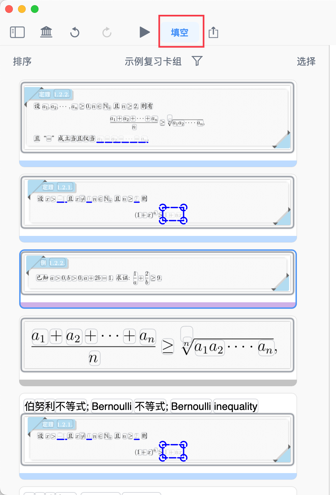

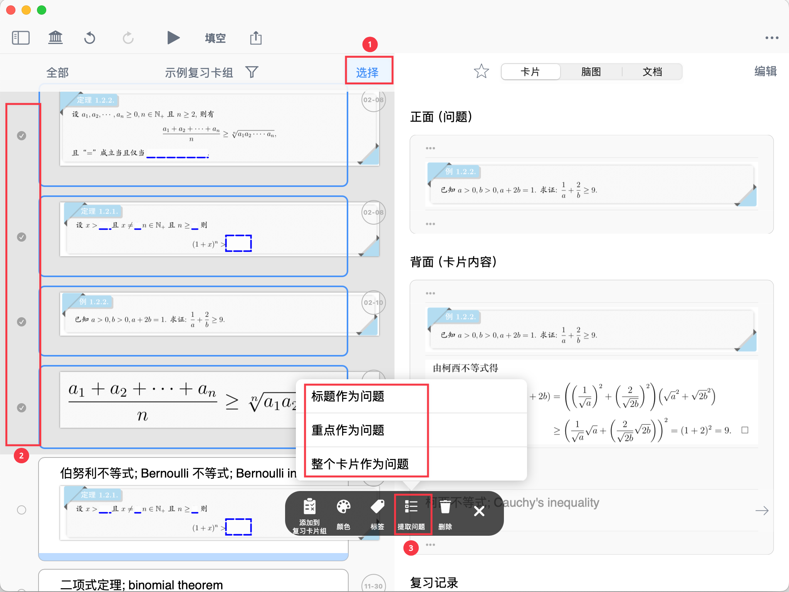

# 4 常见问题

**Q1：填空组的顺序可以调整吗？**

A：可以。填空组的翻转顺序由组名的排序决定。例如，将组名从"1、2、3"改为"3、2、1"，翻转顺序就会相反。

**Q2：删除闪卡正面的设置会怎样？**

A：会恢复为默认设置（使用卡片标题作为问题）。删除设置不会影响卡片内容。

**Q3：可以为同一张卡片设置多个问题吗？**

A：不可以。一张卡片只能有一个正面（问题）。如果需要多个问题，建议复制卡片，为每个副本设置不同的问题。

**Q4：在卡片编辑器中修改问题，会影响批量设置吗？**

A：不会。单张卡片的设置优先级高于批量设置。如果你手动修改了某张卡片的问题，批量提取问题不会覆盖该卡片。

**Q5：什么是"整个卡片作为问题"？**

A：正面和背面显示相同的内容，适合制作挖空题。

# 5 📌 下一步

恭喜你掌握了设置闪卡正反面的方法！

现在你可以：

- ✅ 为单张卡片精细设置问题
- ✅ 批量设置多张卡片的规则
- ✅ 制作填空题和挖空题
- ✅ 控制填空的翻转顺序

**制作闪卡的系列教程已经完成。** 接下来，开始学习如何科学复习，让你的记忆更持久：

→**开始复习：**[闪卡复习①：基于FSRS抗遗忘算法的科学复习](https://www.wolai.com/31KwWufHLt8MUbyxQahbP3 "闪卡复习①：基于FSRS抗遗忘算法的科学复习")

在复习过程中，你还可以学习如何通过上下文辅助记忆：

→**进阶复习：**[闪卡复习②：溯源上下文](https://www.wolai.com/ozYBXbvi3AkqiBShA7X7Co "闪卡复习②：溯源上下文")
