# 闪卡制作②：添加卡片到复习卡组

> 💡📖 **闪卡系列导航**
> 本系列帮助你掌握 MN4 的闪卡制作和科学复习。
>
> - 制作闪卡：
>   - 新手必读：
>     ① 认识闪卡和复习卡片组
>     ② 添加卡片到复习卡组
>   - 进阶：
>     ③ 设置闪卡正反面（本页）
> - 科学复习：
>   - 新手必读：
>     ① 基于FSRS抗遗忘算法的科学复习
>   - 进阶：
>     ② 溯源上下文

**本页内容**

在上一页[闪卡制作①：认识闪卡和复习卡片组](https://www.wolai.com/auMvW4AbuCoxDmYipisYoS "闪卡制作①：认识闪卡和复习卡片组")中，你学会了创建第一张闪卡。本页将教你：

- 如何批量添加已有卡片到复习卡组
- 如何在制作新卡片时自动添加到复习
- 如何使用 AI 高效制作闪卡（MAX 功能）

> ⚠️重要： 复习卡片组依托于学习集，本页介绍的所有操作都在学习集内进行。

# 1 准备工作：绑定复习卡组

> 💡将卡片加入复习之前，需要确保当前学习集已经绑定了复习卡片组。如果你在上一页[闪卡制作①：认识闪卡和复习卡片组](https://www.wolai.com/auMvW4AbuCoxDmYipisYoS "闪卡制作①：认识闪卡和复习卡片组")已经创建了复习卡片组，学习集已经自动绑定，可以跳过这一步。

**操作步骤：**

1. 进入学习集
2. 打开`摘录工具设置`
3. 找到`添加到复习卡片组`选项
4. **选择**一个已有的复习卡片组，或**新建**一个复习卡片组

✅ 绑定完成后，就可以开始添加卡片了。

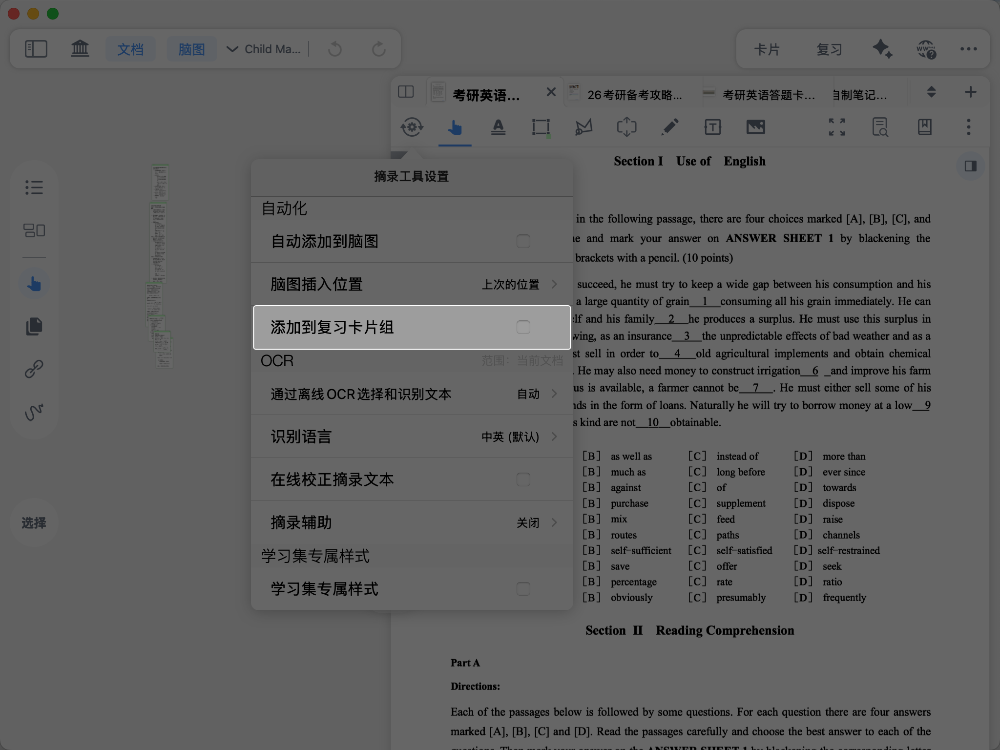

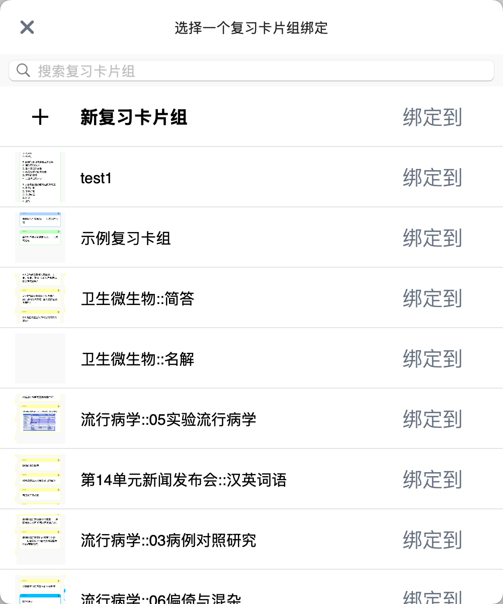

# 2 批量添加已有卡片到复习卡组

如果你已经在脑图中制作了很多笔记卡片，现在想把它们添加到复习卡组，有以下两种方法。

## 2.1 方法一：在脑图中手动选择

> 💡这个方法适合添加**少量卡片**（1-10张）。

**操作步骤：**

1. 在脑图中选中一张或多张卡片
2. 点击`...更多`
3. 选择`添加到复习`

✅ 选中的卡片就添加到复习卡组了。


## 2.2 方法二（推荐）：在`卡片分组看板`中批量筛选添加

> 💡当卡片数量较多、需要按条件筛选时，使用`卡片分组看板`更高效。
>
> 特别适合以下场景：
>
> - 需要添加 50 张以上卡片
> - 需要按条件筛选卡片（如只添加带 #重点 标签的）
> - 需要从多个文档中选择特定章节的卡片
> - 需要按颜色、创建日期等条件批量添加

> **什么是卡片分组看板：** 一个强大的卡片管理工具，可以按来源、标签、颜色、文档、创建日期等多种条件筛选卡片。详细用法见：[卡片分组看板①：从海量卡片中精准筛选](https://www.wolai.com/dJvh1K4GEKaJYtZ14zbfgj "卡片分组看板①：从海量卡片中精准筛选")

**操作步骤：**

1. 点击脑图侧边栏的`卡片分组看板`图标
2. 选择筛选条件：
   - 按`卡片源`筛选：学习集、脑图、文档
   - 按`分组`筛选：颜色、标签、文档、文档目录、创建日期、修改日期、标题链接等
   - 或使用搜索框，按关键词筛选
3. 筛选出目标卡片后，**选中**这些卡片
4. 点击底部弹出菜单中的`添加到复习` 按钮


> 💡使用技巧： 多个筛选条件可以组合使用，取交集。例如，筛选"标签为 #重点 + 颜色为蓝色 + 来自第三章"的卡片，进行精准批量添加。

# 3 摘录新卡片的时自动添加到复习卡组

> 💡如果你正在阅读新内容、制作新卡片，可以设置自动化，让每次摘录的卡片自动添加到复习卡组，无需手动操作。

## 3.1 方法一：开启摘录工具自动化设置

> 💡开启`覆盖默认自动化设置` 之前，首先要做准备工作：绑定复习卡组，否则`添加到复习`不会生效‼️

**操作步骤：**

1. 打开`卡片摘录工具` 面板
2. 开启`覆盖默认自动化设置`
3. 确认`添加到复习`已开启（默认同时开启）

✅ 设置完成后，在该学习集中使用**任意**摘录工具创建的卡片，都会自动添加到复习卡组。

> 💡灵活控制：如果希望部分卡片不自动添加到复习，可以在对应的卡片摘录工具里单独关闭`添加到复习`。

### 3.1.1 同时设置颜色、标签、划重点（可选，推荐使用）

> 💡开启自动化设置后，你还可以为摘录工具预设颜色、标签、划重点，降低后续加工闪卡的成本。

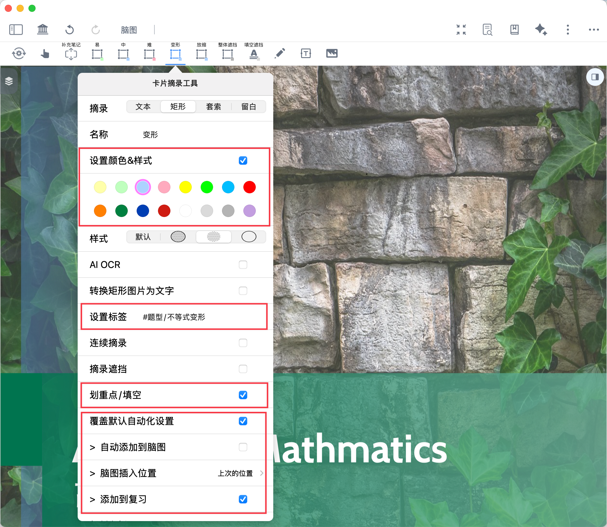

- `颜色`：为某一摘录工具设置颜色，则使用该工具创建的摘录（卡片），将自动使用预设的颜色。

> 💡可按个人偏好和需求，为卡片颜色赋予特定含义。例如，**蓝色代表重点、红色代表易错**，便于后续按颜色筛选卡片。

- `标签`：为某一摘录工具设置标签，则使用该工具创建的摘录（卡片），将自动加上预设的标签。标签支持分级，以“/”划分：上级标签/下级标签。

> 💡可按个人偏好和需求，预设特定标签，例如，**#名词解释、#简答题、#错题、#常考**等等，便于后续按标签筛选卡片。

- `划重点/填空`：开启后，可对摘录内容进行划重点，在复习时，划重点部分会被挖空遮挡，实现填空题、挖空的闪卡效果。
  - 对于**文本摘录**，可点击其中的关键字符进行划重点，被划重点的字符会自动显示蓝色下划线
  - 对于**矩形摘录**，可点击其中的关键字符，或框选关键局部画面进行划重点，被划重点的字符会自动显示蓝色下划线、被框选的局部画面会有蓝色虚线框。

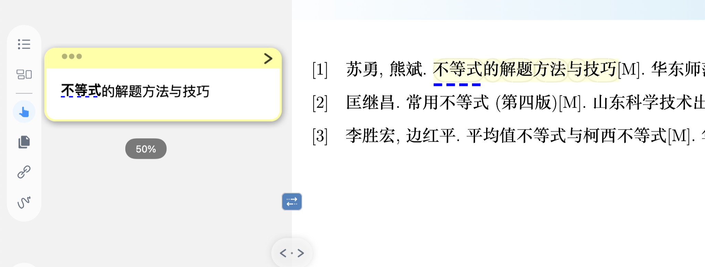

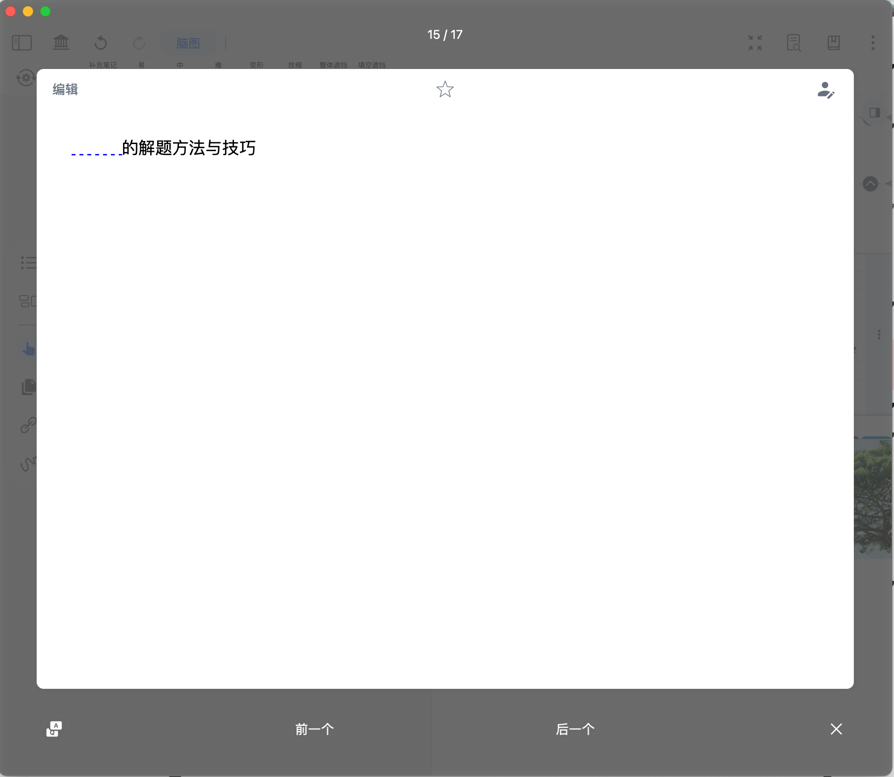

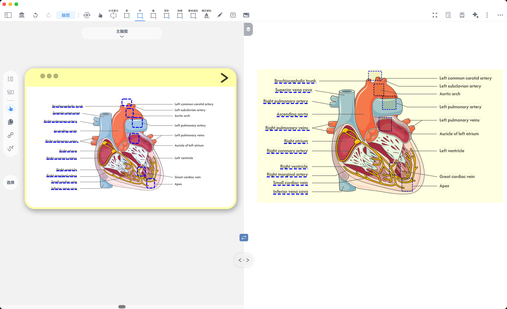

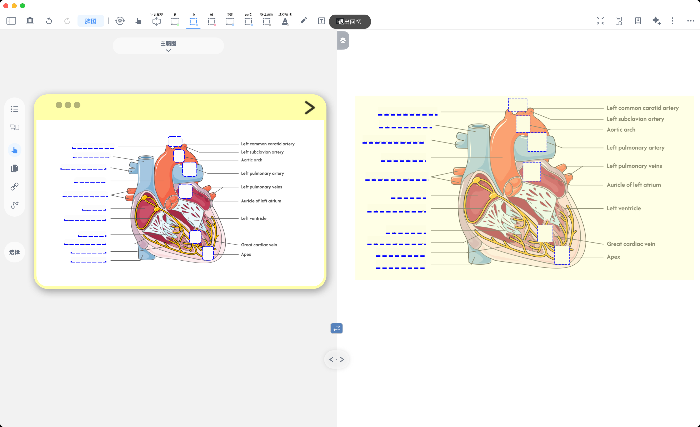

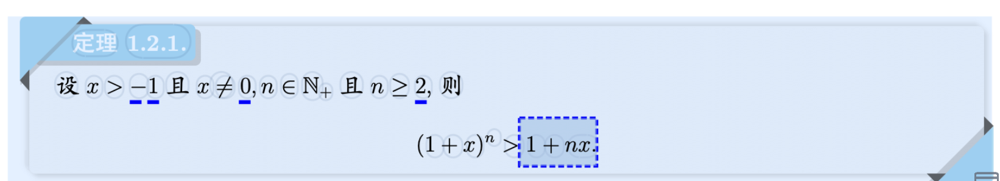

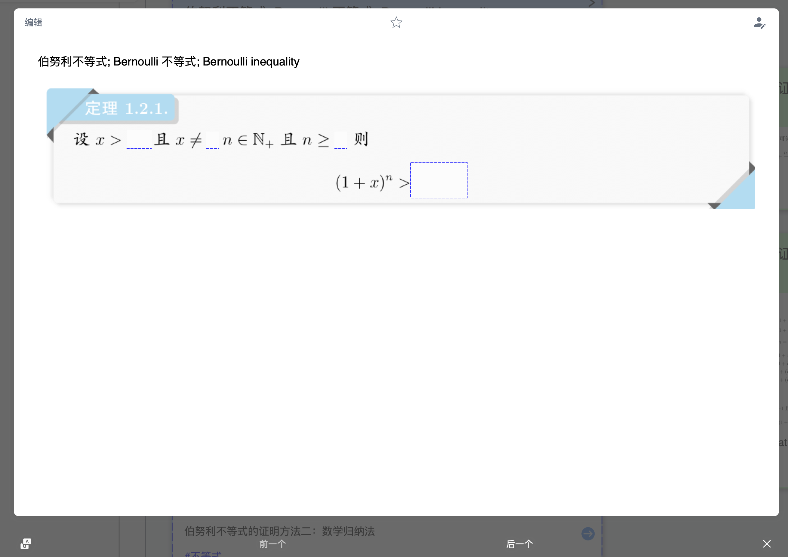

> 💡提示：关于划重点的更多用法（如在复习卡片组中批量划重点、设置填空组等），详见：[闪卡制作③：设置闪卡正反面](https://www.wolai.com/pBH9BFrgyZgeWJVf3xLyVA "闪卡制作③：设置闪卡正反面")

## 3.2 方法二：用 AI OCR 及附加操作生成闪卡（MAX 功能）

> 💡**AI OCR 制卡的优点：**
>
> - **自动识别图片中的文字**，无需手动输入
> - **用提示词要求 AI 自动提取**核心概念和解释，生成标准格式的闪卡
> - **一键生成并添加到复习**，大幅节省制卡时间
>
> 适合处理扫描版教材、截图等图片内容

**操作步骤：**

1. 进入`卡片摘录工具` 面板
2. 开启`AI OCR`
3. 在`附加操作`中输入提示词，要求 AI 为你制作闪卡并添加到复习

```text 
提示词示例： 设置卡片的内容和标题：提取核心概念作为标题，概念的解释作为内容。设置合适的闪卡问题，添加到复习 。
```


✅ 使用该摘录工具时，AI 会自动识别图片内容，提取概念和解释，生成闪卡并添加到复习。

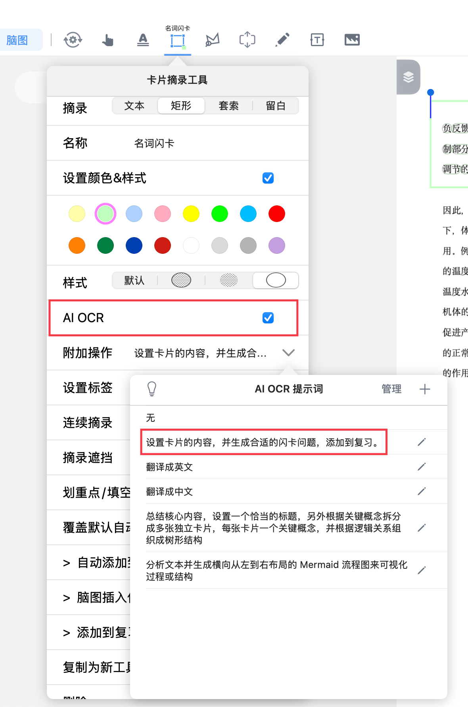

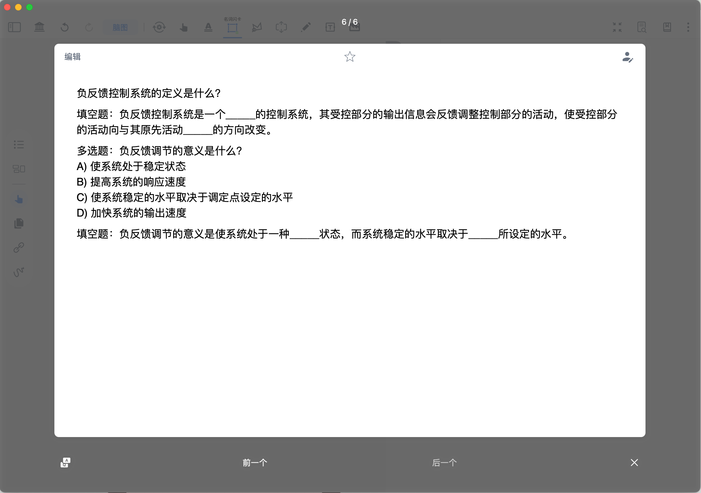

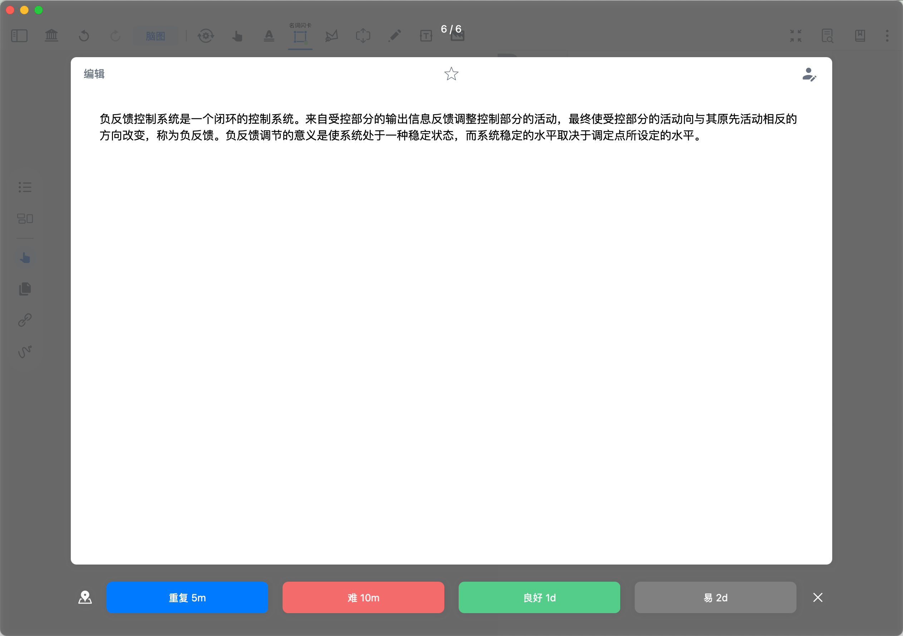

## 3.3 方法三：用AI对话生成闪卡

> 💡相比于 AI OCR，AI 对话的工具调用、批量制卡能力更加强大，能胜任更复杂、更专业的制卡要求。
>
> **AI OCR 和 AI 对话如何选择？**
>
> - 如果你是新手，或者只需要在摘录时顺便制卡，使用**AI OCR（**[**方法二**](https://www.wolai.com/pKZaNAWQAm3Wp41awj1ZJb#4ZAQA8RnipwHe3NF6YsJL9 "方法二")**）**
> - 如果你需要批量制作闪卡，使用**AI 对话（**[**方法三**](https://www.wolai.com/pKZaNAWQAm3Wp41awj1ZJb#x5HvXeS8aZe9QboqZ2Mtn9 "方法三")**）**

**操作步骤：**

**Step 1：新建提示词模板**

创建一个提示词模板，例如：\[全套工具] 制作名词解释闪卡，添加到复习；

**Step 2：选中内容并发送到 AI 对话**

1. 在文档中选中要制卡的内容
2. 发送到 AI 对话窗口
3. AI 将自动执行提示词要求，为你制作闪卡并添加到复习

✅ AI 会批量处理选中的内容，自动生成多张闪卡并添加到复习卡组。

> 💡提示： 关于如何编写更高效的提示词模板、以及 AI 对话的更多高级用法，请参考：[认识对话侧边栏（Chat）：还原完整思考过程](https://www.wolai.com/5iNniGsRaUaEWhu4QaXwYB "认识对话侧边栏（Chat）：还原完整思考过程")、[善用模块，3秒写好提示词](https://www.wolai.com/8AT2HxDZJcfh67JkPagVPC "善用模块，3秒写好提示词")

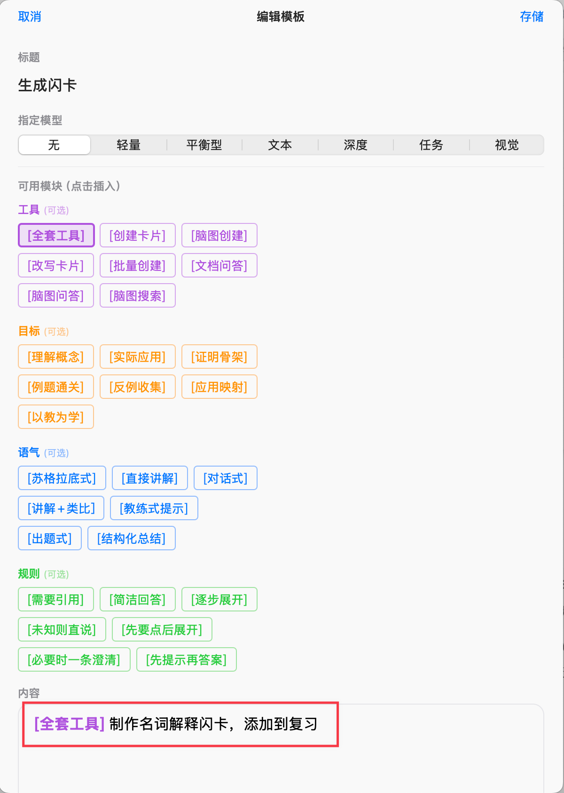

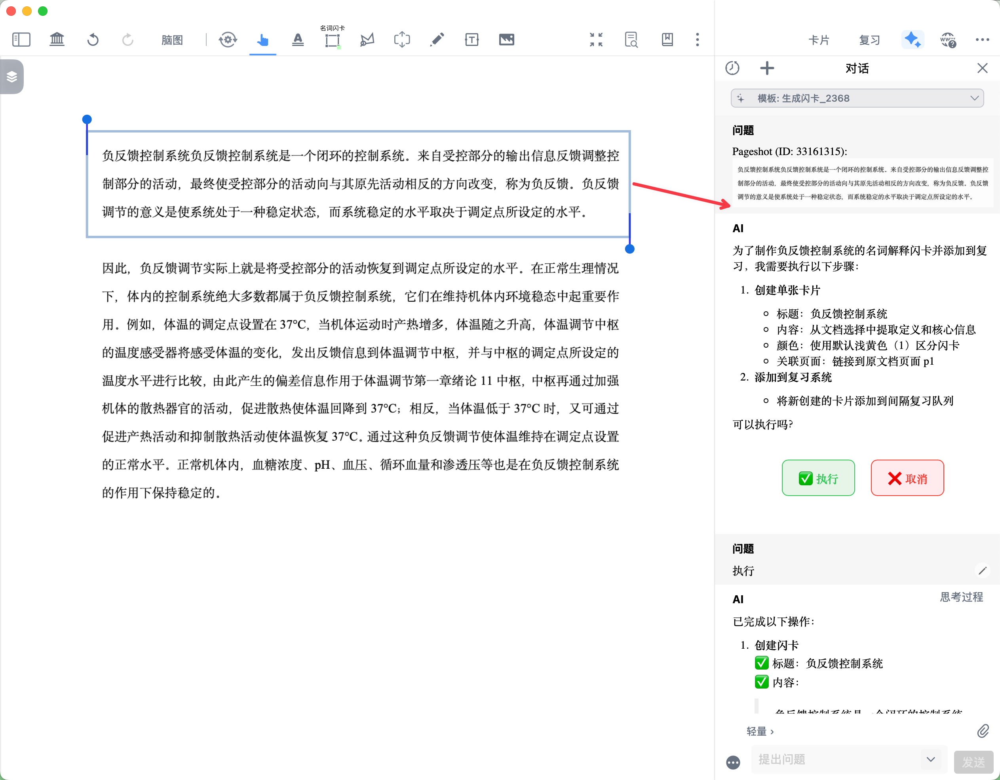

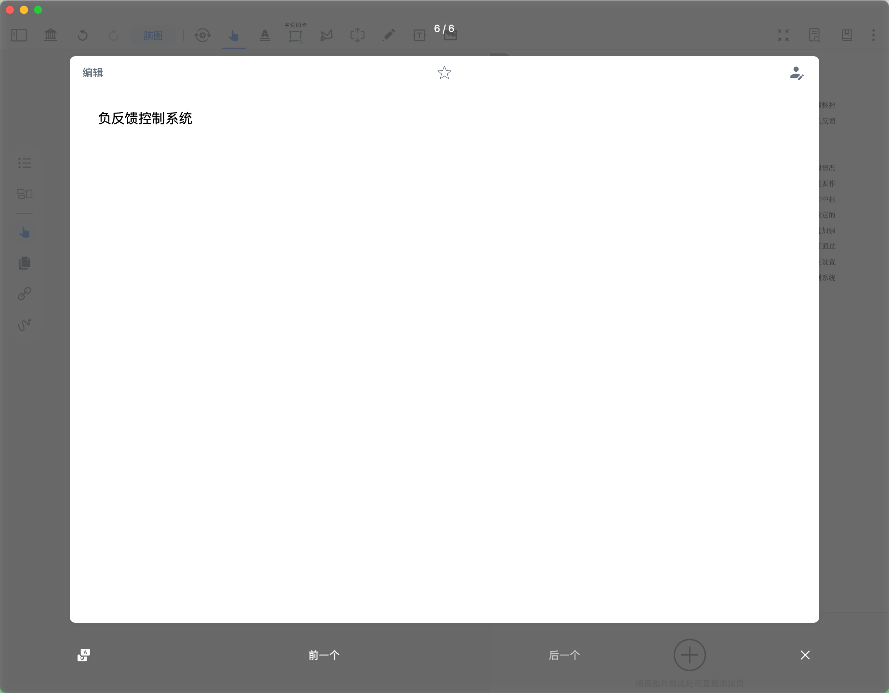

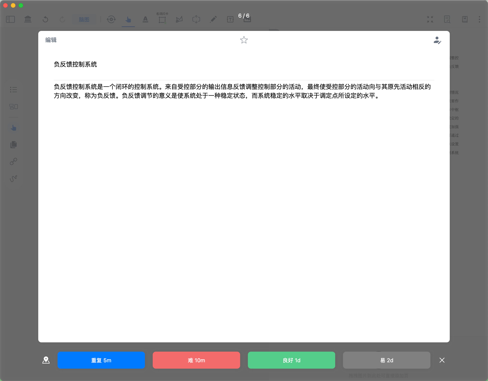

# 4 从复习中移除

# 5 📌 下一步

恭喜你掌握了多种添加卡片到复习卡组的方法！

现在你可以：

- ✅ 手动或批量添加已有卡片
- ✅ 摘录时自动添加新卡片
- ✅ 使用 AI 高效制作闪卡

接下来，学习如何设置闪卡的正反面，制作更高效的复习卡片：

→**继续阅读**：[闪卡制作③：设置闪卡正反面](https://www.wolai.com/pBH9BFrgyZgeWJVf3xLyVA "闪卡制作③：设置闪卡正反面")

如果你已经有足够的卡片，也可以直接开始学习科学复习方法：

→**开始复习：** [闪卡复习①：基于FSRS抗遗忘算法的科学复习](https://www.wolai.com/31KwWufHLt8MUbyxQahbP3 "闪卡复习①：基于FSRS抗遗忘算法的科学复习")
