# 手写：在文档、脑图、卡片中自由书写

# 1. 各场景手写的通用设置

## **文档手写设置**

[文档手写工具](https://www.wolai.com/m6kFJ8oA7c8rsND53QcVPn "文档手写工具")

- 点击文档顶部的手写工具（如上图所示），选择`手写工具栏`中的笔型，即可在**文档**中自由书写。
- **双击**`文档手写工具`，可修改相关设置

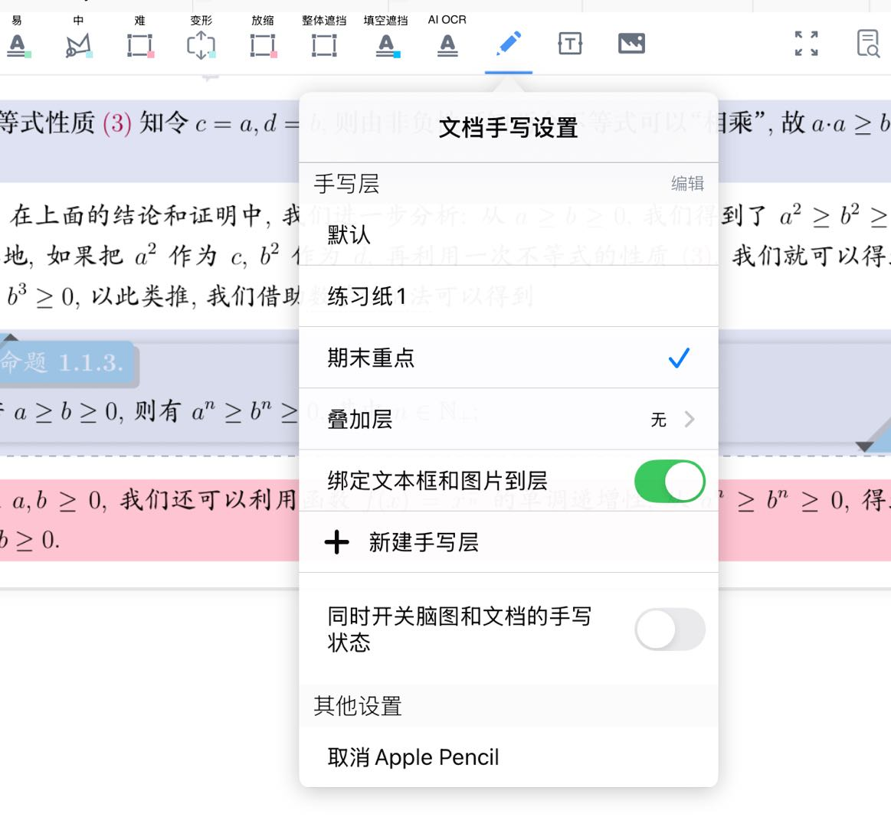

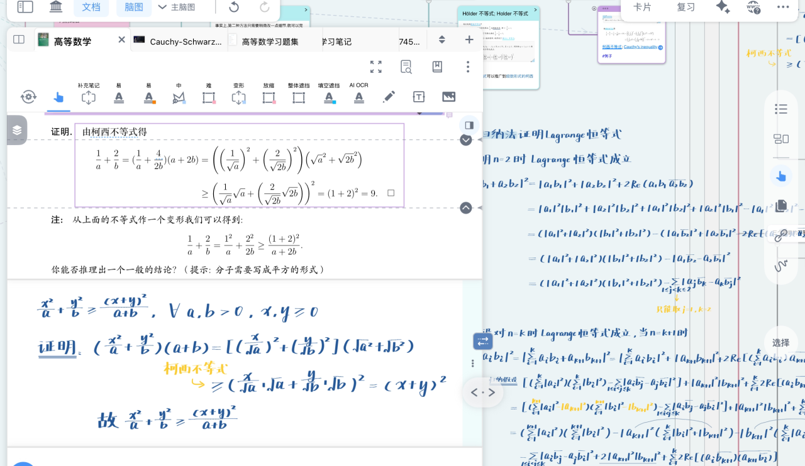

## **脑图手写设置**

[脑图手写工具](https://www.wolai.com/2Cfr7YMtWVH4a9dgyDdNev "脑图手写工具")

- 点击脑图侧边栏的手写工具（如上图所示），即可在脑图中自由书写，也可以把手写绑定到卡片中，便于查看和重组。更多功能用法可参考：[脑图手写随动绑定](https://www.wolai.com/bqdqqoArAjk9afFWktd9aF "脑图手写随动绑定")
- **双击**`脑图手写工具`，可修改相关设置
- **脑图手势**

  打开`脑图手势`开关，手写内容可被识别为脑图操作指令，如形成与删除卡片链接、卡片层级；选中卡片等操作。具体参考：[卡片链接③：手绘曲线链接](https://www.wolai.com/c8dY2ezo4RX67KkmL5dCZp "卡片链接③：手绘曲线链接")

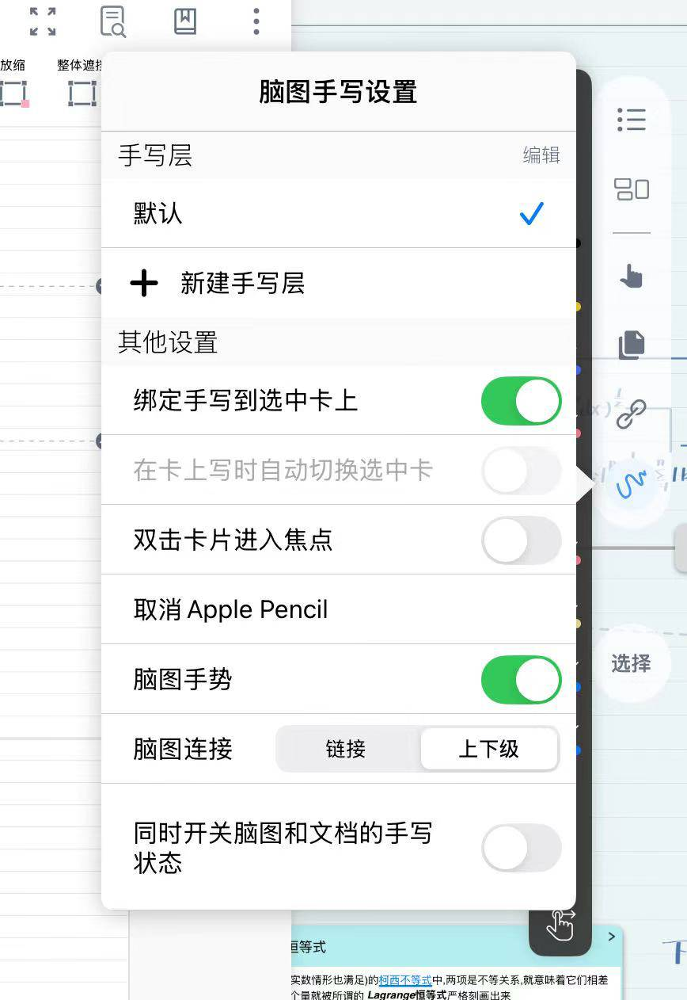

## **卡片手写设置**

[卡片手写工具](https://www.wolai.com/otwwDwHN1YyXUhDWWoaxbd "卡片手写工具")

- 点击`卡片编辑器`中笔型图标（如上图所示）
- 选择`手写工具栏`中的笔型，即可在**卡片含有图片和评论区**中自由书写

1. 在卡片本身的图片中进**行书写**

> 💡**使用场景：**
>
> 在公式、图表等图片摘录上直接涂画，标记重点部分
>
> 在图片摘录上用**荧光笔**涂画考点，在**回忆模式**中进行复习，具体可参考：[文档复习：遮挡挖空与回忆模式](https://www.wolai.com/fyHE27B9XM8VeZ4G2xkFhZ "文档复习：遮挡挖空与回忆模式")

1. **在卡片的评论进行书写**

> 💡**使用场景**
>
> 在评论区拆解卡片结构，内化知识
>
> 作为题目卡片的草稿纸和答题纸，使用无限延展的评论区尽情书写

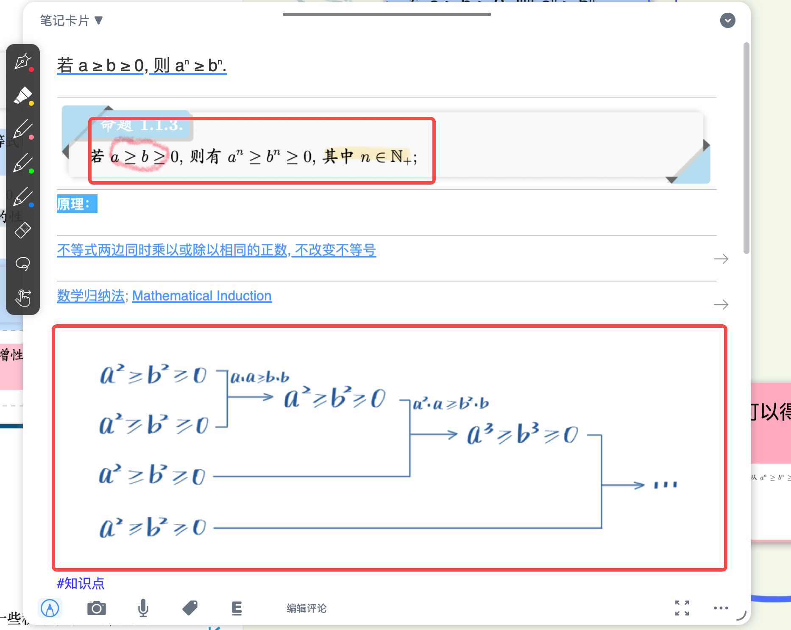

## **复习手写**

> 💡可以在批注中用手写进行默写、演算等活动

[批注](https://www.wolai.com/7vxicFnQFuWnSrPVJD64ZQ "批注")

[卡片手写工具](https://www.wolai.com/otwwDwHN1YyXUhDWWoaxbd "卡片手写工具")

- 进入复习模式，点击`批注`按钮，打开右侧批注界面；点击批注界面中的手写工具，即可在批注界面书写

> 更多用法请见：批注

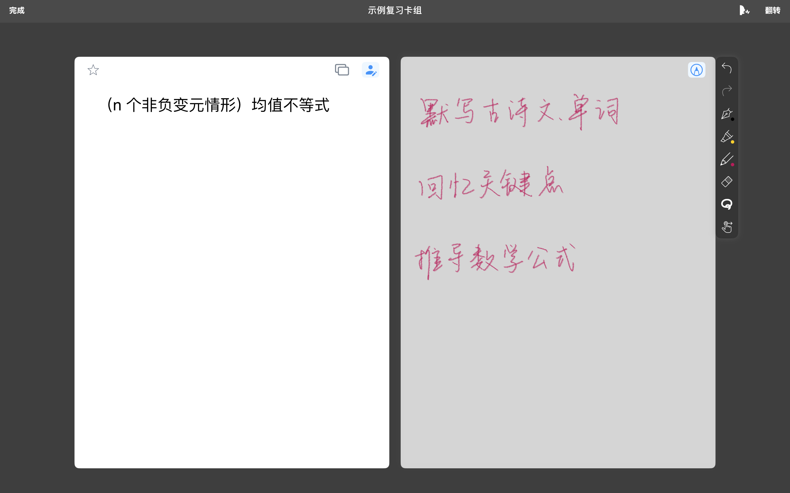

# 2. 手写工具栏

在文档、脑图、卡片或复习场景中开启手写模式后，手写工具栏会自动弹出，支持自定义配置与操作。

- 单击`手写工具栏`的不同图标，可以切换不同笔模式
- 再次点击该图标，弹出手写自定义弹窗，弹窗中可以对笔的颜色、类型、粗细、透明度等进行更改

## 2.1. 手写工具栏的移动

可以拖动手写工具栏将其放在方便的位置，其可以自动吸附在屏幕或文档、卡片边缘，如图所示：

> 💡若手写工具栏的手写笔数量太多，可能无法吸附到顶部，因为顶部空间有限

## 2.2. 笔工具

### 2.2.1. 更改笔的类型

- 点击**不同笔状图标**即可切换笔工具
- 切换到哪只笔，笔的图标就会转为白色

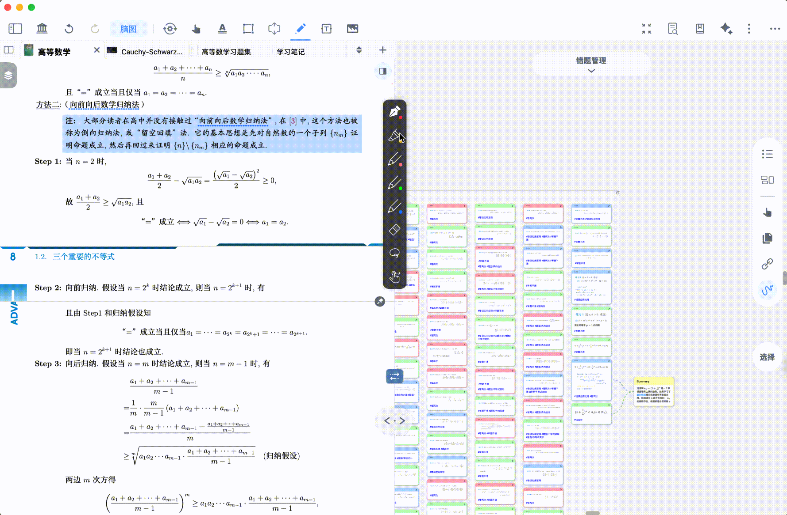

1. **钢笔**：含`普通笔`、`原子笔`、`墨水笔`三种类型，适合书写文字（如批注、解题步骤）

[钢笔图标](https://www.wolai.com/5Vg3pX7v1w5mSGUdZcm8az "钢笔图标")

1. **荧光笔**：适合高亮标注（如勾画文献核心句、考点）

[荧光笔图标](https://www.wolai.com/noYofFuTyBMARCc3fnZdXL "荧光笔图标")

1. **铅笔**：含`铅笔`、`水笔`、`蜡笔`三种类型，适合画图、填色（如绘制医学图示、填充柱状图）

[铅笔图标](https://www.wolai.com/tqnSUd3NRkLxKN1dK6DXQz "铅笔图标")

### 2.2.2. 切换颜色

- 点击笔工具后，可以看到手写自定义弹窗上方的颜色栏，由11个颜色图标和一个取色器图标构成
- 单击颜色图标，即可切换笔的颜色。

### 2.2.3. 自定义颜色栏

[取色器](https://www.wolai.com/2GMtsK1YCkWkoBSyyxWQXj "取色器")

点击取色器（如上方图标所示），即可自定义颜色，也可导入样式实现一键复用现成的色卡

**方法一：通过RGB数值和Hex码更改**

点击取色器图标，打开颜色配置弹窗，在 R/G/B 输入框填入 0-255 的数值，或在 HEX 输入框填入 “# + 六位编码”（如 #FF0000 ），即可自定义颜色。

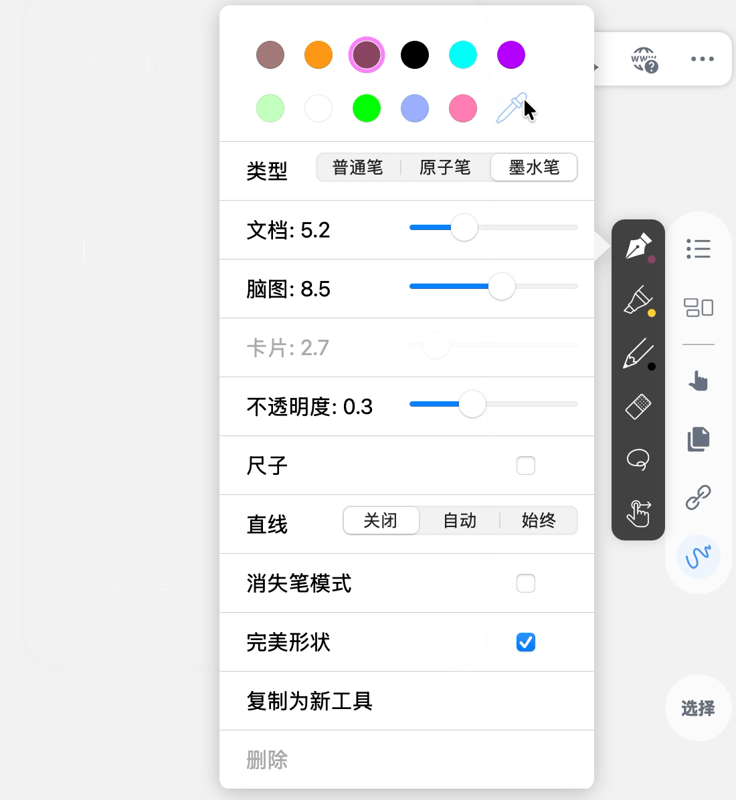

**方法二：在色盘中取色**

> 💡在不清楚想要颜色的具体RGB值时，可以在色盘中直接取色。

- 颜色配置弹窗含颜色显示区域和两个色盘：
  - 颜色显示区域：前两格为纯白 / 纯黑，第三格是原颜色，第四格是调整后的新颜色；
  - 色盘：上方色盘调节**明度、饱和度**，下方色盘**调节色相**；
- 操作：单击色盘选色，或滑动笔尖实时调整，对比原颜色确认后松开即可

### 2.2.4. 更改笔的粗细

手写自定义弹窗的粗细调节栏，按`文档`、`脑图`、`卡片`三类场景划分，每类均支持通过滑杆（默认）或档位调节线条粗细。

> 💡需要注意的是，只有脑图、文档、卡片**开启手写模式**时，才可对粗细进行调节，否则其显示为灰色。

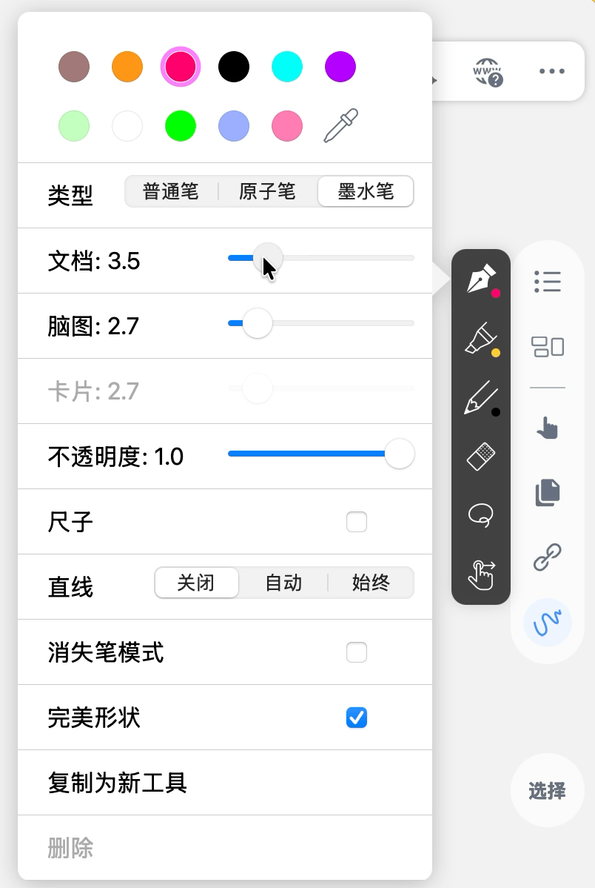

> 💡**手写粗细调节如何切换为档位式调节：**
>
> MN设置 → 手写 → 关闭`使用连续笔宽滑滑杆`
>
> 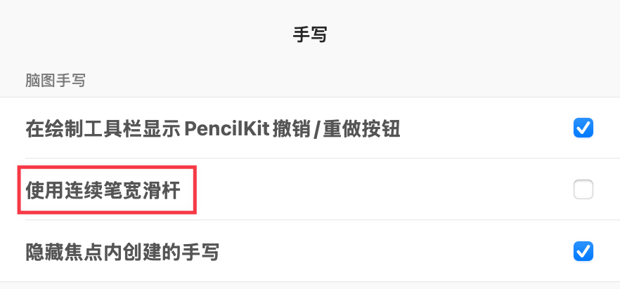

> 💡**使用场景**：
>
> 例如文档中用细笔（匹配文字大小）批注，脑图中用粗笔（突出显示）标注核心概念，无需切换笔工具，直接通过场景分类调整即可。
>
> **官方笔刷参数推荐**：
>
> [ 笔刷/配色参数上新！适配新版笔宽滑杆🖌 - 小红书 支持连续调节的笔宽滑杆，它来啦！ MarginNote 4.3.1 新增「滑杆式笔宽调节器」，粗细调整更精细，手写体验更丝滑。 这次给大家整理了一套官方推荐参数（适配新版笔刷），直接抄作业就能用👇建议先点赞收藏～ 	 ✍️ 四款实用笔刷参数 • 铅笔：文档粗度5.5｜脑图/卡片粗度14.0｜不透明度1.0 真实纸感笔触，书写更有温度 • 普通笔：文档粗度8.8｜脑图/卡片粗度20.0｜不透明度0 https://www.xiaohongshu.com/explore/69c3dbde000000002800ae0a?xsec\_token=ABQB6yMglu610mfdCARVs\_8LL3-0DD8IhevF1pLd0KZ8g=\&xsec\_source=pc\_user](https://www.xiaohongshu.com/explore/69c3dbde000000002800ae0a?xsec_token=ABQB6yMglu610mfdCARVs_8LL3-0DD8IhevF1pLd0KZ8g=\&xsec_source=pc_user " 笔刷/配色参数上新！适配新版笔宽滑杆🖌 - 小红书 支持连续调节的笔宽滑杆，它来啦！ MarginNote 4.3.1 新增「滑杆式笔宽调节器」，粗细调整更精细，手写体验更丝滑。 这次给大家整理了一套官方推荐参数（适配新版笔刷），直接抄作业就能用👇建议先点赞收藏～ 	 ✍️ 四款实用笔刷参数 • 铅笔：文档粗度5.5｜脑图/卡片粗度14.0｜不透明度1.0 真实纸感笔触，书写更有温度 • 普通笔：文档粗度8.8｜脑图/卡片粗度20.0｜不透明度0 https://www.xiaohongshu.com/explore/69c3dbde000000002800ae0a?xsec_token=ABQB6yMglu610mfdCARVs_8LL3-0DD8IhevF1pLd0KZ8g=\&xsec_source=pc_user")

### 2.2.5. 更改不透明度

拖动`不透明度`进度条，可进行10个档位的调节。

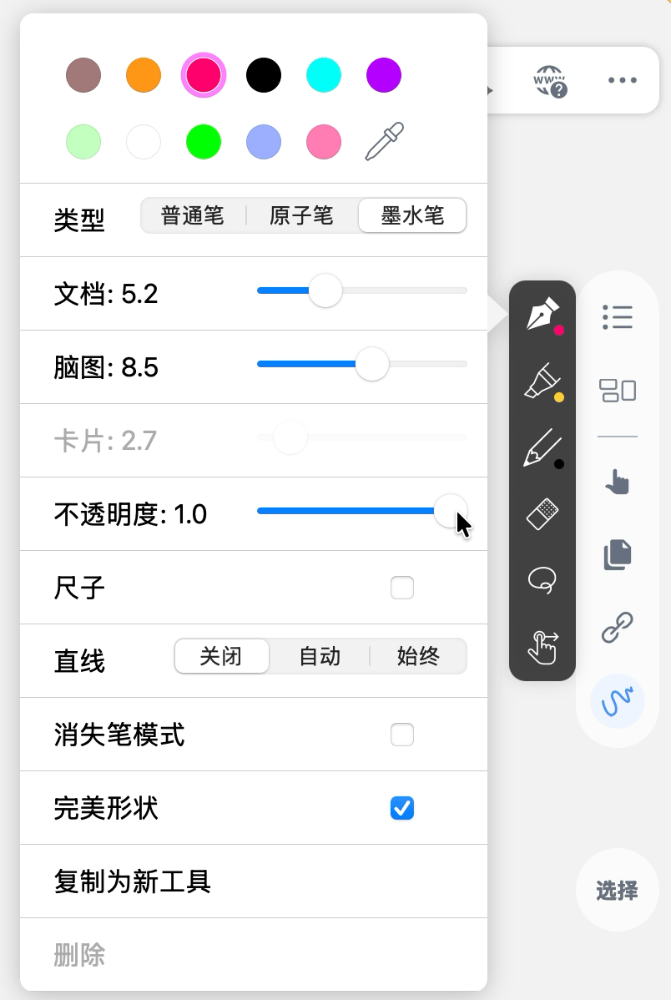

### 2.2.6. 笔的复制和删除

> 💡**当你新增一支笔时，你可能只是想换个颜色**：
>
> MN4支持直接复制笔工具，已调好的参数（如粗细、不透明度）无需重复设置

可以通过笔的复制和删除操作，更快配置`手写工具栏`。

在目前版本中，手写工具栏最多可配置12支笔刷，最少3支笔刷(钢笔、荧光笔、铅笔各一支) &#x20;

> 💡Max 用户最多可配置12支笔刷，Pro 用户最多可配置8支笔刷

#### 2.2.6.1. 笔的复制

- 选中笔工具后再次点击，唤起手写自定义弹窗后点击`复制为新工具`，新工具与原工具配置都完全相同。
- 再次单击新笔刷工具，可改变`颜色、粗细、透明度`等参数

#### 2.2.6.2. 笔的删除

单击想要删除的笔工具，再次点击唤起手写自定义弹窗后点击删除，该笔从工具栏中删除

> 💡笔工具删除后不可撤回，请谨慎操作

## 2.3. 辅助工具

### 2.3.1. 尺子

- 选中笔工具后再次点击，可以看到手写自定义弹窗中的`尺子`开关
- 打开开关，可以在该模块（脑图、文档或卡片）唤起直尺工具

#### 2.3.1.1. 尺子位置和角度的调节

- 点击`尺子`并拖动，可以将尺子拖到想要的位置
- **二指**按着`尺子`转动，即可调节直尺角度。

> 💡如果脑图、文档、卡片都开启直尺功能，则可以分别调节。
>
> 如果发现无法点击无反应，**可以用笔先在该区域写一笔**，令MN识别当前操作的尺子工具

#### 2.3.1.2. 尺子与书写

笔尖沿直尺划线，即可自动生成直线，并显示笔尖所在位置的数值。

> 💡当笔尖不沿着直尺书写时，不会自动生成直线。

直尺也可起到遮挡作用，如图所示：

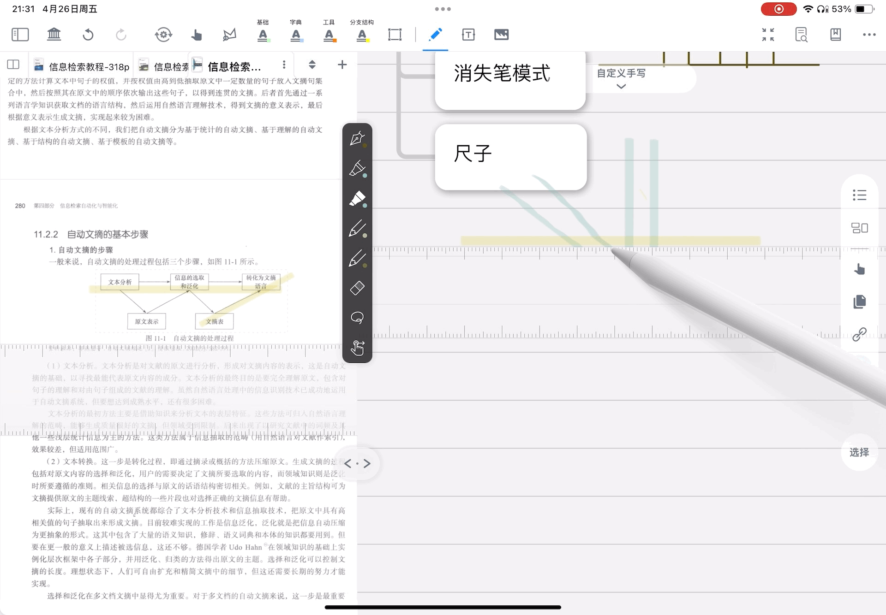

### 2.3.2. 直线

选中笔工具后再次点击，可以看到手写自定义弹窗中的直线栏，有`关闭`、`自动`、`始终`三种状态可以选择。

| 状态                                                   | 效果               | 适用场景                   |
| ---------------------------------------------------- | ---------------- | ---------------------- |
| \[🖼️ 图片]\(image/guanbi\_IFhP75jR6I.gif "🖼️ 图片")    | 不转换为直线           | 手写笔记文字、绘制曲线            |
| \[🖼️ 图片]\(image/zidong\_nxSk-TYgyQ.gif "🖼️ 图片")    | 比较接近直线的笔画可以转化成直线 | 适用于手写和划线（如制作表格）切换频繁的情况 |
| \[🖼️ 图片]\(image/shizhong\_Rr\_2rFM2-y.gif "🖼️ 图片") | 全部转换为直线          | 画表格、链接卡片               |

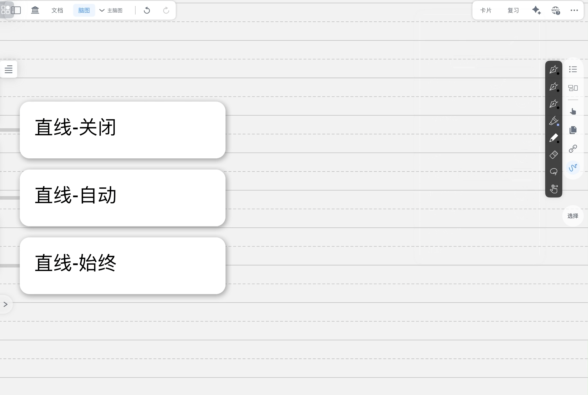

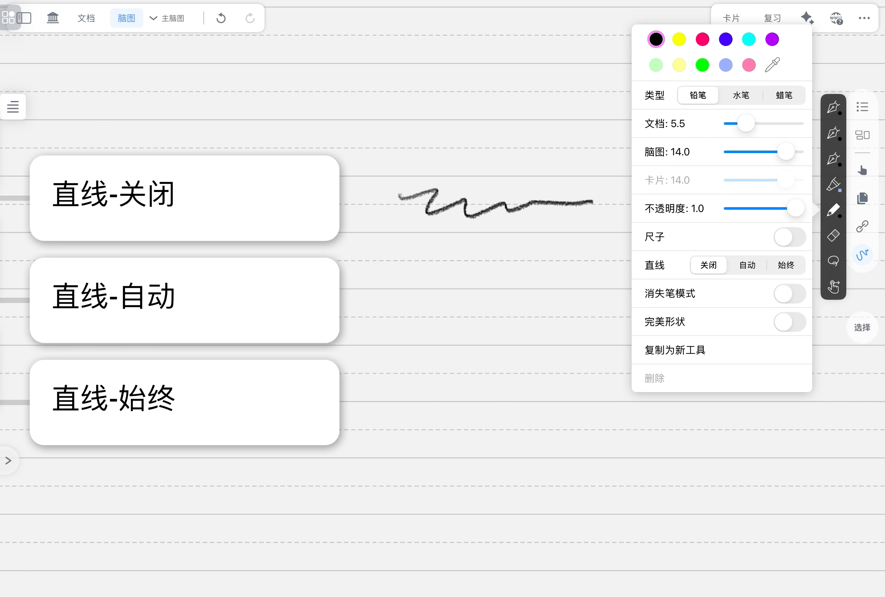

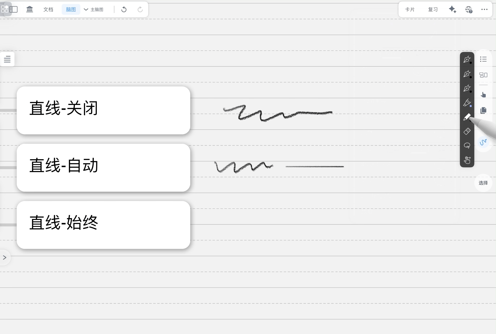

### 2.3.3. 消失笔模式

- 选中笔工具后再次点击，可以看到手写自定义弹窗中的`消失笔`开关
- 开启后，手写笔迹在停顿1秒后自动消失。

> 💡可配合演示模式，用于讲解、录课等。                         &#x20;

### 2.3.4. 完美形状

- 选中笔工具后再次点击，可以看到手写自定义弹窗中的`完美形状`开关。
- 打开该开关即可开启`完美形状`模式

此时，绘制**圆形、椭圆、矩形、五边形、星型、心型**等形状后笔尖停住，则笔迹自动转化为完美图案

> 💡开启完美形状后，还可使用涂抹擦除功能

## 2.4. 橡皮工具

### 2.4.1. 橡皮擦设置

[橡皮](https://www.wolai.com/hAeYs15JzSRwFM8yo5b2cA "橡皮")

打开手写工具栏后选择橡皮工具（如上图），可以使用`橡皮`擦除手写笔迹

再次点击`橡皮`工具，可以唤起橡皮设置弹窗

1. **完整擦除 vs 不完整擦除**

> 💡使用橡皮工具进行擦除时，有时需要擦除该笔迹的全部部分，如大篇幅删除笔记内容。
>
> 而有时只需要擦除这一笔的一部分，如更改绘画形象。

在橡皮设置弹窗，将`橡皮`状态选为`完整`，橡皮会将**接触到的笔迹的所有部分**全部擦除。

将`橡皮`类型切换为`不完整`，橡皮只会擦除**接触到的像素本身**。

1. **自动取消**

在橡皮设置弹窗，打开`自动取消`开关，使用`橡皮`擦除一次便会**自动取消橡皮工具**，切换为上一个使用的笔工具。

> 💡开启自动取消后，擦除动作一旦停止，橡皮工具立刻转变为原用手写工具，工作流简化为"**选取橡皮工具 → 擦除部分 → 继续手写**"，避免了手动切换回笔工具时选错的麻烦

### 2.4.2. 涂抹擦除

**无需切换橡皮擦，只用手写笔同样可以实现擦除：**

第一步，打开任意手写笔的`完美形状`

第二步，使用该手写笔涂抹笔记后，笔尖在屏幕停顿0.5秒左右，即可擦除手写笔迹

> 具体效果演示详见：
>
> [ 💡FAQ| 如何实现涂抹删除手写笔迹 - 小红书 ✍Step 1：打开任意手写笔的『完美形状』 ✍Step 2：使用该手写笔涂抹笔迹后，笔尖在屏幕停顿0.5秒左右，即可擦除笔迹 #marginnote #marginnote4 #MarginNote常见问题解答#MarginNote手写#MN猫猫#MarginNote涂抹删除 #手写 #使用技巧 #常见问题 https://www.xiaohongshu.com/explore/69317e5e000000001e00a61f?xsec\_token=ABy8g-2ot0NpVfySYdkZj5XtPjFPIVM0cbO\_kKngDkYYI=\&xsec\_source=pc\_user](https://www.xiaohongshu.com/explore/69317e5e000000001e00a61f?xsec_token=ABy8g-2ot0NpVfySYdkZj5XtPjFPIVM0cbO_kKngDkYYI=\&xsec_source=pc_user " 💡FAQ| 如何实现涂抹删除手写笔迹 - 小红书 ✍Step 1：打开任意手写笔的『完美形状』 ✍Step 2：使用该手写笔涂抹笔迹后，笔尖在屏幕停顿0.5秒左右，即可擦除笔迹 #marginnote #marginnote4 #MarginNote常见问题解答#MarginNote手写#MN猫猫#MarginNote涂抹删除 #手写 #使用技巧 #常见问题 https://www.xiaohongshu.com/explore/69317e5e000000001e00a61f?xsec_token=ABy8g-2ot0NpVfySYdkZj5XtPjFPIVM0cbO_kKngDkYYI=\&xsec_source=pc_user")

## 2.5. 套索工具

[套索功能](https://www.wolai.com/caJ4kRm9SzFVmFcwC654f6 "套索功能")

打开手写工具栏后选择`套索工具`（如上图），用套索圈住手写笔迹后，笔迹会被选中并显示在蓝色框内，同时弹出黑色的`套索弹出菜单栏`，支持颜色调整、剪切、复制、转文本、删除等操作。

### 2.5.1. 移动和缩放选中笔迹

- 使用笔或手指，点击蓝色框右下角的三角图标并**拖动**，可以调整笔迹大小。
- 使用笔或手指对选中笔迹进行**拖动**，可以改变笔迹位置

> 💡长按选中笔迹进行拖动，可以将文档内的笔迹复制到脑图，反之亦然

### 2.5.2. 调整选中笔迹颜色

点击套索弹出菜单栏中的颜色选项，弹出颜色栏，点击颜色图标即可将选中所有笔迹更改为该颜色。

### 2.5.3. 笔迹剪切、复制和删除

点击套索弹出菜单栏中的剪切选项，可以粘贴到脑图、文档、卡片的其他位置

### 2.5.4. 笔迹转文本

详情见：[AI一键转手写为 Markdown文本](https://www.wolai.com/7sJPSm6pe4i3NeBDJZsKUQ "AI一键转手写为 Markdown文本")

### 2.5.5. 创建卡片、绑定到卡片

在脑图中套索弹出菜单栏中，有`创建卡片`和`绑定到卡片`选项。

`创建卡片`：选中笔迹作为脑图中生成的一张新卡片；

`绑定到卡片`：将笔迹加入到某张卡片作为卡片的一条评论，详见[脑图手写随动绑定](https://www.wolai.com/bqdqqoArAjk9afFWktd9aF "脑图手写随动绑定")。

## 2.6. 切换触控

[触控图标](https://www.wolai.com/toDSQXUNTwwtGFYWHST2dq "触控图标")

打开`手写工具栏`后选择`触控工具`（如上图），Apple Pencil将代替手指完成摘录、翻页、拖动卡片等动作，**不再生成笔迹。**

> 💡频繁切换书写-摘录等操作时，可以使用该工具减少功能之间的切换

# 3. 手写层

手写层是文档和脑图的"图层"，用户可以在不同的"图层"进行书写，并且支持多层叠加、切换等操作。文档和脑图都具有手写层功能，操作方式相似。

> 💡`手写层`功能使得 MarginNote 在刷题复习和笔记整理方面更加高效和便捷。它让刷题次数不受限，用户可以通过创建多个手写图层进行多次练习，并且叠加层概念使对照查看更高效，方便用户总结和复盘。
>
> 例如，在刷题复习时，每轮刷题可以新建一个图层并命名日期，如"**函数 round1**"。用户还可以隐藏历史笔迹，专注于当前练习，也可以将不同手写图层进行半透明叠加，对照解题思路差异。

1. **手写层的新建**：

未添加手写层时，用户手写绑定到"默认层"，可以点击"＋"图标，出现`手写层命名弹窗`。

手写层默认名称为"练习纸 1，练习纸 2……"

1. **手写层的其他操作**：

在手写设置页面点击右上角"`编辑`"，可以进入`手写层编辑页面`：

- 点击手写层右侧"..."图标，点击`删除`，将删除该手写层

> ⚠️选择删除后，手写层内的手写、绑定的文本框等都将消失，且撤回操作无效，请谨慎操作。

> 更多设置请参考：[图层：文档笔记本&手写图层](https://www.wolai.com/6gbzKZ4a16uYGaFNLMYASD "图层：文档笔记本&手写图层")
