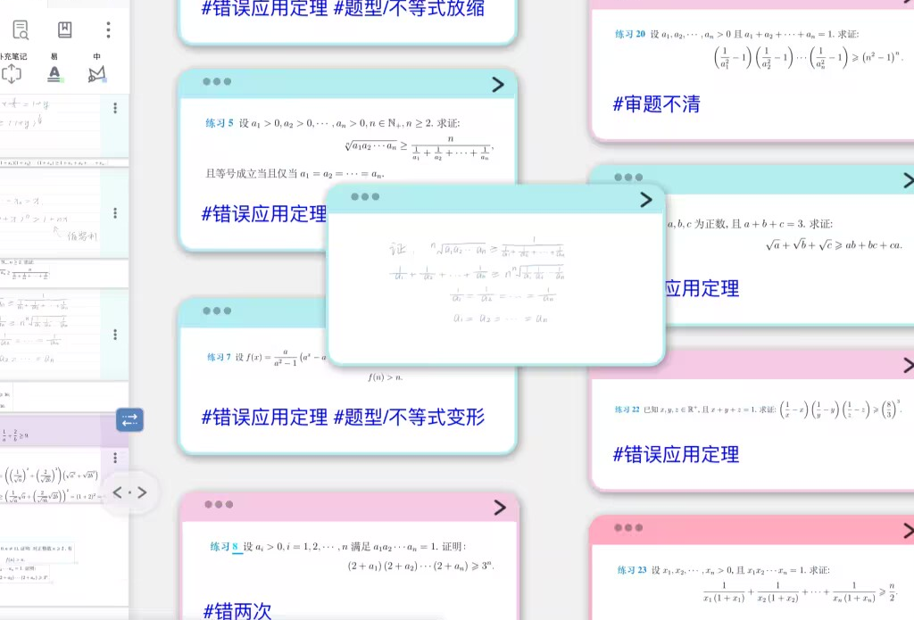
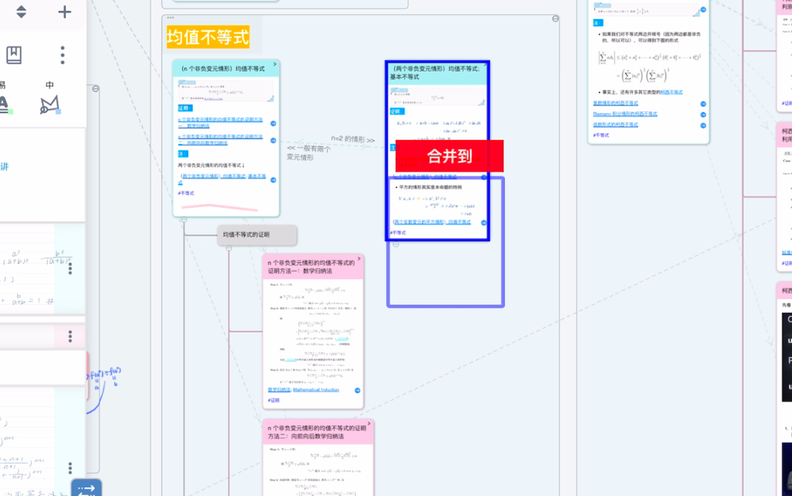

# 脑图卡片②：移动、合并、重组

> 💡本页内容
>
> - 移动卡片：拖拽到任意位置、成为子卡片、独立卡片
> - 合并卡片：将多张卡片内容合并为一张
> - 重组卡片：拆分已合并的卡片

> 💡**使用场景：**
>
> 制卡后，可以手动/自动将散乱排列的卡片移动、合并、重组，成为次序分明的思维导图，达到内化知识的目的。
>
> 在脑图中的手写，也可以圈墨成卡，将其内容归并入节点。
>
> 集中复习时，可以将多知识点合并为一张卡片。

## 1 移动卡片

### 1.1 拖拽卡片进行移动

#### 1.1.1 随意拖拽

在脑图或子脑图中，独立卡片（没有上级节点的卡片）可以随意分布。

用户可以按住卡片并拖到想要的位置，也可以与其他卡片重叠，进行联系和对比

> 💡非独立卡片可以f将子卡片移出为独立卡片，也可以拖动为子卡片

> 💡卡片拖动到其他卡片上，且重合区域较少，没有触发“[🖼️ 图片](image/IMG_1525_xFc6vjmCls.jpeg "🖼️ 图片")”及“[🖼️ 图片](image/RPReplay_Final1715015746_j3A8qFeENa.gif "🖼️ 图片")”才可堆叠显示

#### 1.1.2 拖动为子卡片

- 按住选择的卡片A拖动到另一个卡片B上，出现绿色提示框“`成为子卡片`”后松手
- 卡片A成为卡片B的子卡片。
- 如果A也有子卡片，将会随之移动。

> 💡在[脑图焦点](https://www.wolai.com/5nntHuyzfBSdVrEo4YYhxC "脑图焦点")或者B有其他子卡片时，布局会自动排列，此时可按住卡片A在分支中拖动，调整分支顺序

### 1.2 将子卡片移出为独立卡片

- 按住选择的卡片，将卡片拖拽到右上角空白处
- 右上角会出现`独立`字样的黑色文字框
- 将卡片拖拽到`独立`框中后松手，卡片从分支中移除，变为独立卡片。

_hX36DqVjY.gif>)

### 1.3 按文档目录自动组织卡片

> 💡前提：文档需要有目录结构。
>
> 如何生成目录详见：[手动&自动生成文档目录](https://www.wolai.com/djV6nMiEdSaxCacjWcptpA "手动&自动生成文档目录")

在卡片**独立**时，按住选择的卡片，将卡片拖拽到右上角空白处

右上角会出现`文档目录`字样的黑色文字框

将卡片拖拽到`文档目录`框中后松手，该文档目录将会以脑图分支的形式呈现，并且摘录卡片会成为所属分支的子卡片。

## 2 合并节点

> 💡使用场景
>
> - 将多个相关概念整合为一张复习卡
> - 将分散的笔记汇总到一个主题下
> - 减少卡片数量，简化脑图结构

### 2.1 多次拖动使卡片合并

- 在默认情况下，按住选择的卡片A拖动到另一个卡片B上，出现绿色提示框`成为子卡片`后松手，卡片A成为卡片B的子卡片。
- 此时再次拖拽，出现红色提示框`合并到`后松手，卡片 A 则会与卡片 B 合并，其内容位于卡片B 的内容之后。

### 2.2 一次拖动使卡片合并

[手形工具-脑图](https://www.wolai.com/ZZTg45zHLVw17uSZysVDb "手形工具-脑图")

点击`脑图工具栏`的手型工具（如上图所示），打开“快速合并”开关

- 按住选择的卡片A拖动到另一个卡片B的右侧，出现绿色提示框“`成为子卡片`”
- 拖到卡片B的左侧，则出现红色提示框“`合并到`”

## 3 重组节点

> 💡在卡片合并后如需再次进行调整，可以将卡片解除合并，拆分后重组

- 点击需要解除合并的卡片，在[卡片弹出菜单栏及其自定义](https://www.wolai.com/6QJHeJqZghQKQ4PcEA3w5u "卡片弹出菜单栏及其自定义")的`高级`栏中选择`更多`；
- 在弹出的`选中`面板的`操作\卡片栏`选择`解除合并`
- 此时卡片内仅存第一段摘录，其他摘录\评论变为该卡片的子卡片，方便后续重新进行节点的移动和合并。

