# 数据同步、备份与恢复

> 💡**新用户推荐设置：**
>
> 1. 如何开启 iCloud 同步
> 2. 开启
>    若想了解同步状态标识可阅读  检查文档和学习集是否开启了云同步

> 💡**必读提示**：“**iCloud同步” *****vs***** “备份”**
>
> - **iCloud同步仅用于多设备间笔记数据的同步**，**无任何备份功能！**(有延时,以及同步状态显示错误导致iCloud中笔记数据不完整的可能性)。
> - **备份可以完全保留备份时的完整数据库**(包含笔刷设置、摘录工具设置等)，请学习者注意日常使用和卸载软件前均做好数据备份

> 💡按本文设置后，若仍出现同步问题，优先查看：[常见问题：iCloud云同步指南](https://www.wolai.com/teaCPu5CKGw3xvVUJNNvBE "常见问题：iCloud云同步指南")

# 1 iCloud同步

## 1.1 如何开启 iCloud 同步

1. **确保 iCloud 已登录并启用 MarginNote 同步**

- 打开系统设置，点击您的头像，然后选择 "**iCloud**"。
- 点击**查看全部**
- 确保**MarginNote4**已被勾选启用

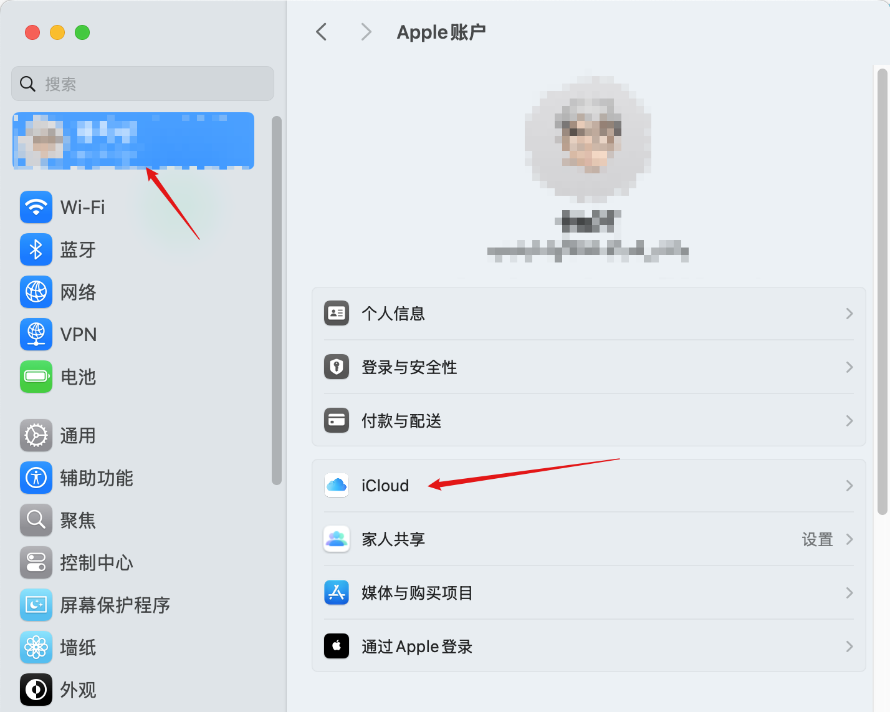

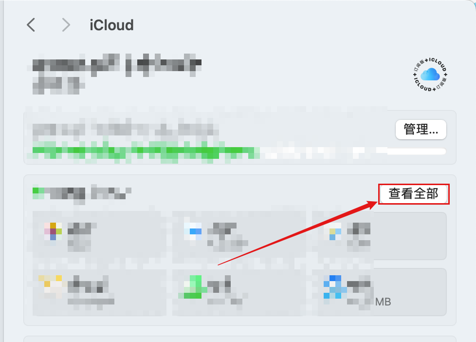

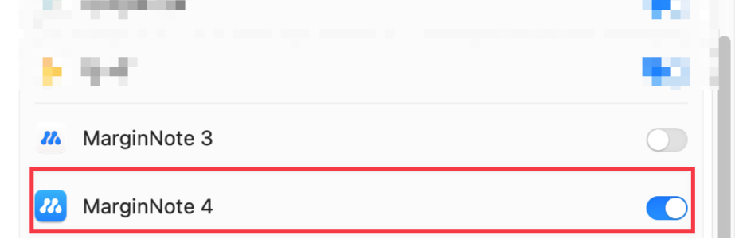

&#x20;2\. **在 MarginNote 设置中配置 iCloud 同步选项**

点击MN 设置-云同步，有如下选项可以进行选择：

> 💡建议iCloud和设备空间充足的用户开启以下设置：
> **自动为每个学习集开启、默认导入到iCloud文件夹、同步学习集时同步文档**
>
> 1. 笔记数据库**同步模式**：手动为每个学习集开启[^注释1]/自动为每个学习集开启[^注释2]/关闭[^注释3]
>    > 💡笔记数据库：包含所有的摘录、脑图、文档笔记本、 手写图层、学习集专属样式等笔记内容和设置，**不包含源文档 PDF**。
> 2. **笔记数据库同步缓存**：重置同步缓存[^注释4]
> 3. **文档**：默认导入到iCloud文件夹[^注释5]/同步学习集的同时同步文档 [^注释6]

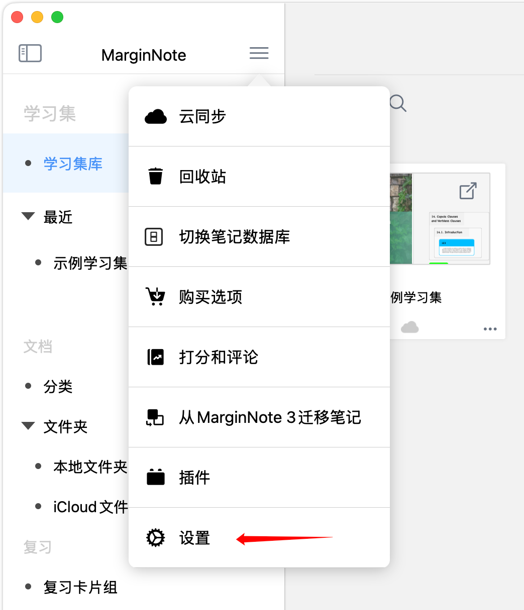

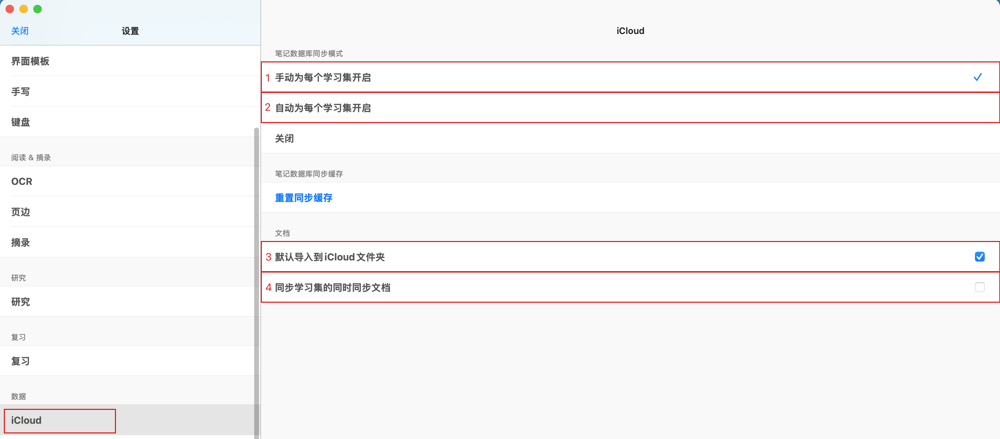

## 1.2 检查文档和学习集是否开启了云同步

### 1.2.1 检查学习集同步开关是否打开

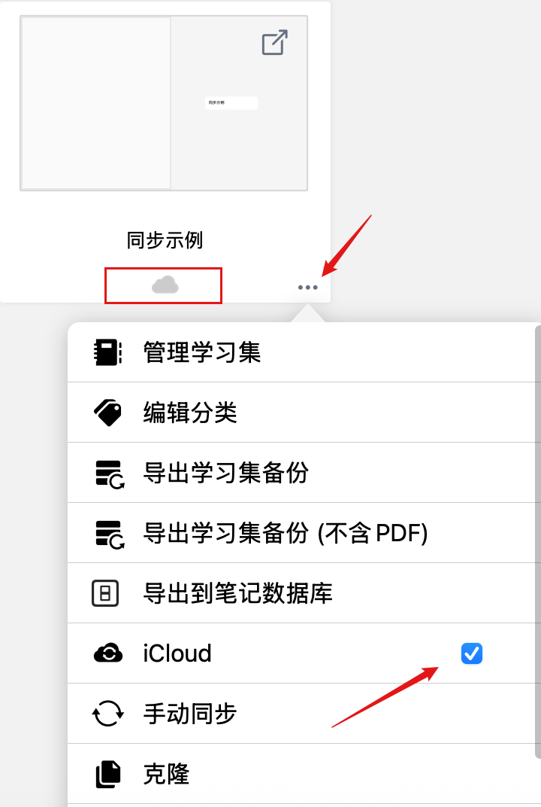

> 💡 没有图中红框标识的学习集不会进行同步。您可以在学习集右下角的"..."更多选项中，手动打开 iCloud 同步开关。

### 1.2.2 检查文档同步开关是否打开

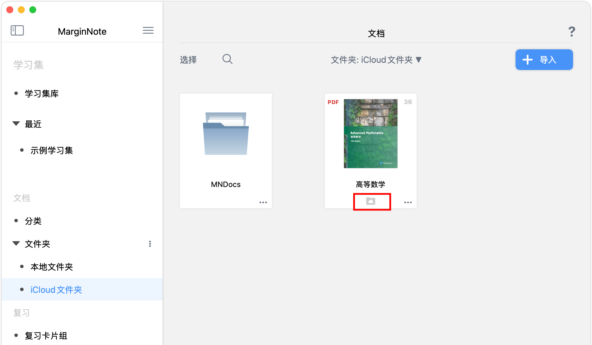

> 💡 没有图中红框标识的文档不会进行同步。您可以手动将文件移动到iCloud文件夹，或者**文档**：默认导入到iCloud文件夹[^注释5]/同步学习集的同时同步文档 [^注释6]（打开此开关后且文档有新增笔记，文档会进行同步）

## **查看笔记同步状态**

&#x20;完成上述设置后，您可以进入**云同步**界面查看同步进度。

- 如果部分学习集没有下载，可以点击学习集名称后的"···"，在弹出菜单中选择`从iCloud下载`，等待下载完毕即可获得云端的学习集数据。
- 当所有数据完全上传/下载完成后，界面会显示**数据库已同步**（数据库较大时，此过程可能需要较长时间）。

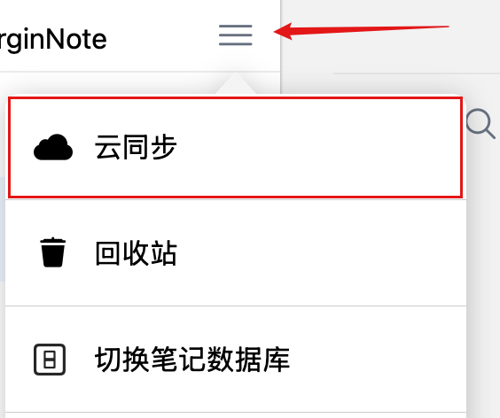

# 2 数据手动备份

> 💡可以将手动导出的备份文件存储到"文件"、保存到网盘（上传网盘前最好先将备份文件压缩，降低数据损坏的风险）或隔空投送到目标设备上，如果不进行储存操作，会留下缓存，可。

## 2.1 备份单个学习集/文档

> 💡学习集备份可以在首页或者学习集内进行备份，学习集备份包含学习集内的所有文档的笔记和脑图。
> 文档备份在首页进行备份，文档备份只包含当前文档的笔记。

### 2.1.1 学习集备份

> 💡当要分享的设备中有需要的文档时可以选择导出`导出学习集备份（不含PDF）`，体积更小(不含版本历史记录,无法恢复历史版本)

- 学习集备份有2种导出方式。首先在 MN首页找到需要导出的目标学习集，点击学习集右下角的`...`：
  - `导出学习集备份`：备份文件包含学习集内的笔记数据（含历史版本）和源文档。
  - `导出学习集备份（不含PDF）`：备份文件仅含笔记数据，不含源文档。
    > 💡mn的笔记数据并不保存在文档文件里
- 在学习集视图中，点击右上角`...`-`导出学习集备份`，即可导出当前学习集备份(含有历史版本)。
  > 💡若此时脑图界面为"子脑图"或"焦点分支"，可以导出当前子脑图或焦点分支的内容。

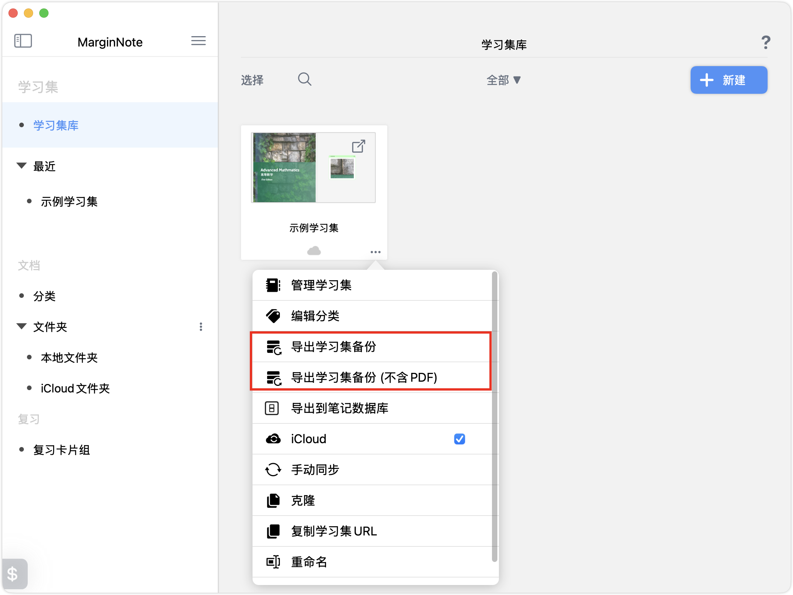

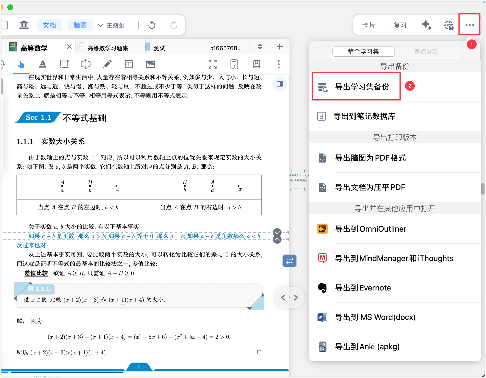

### 2.1.2 文档（文件夹）备份

在文档管理页面，文件夹和文档右下角的“...”更多按钮可以进行文档的备份与导出

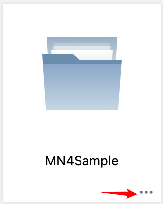

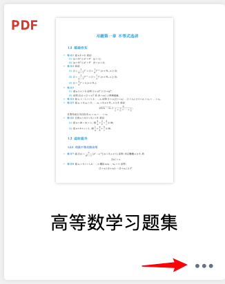

点击文档/文件夹右下角的“...”更多按钮后，在弹出的子菜单轻点`导出备份`/`导出文档备份`，即可导出对应文件夹或文档的“.marginpkg”备份文件。

> 💡此文件包含源文档、以及此文档上所做的笔记（卡片摘录、文本框、手写、图片等文档上的笔记，不包含脑图结构）

## 2.2 备份整体数据

> 💡`完整导出`是对当前所有数据的 " 快照 "，适用于以下场景：
>
> - **分享给他人：** 可将导出文件直接发送给其他人。对方导入时无需登录您的账号，方便快捷。
> - **资料归档：** 可将某一特定时期的学习资料整体打包归档。未来若需回溯，直接恢复该文件即可将整个数据库还原到保存时的状态。

完整导出共有3个选项:

1. **`导出内容（数据库 + 全部文档 + 历史版本）`**：包含所有笔记，数据库里的所有文档和学习集的历史版本。
2. **`导出内容（数据库 + 学习集文档）`**：包含**已经加入学习集的所有文件夹**（本地文件夹、iCloud文件夹、外部文件夹）的文档与所有笔记数据。**不包含**历史版本。
3. **`仅导出数据库`**：仅有笔记数据，无源文档
   > 💡 注意mn的笔记数据**不**储存在源文档文件里

点击其中一种，即可生成对应备份文件包，可发送到Files或其他app保存或者分享。

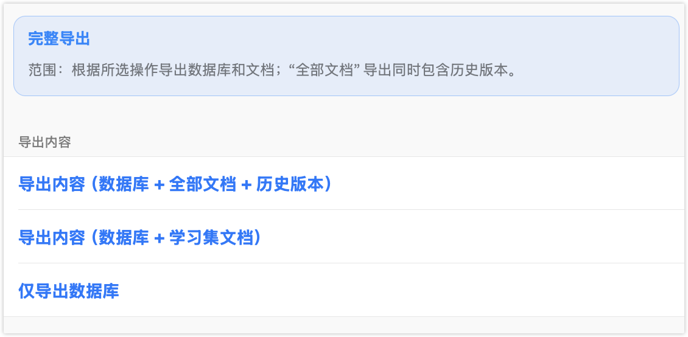

> 💡完整导出推荐使用情景
>
> | 选项                          | 空间占用 | 适用场景                                                  |
> | --------------------------- | ---- | ----------------------------------------------------- |
> | \`导出内容（数据库 + 全部文档 + 历史版本）\` | 高    | 本地空间充足，需要保存完整数据库，不想自己手动备份文档（即数据库里的文档都是自己需要的）          |
> | \`导出内容（数据库 + 学习集文档）\`       | 中    | 不需要版本历史，或者仅需要备份已经加入到学习集的文档（比如数据库里的有些文档目前不需要阅读，并且不想备份） |
> | \`仅导出数据库\`                  | 低    | 自己有所有文档的备份，并且不需要历史版本，使用这个选项可以大大减少备份文件的大小              |

# 3 数据自动备份

点击主页`设置-备份与恢复`，有 2 种备份方式：`完整导出`（手动）和`自动备份`（自动）。

> 💡**建议所有用户开启**，保证数据安全。
>
> 自动备份旨在最大程度地保障数据安全。它通过持续记录数据的历史版本，确保即使误操作或者数据错误，您的笔记也能完整恢复。

- **第一步：选择备份位置**
  - 点击主页`设置`-进入`备份与恢复`
  - 选择自动备份保存位置
  - 支持`WebDav服务器` 、`本地文件夹` 、`百度网盘` 、`Google云端硬盘`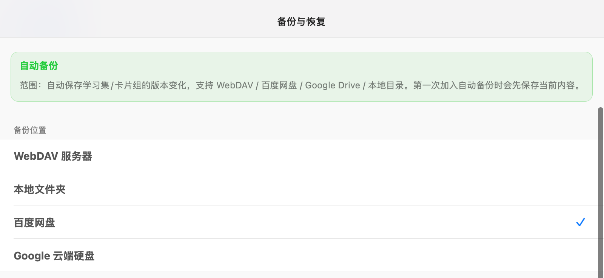
  > 💡存储位置详解
  >
  > | 存储位置       | 速度                                                              | 设备损坏笔记安全性 |
  > | ---------- | --------------------------------------------------------------- | --------- |
  > | WebDav服务器  | 上传和速度取决于使用的WebDAV服务商。 \&#x20; 本地NAS使用WebDAV速度取决于你的NAS硬盘速率和局域网带宽 | 高         |
  > | 本地文件夹      | 最快，取决于硬盘速率                                                      | 低         |
  > | 百度网盘       | 上传和下载速度取决于会员状态                                                  | 高         |
  > | Google云端硬盘 | 仅国外用户可用，取决于网络带宽                                                 | 高         |
- **第二步：设置备份频率**

  可选频率：仅手动 / 每小时 / 每 6 小时 / 每 12 小时 / 每天 / 每周
  > 💡建议设置为每小时
  > 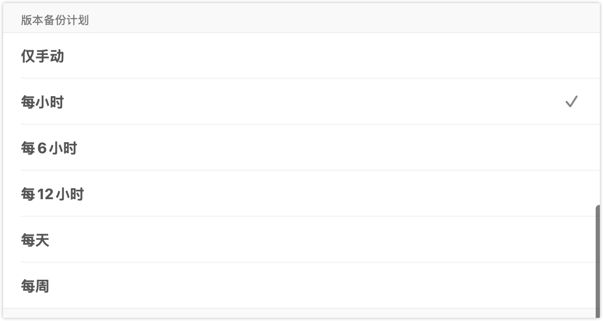
- **第三步：配置通知**
  - **`自动备份失败时通知`：** 开启后，备份失败时会收到通知，便于及时发现问题。
  - **`自动备份成功时通知`：** 开启后，每次备份成功也会收到通知。
  > 💡仅在 App 未运行时，定时执行的自动备份会发送通知。手动备份和恢复的结果直接显示在此页面内。
- **第四步：是否包含原始文档（PDF/视频）**

  自动备份内容中可选择是否包含原始文档（PDF/视频）。
  - **开启（默认）：** 备份内容同时包含原始文档文件。
  - **关闭：** 自动备份仅保存版本数据和笔记对象。在新设备恢复时需要原始 PDF/视频文件已经存在或重新导入。
- **第五步：执行备份操作**
  1. 点击`立即开始自动备份`

     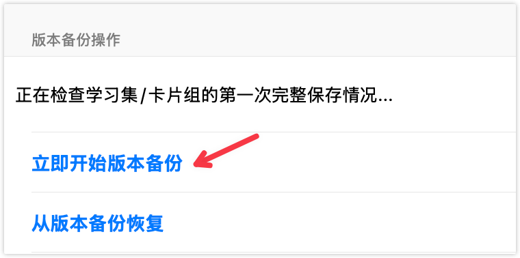
  2. 如果是第一次备份或者备份位置没有会有提示
     > 💡此处建议选择`补齐第一次完整保存`
     >
     > 否则只会备份此设备`版本库`里的备份
     >
     > 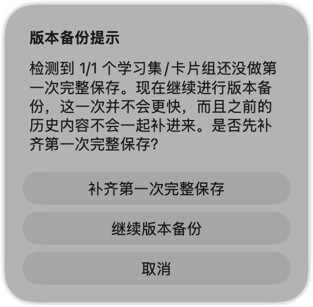
     > 页面底部会显示**上次备份时间及状态**（成功/失败），可随时确认备份是否正常运行。

# 4 从备份恢复数据

## 4.1 从完整导出文件恢复

当需要恢复以前备份的笔记时，使用MarginNote打开完整导出文件即可进行数据恢复

- `替换`：替换当前数据库
- `新建笔记数据库`：max用户可以新建一个笔记数据库打开备份文件
- `合并`：将当前数据库和要导入的数据库进行合并
  > 💡 数据库中相同的笔记和不同的笔记都会保留（相同的笔记会有两份），学习集和文档备份同理。

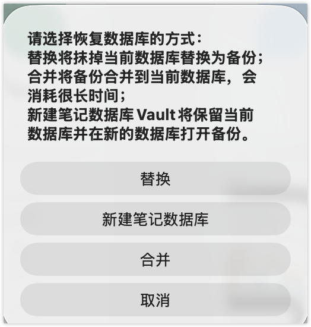

## 4.2 从自动备份恢复

进入`设置`-`备份与恢复`-点击`从自动备份恢复`，选择要恢复的版本。

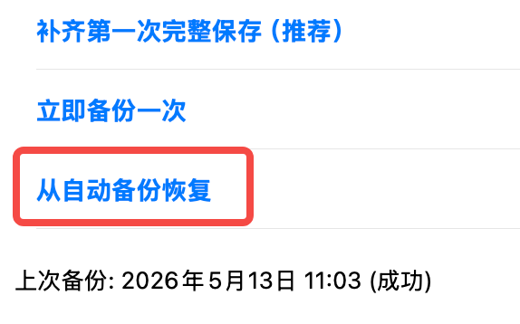

## 4.3 其他备份方式

### 4.3.1 连接电脑备份

- 拥有Mac或者Pc设备的学习者，可以通过Finder或iTunes来快速备份和恢复所有笔记数据。
  1. 使用自带USB数据线，将iPad连接到电脑。
  2. 点击"信任"，并输入设备密码。
  3. 在Finder中，找到并点击自己的设备。
  4. 在文件里，找到并点击"MarginNote4"。
  5. 在"MarginNote4"里，找到一个名为"MN4NotebookDatabase"的文件夹。
- 备份：拖拽出文件夹，内涵全部笔记数据。（不含PDF）
- 恢复：拖拽出文件夹，将此文件夹下的splite等文件依次替换放入即可。

### 4.3.2 系统备份

苹果系统的iCloud功能可以备份设备中各项软件的数据，若iCloud空间充足，学习者可打开设置软件，点击自己的apple id，点击"iCloud"，管理iCloud的软件情况。

1. 在"使用iCloud的APP"栏点击"显示全部"，然后下拉找到MarginNote4，打开使用开关。
2. 在"设备备份"栏点击"iCloud云备份"，在"所有设备备份"栏找"此ipad"（若没有，打开同页面的"备份此ipad"开关），等待app列表加载显示以后，打开MarginNote4的app备份开关。

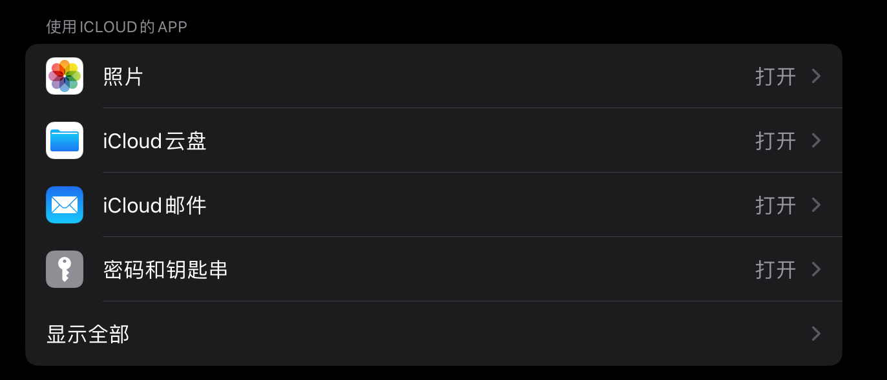

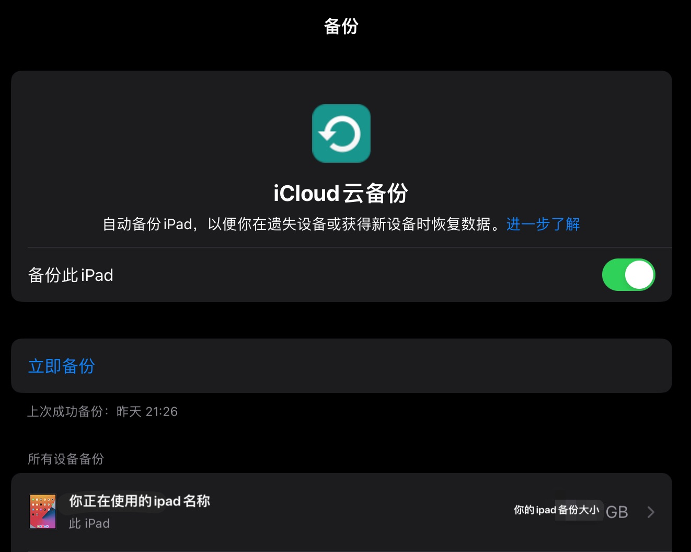

# 5 版本库与历史版本

## 5.1 版本库功能介绍

> 💡电子笔记易于误删，恢复笔记的功能是学习软件必备的"后悔药"，除了[自动备份](https://www.wolai.com/qU6nwa4s6GCBuTDsjs9oeu#n4M1u1ecibzhSge9EBQvRc "自动备份")，学习者还需掌握`版本库`功能的用法。由于版本库的恢复能力远强于回收站功能，回收站功能目前默认关闭，如果需要打开，请在`设置`-`备份与恢复`的页面最底部打开`回收站（旧版）`

1. 点击主页侧边栏菜单-`版本库`，进入版本库页面

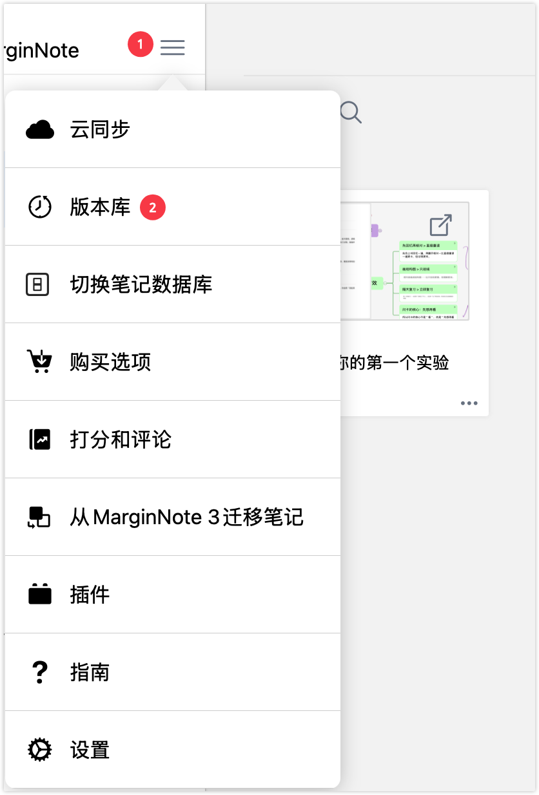

1. 版本库会存储所有学习集和文档笔记本的版本历史，点击可以查看所保存的历史版本

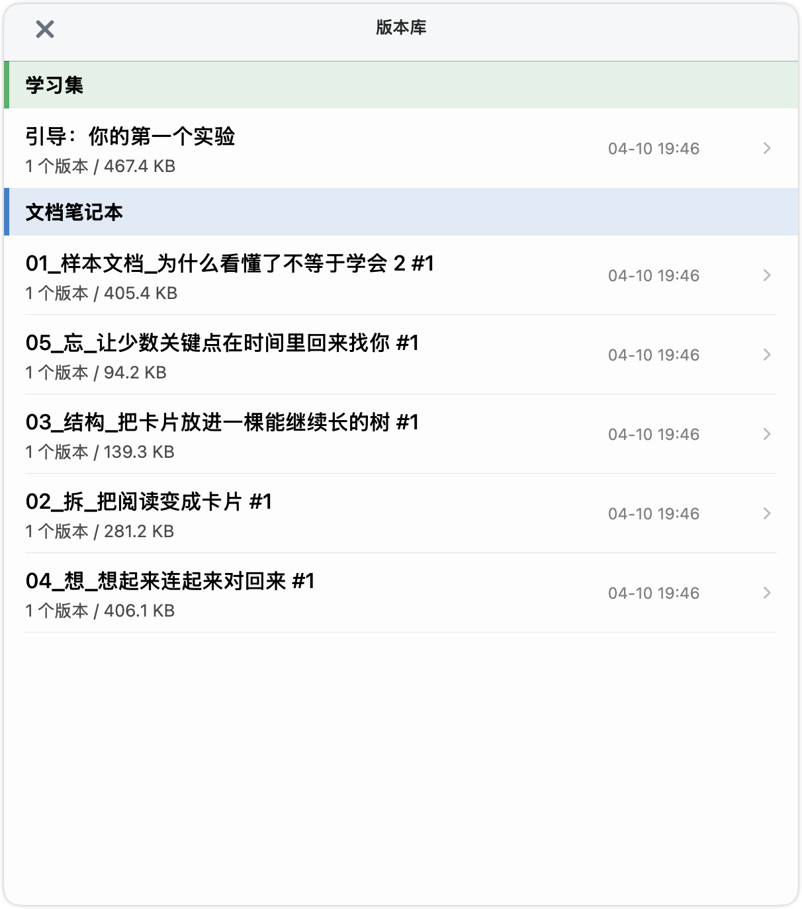

3\. 通过点击选择对应版本，然后可以点击`恢复`，将学习集/文档笔记本恢复到此版本状态。也可以点击`删除版本`去删除不需要的历史版本，需要批量操作时可以点击`选择`去多选历史版本。

- `自动创建历史版本`：勾选后，会在**退出**学习集/空闲时自动保存版本历史
  > 💡退出指的不是清除后台退出软件，需要点击MN首页按钮退出才会触发

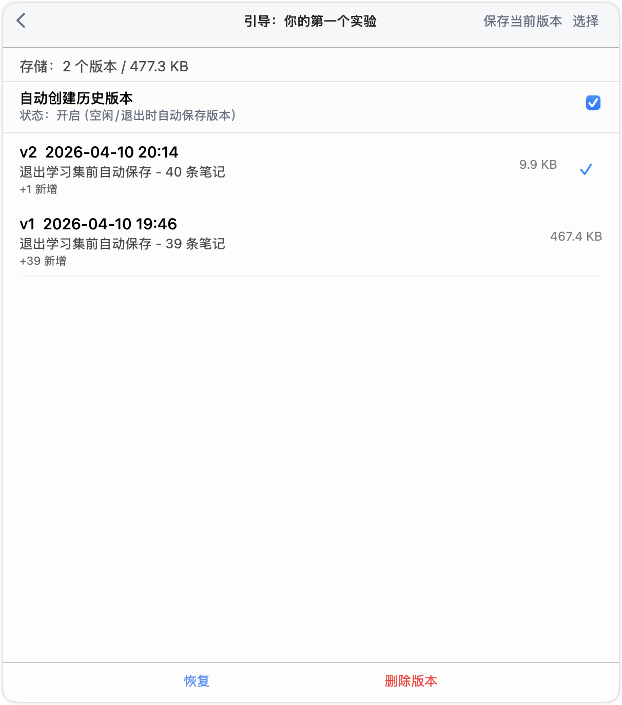

## 5.2 管理与查看历史版本占用

在软件设置里-`存储与缓存`里点击`管理历史版本存储`可以查看笔记和历史版本的存储空间占用情况

- `当前资料库数据`：所有笔记的空间占用
- `历史版本`：之前历史版本的空间占用
- `备份文档`：数据库里所有文档的大小

1. 点击`清理`可以快速清理所有历史版本
2. 点击内容可以`查看历史版本`或者`删除历史版本`

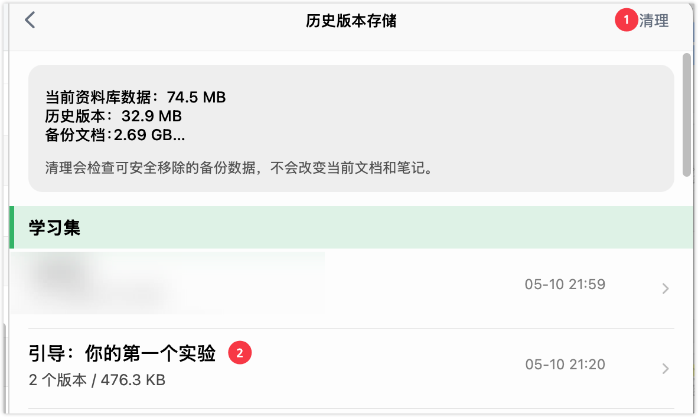

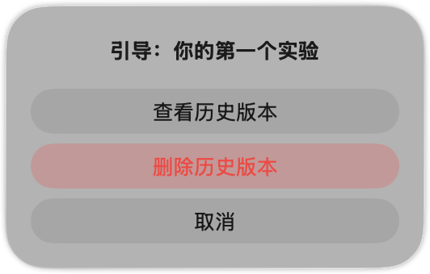

## 5.3 直接查看某个学习集的历史版本

除了`版本库`，学习集也有单独的版本历史管理入口，用法与版本库完全一致。类比数学中的“集合”概念，可以认为`历史版本`是`版本库`的一个“子集”。

点击学习集右下角`。。。`→`历史版本`，即可进入该学习集的历史版本界面。

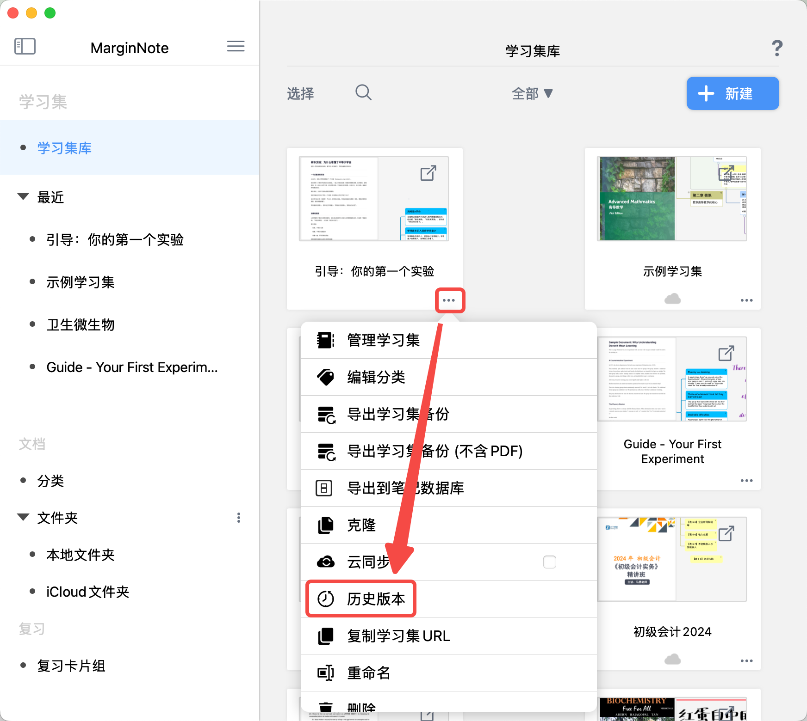

# 6 缓存

缓存中包含缩略图、OCR文字索引以及部分备份文件。

- 管理缓存：点击`设置`-`数据`-`缓存`，点击`清除缓存以释放存储空间`，确认清除，即可清除缓存以释放存储空间。

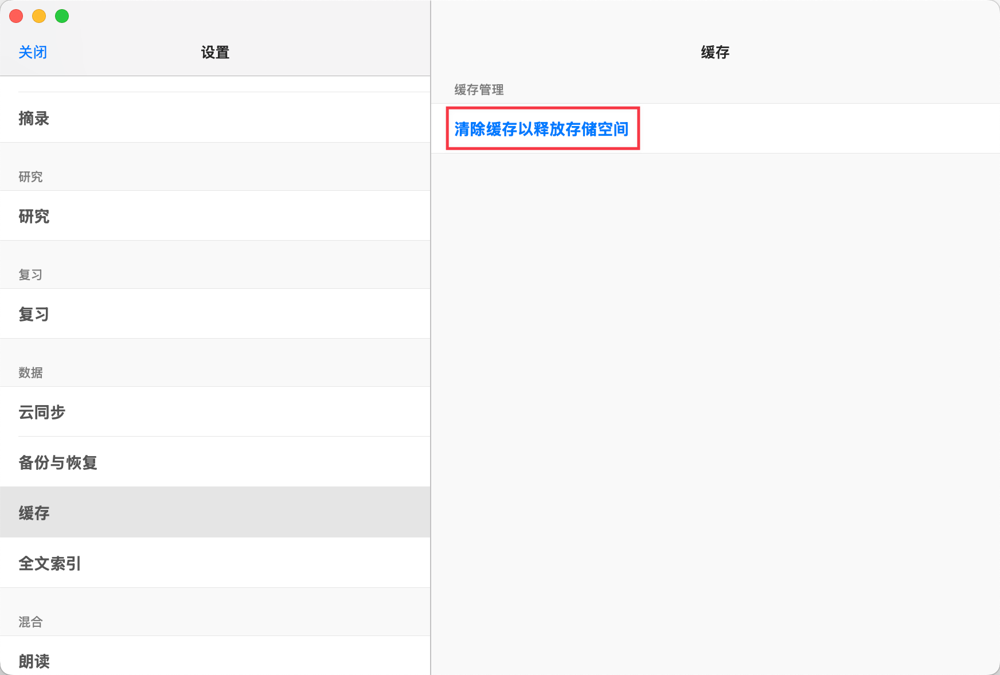

> 💡该操作无法撤销，数据将被永久删除。
>
> - 如果笔记完整，没有问题的情况下，需要释放存储空间，可以清理。但是部分内容需要重新索引可能短期内会发烫。
> - 如果出现笔记丢失情况，不建议清理缓存，并尽快联系工作人员（<service@marginnote.com>）寻求支持，并[备份笔记数据库](https://www.wolai.com/qU6nwa4s6GCBuTDsjs9oeu#dNUB5QSR87TmR3voNLj3Dr "备份笔记数据库")。

# 7 回收站（4.3.0及以后版本已升级为版本库，不建议用）

## 7.1 如何启用回收站

MN 设置-`备份与恢复`-开启`回收站（旧版）`

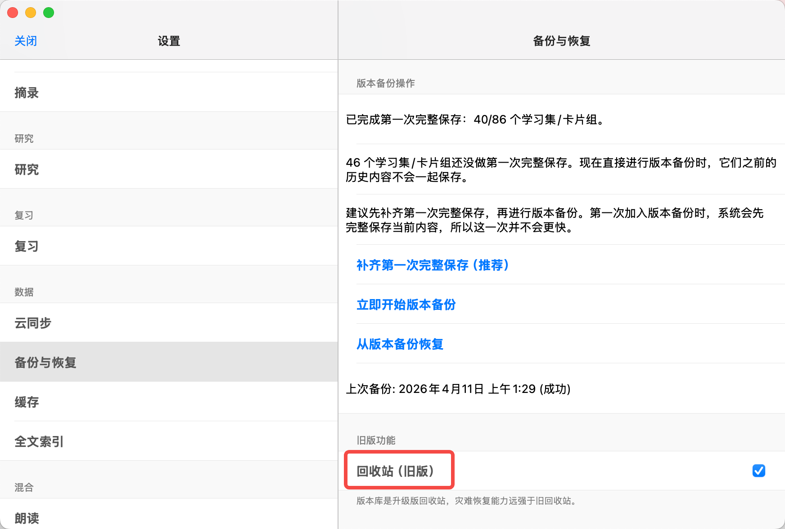

## 7.2 回收站相关用法

在主界面，轻点"`更多`"-"`回收站`"，进入回收站视图。卡片、文档笔记、学习集、复习卡片组都有对应的栏目，删除的笔记按照时间顺序排列在回收站中，学习者可以搜索自己想要恢复的笔记项目，选中进行操作。

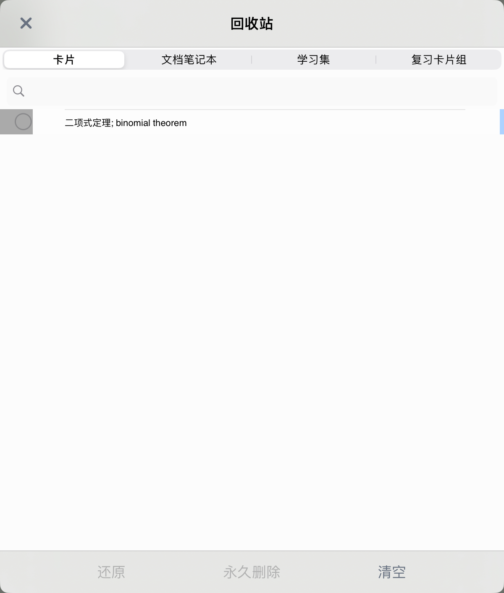

### `7.2.1 还原`

点击该项，将恢复选中的项目。

### `7.2.2 永久删除`

点击该项，将永久删除选中的项目。

> 💡该操作无法撤销，数据将被永久删除。

### `7.2.3 清空`

点击该项，可选择清空回收站所有内容或清空当前栏目类别的内容，也可以取消操作。

> 💡该操作无法撤销，数据将被永久删除。

[^注释1]: 新建立的学习集将不会自动开启iCloud同步，需要手动开启（参考下面），原本设定为开启iCloud同步的学习集不会被关闭同步。

[^注释2]: 自动为每个学习集开启iCloud同步，无论是原有学习集和新建学习集都会开启

[^注释3]: 关闭所有学习集的iCloud同步，学习集变化将不会对iCloud云端已保存的学习集产生影响。

[^注释4]: 重置同步缓存将导致重新同步当前设备的所有数据，可能会需要很长的时间。一般不需要点击，同步不了优先查看iCloud同步常见问题

[^注释5]: 软件外导入的文件将默认导入到软件的iCloud文件夹位置

[^注释6]: 开启该项会在文档有新增笔记时同步本地文件夹的文档，否则默认只会同步iCloud文件夹中的文档。
