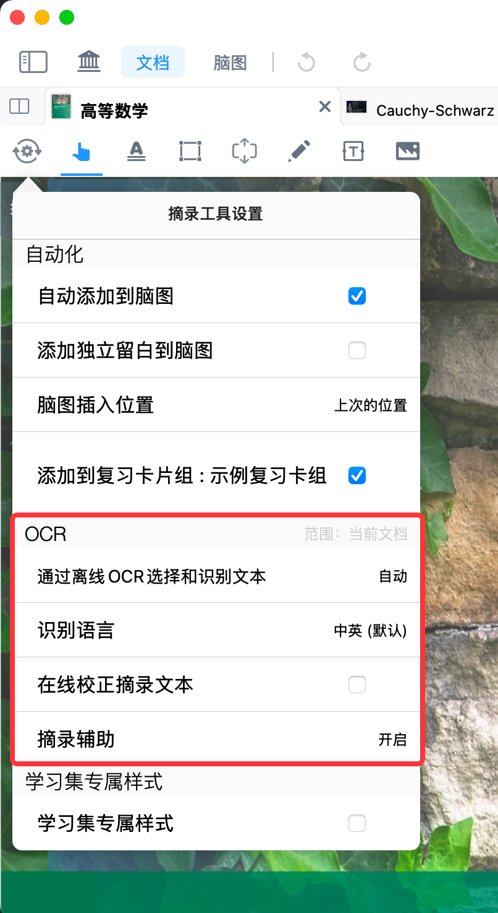
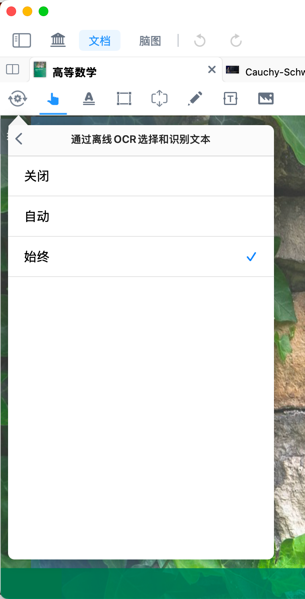
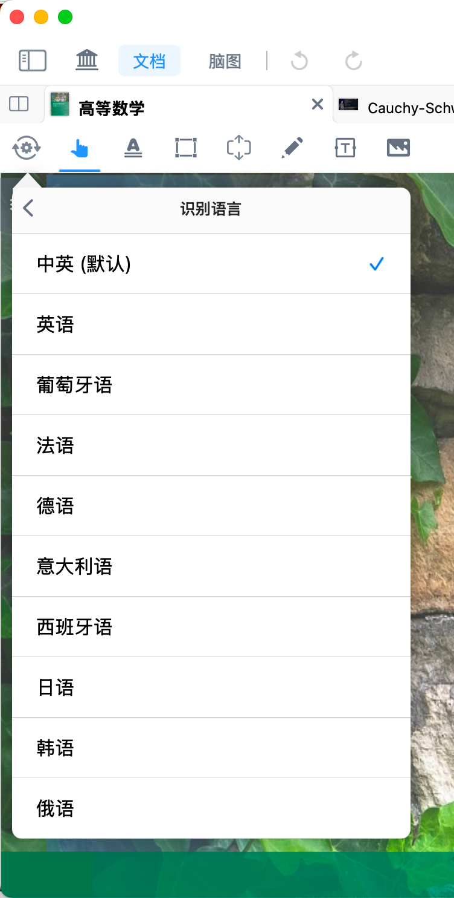
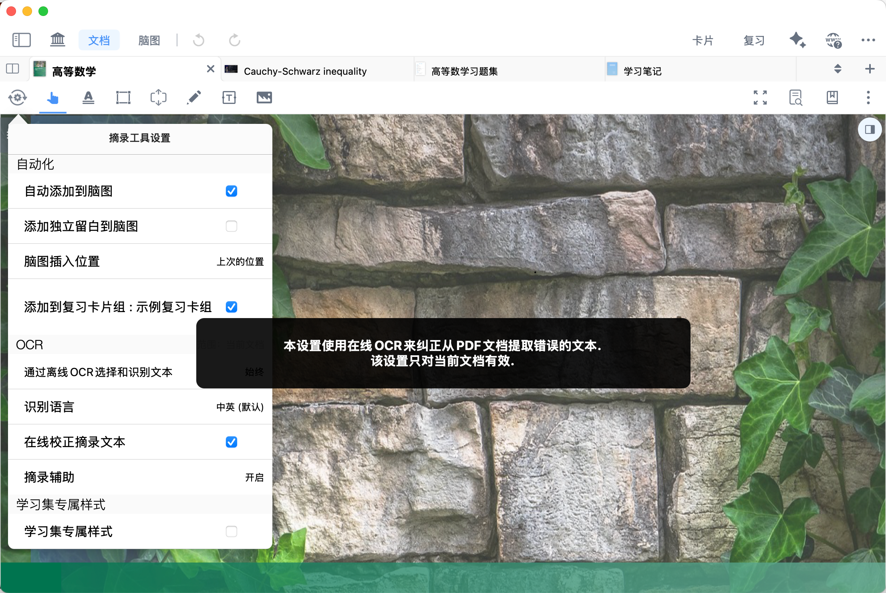
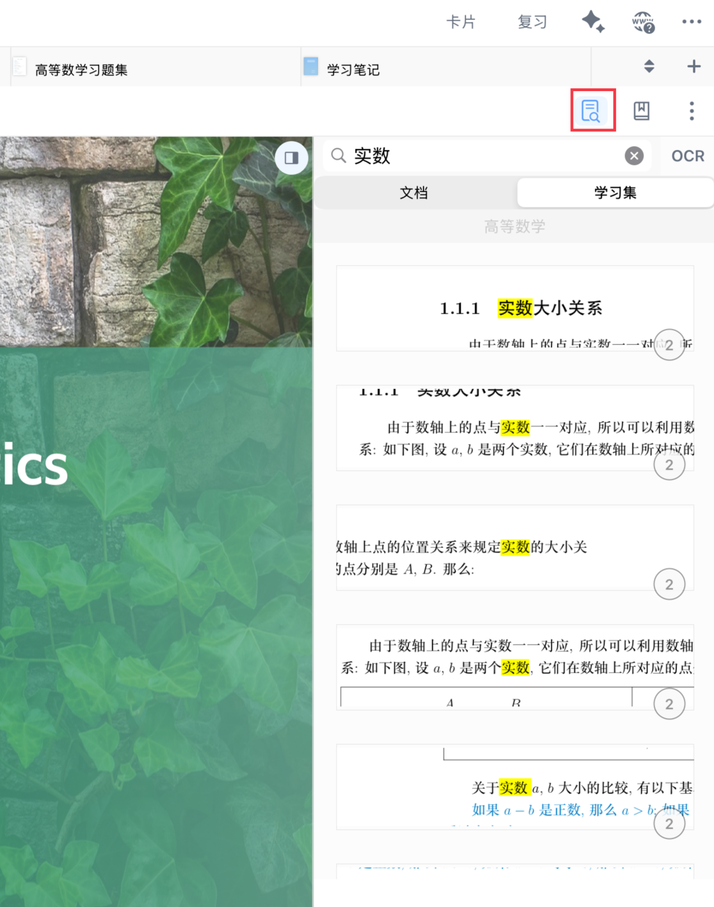
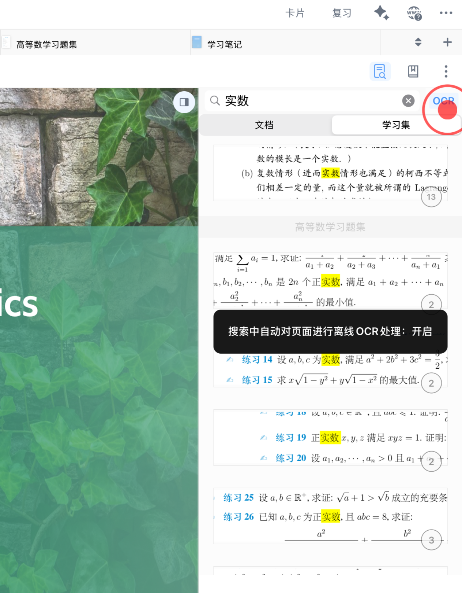
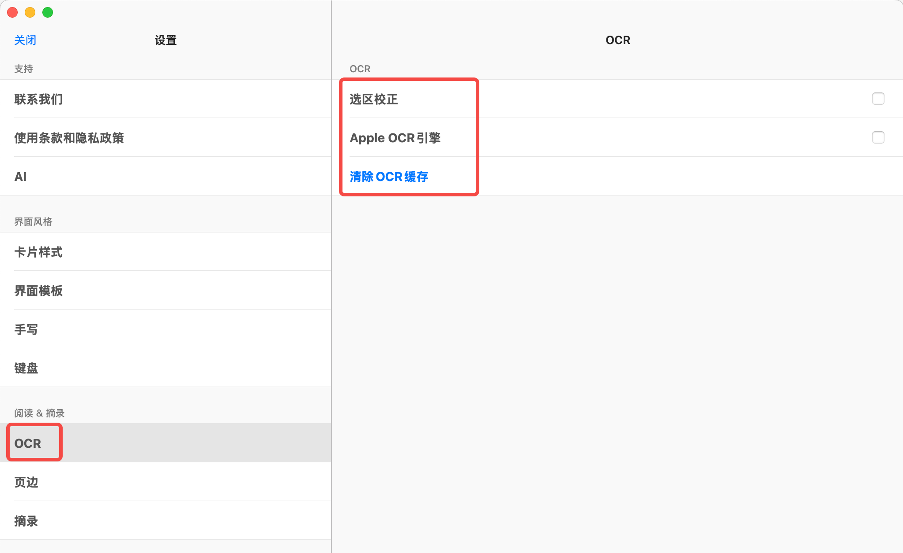
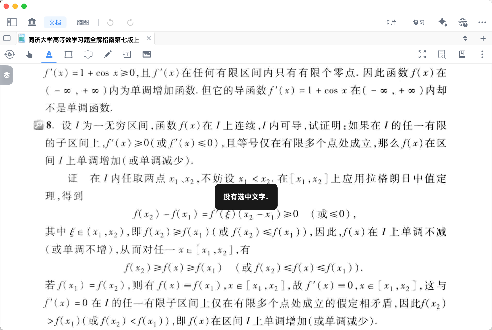

# 检索①：全文 OCR +搜索定位，扫描版书籍也可畅享阅读

> 💡**OCR 功能是什么 ？**
>
> 你是否遇到过这些问题：
>
> - 扫描版PDF只能看不能搜索；
> - 选中文本经常错位；
> - 搜索不到明明在页面里的词。
>
> OCR 功能将解决“**能搜、搜准、能定位**”这三件事，即光学字符识别，把图片、扫描PDF中的文字图像，转换为可选中、可编辑、可检索、可复制复用的数字文本的技术。

> 💡**MarginNote 4 OCR核心作用是什么 ？**
>
> 整体而言，是把当前无法直接编辑的扫描件、图片文档，变成可直接学习、标注、整理与复用的电子文本，提升资料处理效率。
>
> MarginNote 4 OCR 分为离线OCR与AI OCR两类，满足不同场景需求：
>
> • 离线OCR：无需联网即可使用，支持关闭/自动/始终三种识别模式，可智能识别扫描文档文字，让无网络环境也能正常摘录、标注、检索文档内容。
>
> • AI OCR：需要联网使用，识别能力更强，支持全语种与表格、公式高精度识别，进一步提升准确率。

# 1 OCR识别功能（对当前文档静默生效）

[摘录工具设置](https://www.wolai.com/hgMYX7XCNpvGAMxgBfLAQE "摘录工具设置")

点击`摘录工具设置`（如上方图标所示）→ 找到`OCR`设置面板：

- 通过离线 OCR 选择与识别文本
- OCR 识别语言支持
- 在线校正摘录文本
- 摘录辅助

> 💡以上OCR设置**仅对当前文档生效**，每个文档都可以单独启用不同的 OCR设置。

## 1.1 通过离线 OCR 选择与识别文本

`离线OCR`功能提供`关闭`、`自动`、`始终`3种工作模式，用户可根据文档类型灵活选择：

### 1.1.1 关闭

不启用离线 OCR 选择与识别文本功能。

> 💡适用于当前文档超高清、原生文本层完整、无需OCR增强时。

### 1.1.2 自动（默认推荐）

若 PDF 包含原生文本层，**优先使用文档自带文本层**；若为无文本层的扫描版 PDF，自动启用离线 OCR 进行文本识别。

> 💡适用于绝大多数文档，系统自动判断是否启用OCR。

### 1.1.3 始终

无论扫描 PDF 是否存在原生文本层，均\*\*强制使用离线 OCR \*\*进行文本识别。

> 💡适用于原生文本层质量差、选区错位、搜索不准时。
>
> [ 💡FAQ| 文字识别结果乱码/错字 - 小红书 ❓使用MarginNote 4 文本摘录、翻译、AI 目录等功能时，如发现文字识别乱码或常有错字，可按以下步骤操作： ✍点击摘录工具设置⚙️ - 通过离线 OCR选择和识别文本，将选项切换为「始终」，然后重新尝试文本摘录等功能 ⚠️温馨提示：“始终”识别效果最好，但会增加耗电 #marginnote #marginnote4#MarginNote常见问题解答 #MN猫猫#MarginNote文字识 https://www.xiaohongshu.com/explore/694b8dec000000001e00dd3a?xsec\_token=ABvJB2ohnywR7hTBVOhgz604UhdXP\_tAYYEbtqVkV7iys=\&xsec\_source=pc\_user](https://www.xiaohongshu.com/explore/694b8dec000000001e00dd3a?xsec_token=ABvJB2ohnywR7hTBVOhgz604UhdXP_tAYYEbtqVkV7iys=\&xsec_source=pc_user " 💡FAQ| 文字识别结果乱码/错字 - 小红书 ❓使用MarginNote 4 文本摘录、翻译、AI 目录等功能时，如发现文字识别乱码或常有错字，可按以下步骤操作： ✍点击摘录工具设置⚙️ - 通过离线 OCR选择和识别文本，将选项切换为「始终」，然后重新尝试文本摘录等功能 ⚠️温馨提示：“始终”识别效果最好，但会增加耗电 #marginnote #marginnote4#MarginNote常见问题解答 #MN猫猫#MarginNote文字识 https://www.xiaohongshu.com/explore/694b8dec000000001e00dd3a?xsec_token=ABvJB2ohnywR7hTBVOhgz604UhdXP_tAYYEbtqVkV7iys=\&xsec_source=pc_user")

## 1.2 OCR 识别语言支持

- 默认识别语言：中英双语识别，适用于中英混排资料。
- 支持OCR 识别语言：英语、葡萄牙语、法语、德语、意大利语、西班牙语、日语、韩语、俄语。

> 💡当出现外语识别/翻译结果异常时，先检查语言设置是否匹配文档
>
> [ 💡FAQ｜外语识别/翻译错误怎么办 - 小红书 用 MarginNote4 学习和翻译外语材料时，若遇到文本识别/翻译错误，可先检查“识别语言”是否正确选择： ✍️Step 1 ：点击“摘录工具设置“ ✍️Step 2 ：下滑找到“识别语言”选项并点击进入 ✍️Step 3 ：在弹出的语言列表中，选择需要的识别语言（如英语、日语、韩语等），即可完成设置 	 按前述方法操作后，若问题还不能解决，再按以下步骤操作： 在“摘录工具设置”中，点击“离线 https://www.xiaohongshu.com/explore/69a582e80000000016008610?xsec\_token=ABCuzs6R6m8OWU4xUzFzR8fUb-NyzYY2TRgq7b9oAni9I=\&xsec\_source=pc\_user](https://www.xiaohongshu.com/explore/69a582e80000000016008610?xsec_token=ABCuzs6R6m8OWU4xUzFzR8fUb-NyzYY2TRgq7b9oAni9I=\&xsec_source=pc_user " 💡FAQ｜外语识别/翻译错误怎么办 - 小红书 用 MarginNote4 学习和翻译外语材料时，若遇到文本识别/翻译错误，可先检查“识别语言”是否正确选择： ✍️Step 1 ：点击“摘录工具设置“ ✍️Step 2 ：下滑找到“识别语言”选项并点击进入 ✍️Step 3 ：在弹出的语言列表中，选择需要的识别语言（如英语、日语、韩语等），即可完成设置 	 按前述方法操作后，若问题还不能解决，再按以下步骤操作： 在“摘录工具设置”中，点击“离线 https://www.xiaohongshu.com/explore/69a582e80000000016008610?xsec_token=ABCuzs6R6m8OWU4xUzFzR8fUb-NyzYY2TRgq7b9oAni9I=\&xsec_source=pc_user")

## 1.3 在线校正摘录文本

`在线校正摘录文本`依托于百度 OCR 引擎，通过在线 OCR 识别能力，对当前摘录文本进行精准校正，提升文本识别准确性。

> 💡建议在以下情况开启在线校正：断词严重、错字频繁、专有名词识别错误或公式附近的文本混乱问题。

## 1.4 摘录辅助

MarginNote4现已接入大模型用于AI 文档排版，支持对文档（尤其论文）的标题、图片、公式等元素的排版位置进行快速识别、摘录。

详见[自动生成脑图①：使用AI模型一键摘录](https://www.wolai.com/91ptxv4wkpB2RSq8GQkAtc "自动生成脑图①：使用AI模型一键摘录")

> ⚠️温馨提示：摘录辅助功能会增加耗电功率，并在部分低性能设备上易导致闪退，建议确有需要时再开启

# 2 AI OCR 识别功能（能力更强，仅在摘录时生效）

> 💡 AI OCR的优势：
>
> - 识别能力更强，支持全语种识别；
> - 可对表格、公式、复杂排版文本实现更高精度识别与排版。

详情请参见 ：[AI OCR： 摘录→识别→知识结构化，一步到位](https://www.wolai.com/hQ5STjDE5P7362vywGNa1U "AI OCR： 摘录→识别→知识结构化，一步到位")

# 3 OCR检索功能

[全文检索](https://www.wolai.com/hXbEqYYg3Apu4MidwcN1a4 "全文检索")

点击`全文检索`按钮`（`如上方图标所示），在搜索栏内键入关键词，便可在当前文档或当前学习集中**对文档自带的文字层**进行文本检索。

开启 `OCR` 后，MN4会调用离线 OCR 能力：即使是不带文字层的扫描版PDF，也可以搜索到书上具体的文字内容，并定位到相应的页码。

> 💡如果你不确定关键词，但知道大致章节位置，建议切换[检索②：查看文档目录/缩略图/书签/手写标注/卡片](https://www.wolai.com/8PoZfbSRai6owkvzpttZAE "检索②：查看文档目录/缩略图/书签/手写标注/卡片")导航。

# 4 OCR 高级设置

## 4.1 选区校正

对文档选区进行智能校正，解决文本层与扫描文档选区错位问题，提升文本选取与识别的精准度。

## 4.2 Apple OCR 引擎

支持切换至 Apple OCR 引擎，可针对特定类型文档优化识别效果，适配不同场景需求。

## 4.3 清除 OCR 缓存

用于清理本地 OCR 缓存数据，解决因缓存异常导致的文本识别失败问题。

> ❗**常见OCR识别问题：提示没有选中文本 / 识别失败？**
>
> 
>
> 1. 若是扫描版PDF：先确认离线OCR已开启；
> 2. 若文本乱码：检查语言是否匹配；
> 3. 若偶发失败：清理OCR缓存并重试。

# 5 常见问题

1. 为什么搜索不到明明在页面里的文字？

   优先检查离线OCR是否开启、识别语言是否匹配、是否需要清理OCR缓存。
2. &#x20;OCR 识别的始终模式是不是一定更好

   不是。始终模式更耗电，建议只在识别异常或文本层质量差时使用。
3. 检索①和检索②先看哪个？

   按目标选。

   要检索特定关键词，看[检索①：全文 OCR +搜索定位，扫描版书籍也可畅享阅读](https://www.wolai.com/rpmCakup76GuHCF6N4Ns5c "检索①：全文 OCR +搜索定位，扫描版书籍也可畅享阅读")；

   要按章节和阅读痕迹找内容，看[检索②：查看文档目录/缩略图/书签/手写标注/卡片](https://www.wolai.com/8PoZfbSRai6owkvzpttZAE "检索②：查看文档目录/缩略图/书签/手写标注/卡片")。
4. 清除OCR缓存会不会丢笔记？

   不会删除你的笔记内容，主要是重建OCR相关缓存数据。
