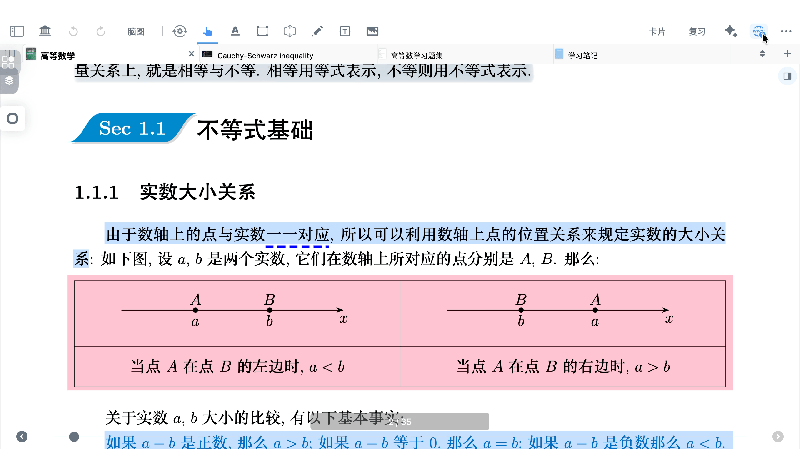
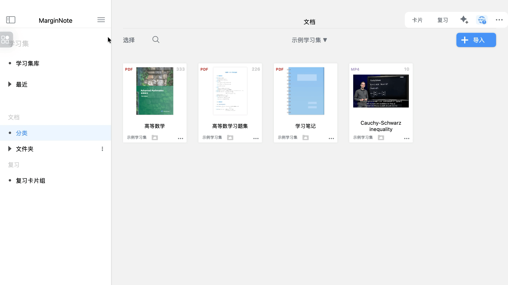
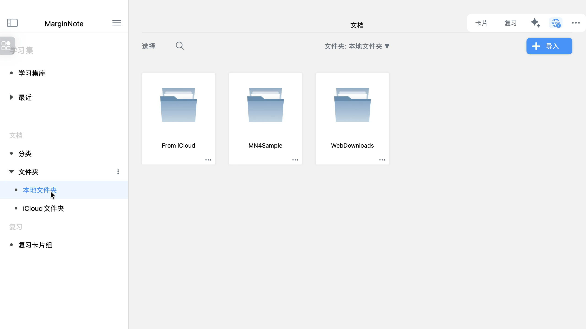
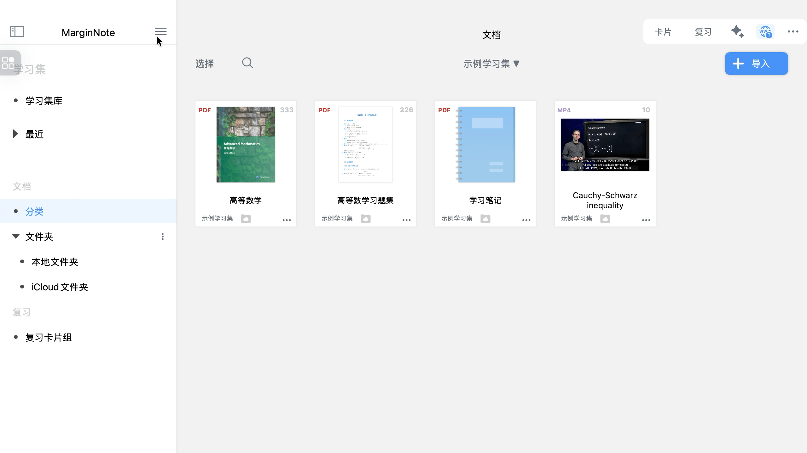

# 研究浏览器视图

# 1 功能定位

[研究](https://www.wolai.com/7AXUEU5B5UUuEGW1m7oZ9z "研究")

`研究浏览器`是 MarginNote 4 内置的边读边查工具，支持在阅读文档和制作脑图时快速调用多类型搜索功能，同步实现网页转存、跨内容对照，无需切换外部应用即可完成知识补充与验证，核心适配学术研究、深度阅读等场景。

# 2 核心功能模块

## 2.1 八大搜索工具

- `视频搜索`：一键检索B站和YouTube相关视频资源，无需切换外部平台。
- `字典搜索`：快速查询字词释义，适配多语言翻译需求。
- `文本搜索`：针对选中内容进行全网关键词检索。
- `学术搜索`：对接学术数据库，精准查找论文、文献资源。
- `问题搜索`：以问答形式获取针对性解答。
- `图片搜索`：基于图片内容反向检索相关资源。
- `翻译功能`：支持多语言互译，可自定义搜索URL适配专属翻译工具。
- `PDF搜索`：定向检索网络上的相关PDF文档资源。

## 2.2 网页转存与深度加工

- 支持将有用的网页直接转化为PDF格式，下载至本地文档库，并自动添加到当前学习集，作为补充学习材料。
- 转存后的PDF可直接使用批注、摘录、脑图生成等功能深度加工。

## 2.3 多窗口联动对照

- 支持文档与研究浏览器分屏对照，一边阅读一边查阅资料。
- 兼容多文档双文对照，构建闭环学习流。

# 3 基础使用步骤

## 3.1 打开研究浏览器

打开研究浏览器有两种方法。

- 方式一：阅读文档时，选中目标文字/摘录，弹出菜单栏，点击`研究浏览器`图标，唤起浏览器。
- 方式二：通过学习集右上角>`研究浏览器`手动开启。

## 3.2 选择搜索工具与检索

- 选择搜索工具：唤起浏览器后，顶部将显示八大搜索工具图标，点击对应图标即可启动相关检索（如点击「学术搜索」可查找专业文献）。

- 检索操作：选中文字后5秒内点击研究浏览器图标，将直接检索选中内容；未选中文本时，可手动输入关键词搜索。

- 网页前进与回退操作：研究浏览器底部导航栏，左侧第一个为「回退」按钮、第二个为「前进」按钮，支持当前搜索会话内的网页历史记录切换。

- 结果处理：支持在新窗口打开链接、外部浏览器打开、复制链接，或直接转存为PDF导入文档库。

- 支持自定义搜索引擎排序：进入软件`设置`，在`研究`栏调整工具显示顺序，常用功能前置。

## 3.3 窗口模式切换

- 锁定结果：点击研究浏览器页面窗口底部锁定图标，保持当前搜索内容；再次点击解锁，自动同步新选中文本。
- 分屏对照：原生支持文档与浏览器分屏。

## 3.4 网页转存与导入

- 单页转存：在目标网页点击右上角`下载`，自动转为PDF并存入`WebDownloads`文件夹。
- 定位文件：转存后可在`文档`>`WebDownloads`文件夹中找到文件，支持移动、重命名、添加标签。

# 4 进阶自定义配置

## 4.1 自定义搜索引擎（含学术引擎示例）

- 核心原理：替换搜索引擎URL中的关键词为占位符%s，系统自动填充检索内容。
- 操作路径：`设置`>`研究`> 选中目标搜索类型 >`自定义URL`。
- 保存生效：输入URL后点击确定，即可在搜索工具栏中调用自定义引擎。

- 实用模板（直接复制使用）：
  - 百度学术：[https://xueshu.baidu.com/s?wd=%s](https://xueshu.baidu.com/s?wd=%s "https://xueshu.baidu.com/s?wd=%s")
  - 谷歌学术：[https://scholar.google.com/scholar?hl=en\&q=%s](https://scholar.google.com/scholar?hl=en\&q=%s "https://scholar.google.com/scholar?hl=en\&q=%s")
  - 知网：[https://kns.cnki.net/kns8s/defaultresult/index?crossDbcodes=CJFQ,CDFD,CMFD,CPFD,IPFD\&korder=SU\&kw=%s](https://kns.cnki.net/kns8s/defaultresult/index?crossDbcodes=CJFQ,CDFD,CMFD,CPFD,IPFD\&korder=SU\&kw=%s "https://kns.cnki.net/kns8s/defaultresult/index?crossDbcodes=CJFQ,CDFD,CMFD,CPFD,IPFD\&korder=SU\&kw=%s")

## 4.2 插件安装与配置（MN Browser）

MN Browser 是官方推荐的研究浏览器增强插件，可突破原生功能限制——解决窗口固定、视频适配等痛点，支持分屏布局等功能，大幅提升 “边查边学” 的操作灵活性与场景适配性，是学术研究、多源内容整合的高效工具。

- 前置要求：需先安装依赖插件MN Utils，否则插件无法运行。
- 插件安装步骤详见：[用插件高效处理 MN工作](https://www.wolai.com/coBAV38vuTcUbTdHwnNNL5 "用插件高效处理 MN工作")
