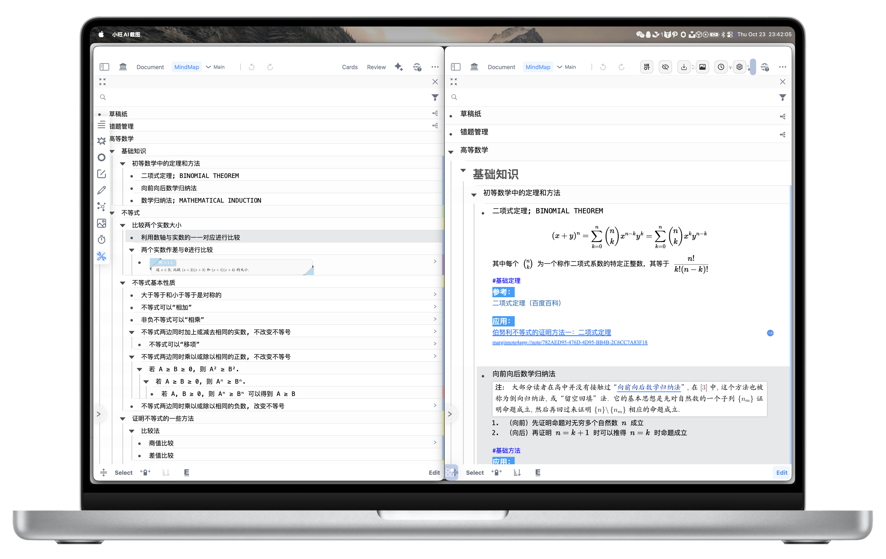
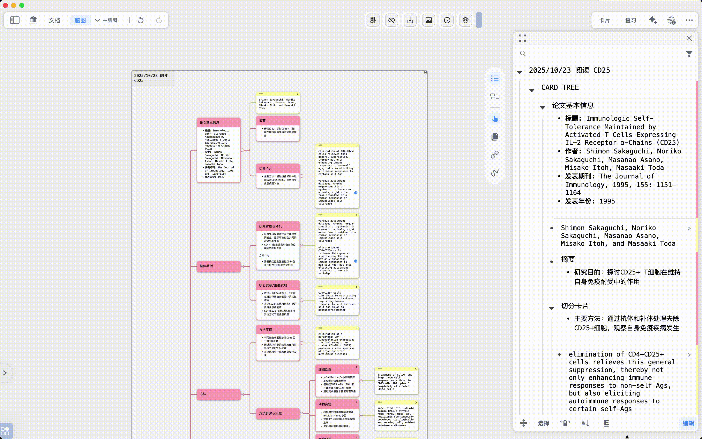
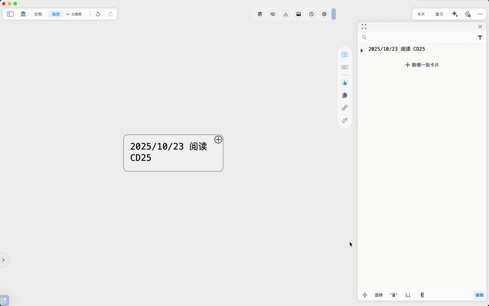

# 大纲显示和排序

# 1 大纲显示模式

> 💡大纲显示模式主要控制您的卡片内容如何在大纲视图中呈现，让您能够根据需要，**选择显示全部内容**或**仅显示关键信息。**

## 1.1 单行显示模式：快速概览大纲主干

> 💡当您的大纲中包含**大量带有详细笔记的卡片**时，标准的大纲视图可能会显得过于拥挤和繁杂。为了帮助您快速梳理出大纲的整体结构和主要内容，MarginNote 提供了“单行显示模式”。
>
> **此模式的特点：**
>
> - **内容精简：** 在此模式下，每张卡片只会显示其第一行文字。卡片其余的详细内容会被自动折叠起来，让大纲视图更加简洁。
> - **标题优先：** 如果卡片的第一行文字是标题，那么在单行显示模式下，只会显示该标题部分。

**如何进入/退出单行显示模式：**

- **通过底部工具栏按钮：**
  - 点击大纲底部工具栏最左侧的“单行显示”按钮（如下方图标所示）。

    [单行显示](https://www.wolai.com/mmMx6RUSgjLf9FCAy2dWUv "单行显示")
  - 再次点击该图标即可退出单行显示模式，返回标准显示。
- **通过手势操作（更快捷）：**
  - **进入模式：** 在大纲视图中，使用您的两根手指在屏幕上做“**双指捏合**”手势（就像缩小图片一样）。
  - **退出模式：** 使用您的两根手指在屏幕上做“**双指张开**”手势（就像放大图片一样），即可返回标准显示模式。

## 1.2 全部折叠：隐藏次级节点，聚焦一级结构

> 💡“全部折叠”功能可以帮助您快速隐藏所有次级卡片节点，只显示大纲中的一级节点，从而让您专注于大纲的最高层级结构。

- 点击大纲底部工具栏中的`排序`按钮（如下方图标所示）

  [排序](https://www.wolai.com/qFD6CugPhByeciw6xgriJy "排序")
- 在弹出的菜单中，选择`全部折叠`选项。
- 此时，除了作为一级节点的卡片外，所有下属的次级节点（包括二级、三级等所有子卡片）都将被折叠起来

## 1.3 全部展开：显示所有节点，查看完整结构

> 💡与`全部折叠`相反，`全部展开`功能可以一键展开大纲中的所有卡片节点，让您能够查看完整的层级结构和所有卡片。

- 点击大纲底部工具栏中的`排序`按钮。

  [排序](https://www.wolai.com/qFD6CugPhByeciw6xgriJy "排序")
- 在弹出的菜单中，选择`全部展开`选项。
- 此时，大纲中的所有卡片节点（包括所有层级）都将完全展开，您可以看到所有的子卡片。

> 💡**单行显示模式 与 展开/折叠功能**
>
> 请注意，**“单行显示模式”和节点的“展开/折叠”是两个互相独立的功能**：
>
> - **单行显示模式：** 关注的是**卡片内容的显示方式**。它决定了每张卡片是显示全部内容还是只显示第一行。
> - **展开和折叠：** 关注的是**卡片层级的显示方式**。它决定了卡片之间的父子关系是否展开或收起。

# 2 大纲顺序：调整卡片在大纲中的排列方式

> 💡大纲顺序功能允许您根据自己的学习习惯和内容逻辑，灵活调整卡片在大纲中的排列顺序和层级关系。

## 2.1 手动排序：自由调整卡片位置和层级

> 💡手动排序功能赋予您完全的自由：可以根据需要拖动卡片，调整它们在同一层级中的位置，或者改变它们的层级关系（即缩进或提升层级）。

**操作步骤：**

- 开启大纲缩进功能：
  - 点击大纲底部工具栏中的`大纲缩进手势`按钮

    [大纲缩进手势](https://www.wolai.com/95RrakZuGRCajKEVn4cYeA "大纲缩进手势")
- 当“大纲缩进”功能开启后，您可以拖动任意卡片。
  - **调整同级顺序：** 将卡片拖动到同一层级中的其他位置，松手即可改变其顺序。
  - **调整层级关系（缩进/提升）：**
    - 将卡片向右拖动，当出现缩进指示时松手，该卡片将成为其上方卡片的子节点（层级降低）。
    - 将卡片向左拖动，当出现提升指示时松手，该卡片将提升一个层级（成为其原父节点的兄弟节点）。
- 拖动节点手动调整节点层级

> 💡详见：**大纲缩进**手势：拖拽调整层级

## 2.2 自动排序：根据特定规则快速整理大纲

> 💡除了手动调整，MarginNote 还提供了多种自动排序功能，可以帮助您根据预设的规则快速整理大纲，尤其适用于从文档中大量摘录卡片后进行初步整理。

### 2.2.1 以文档页排序：按原文顺序组织卡片

> 💡此功能将会根据卡片在原始文档中的页面顺序进行排列，如果您是从 PDF 或 EPUB 文档中摘录的笔记，使用此功能可以确保您的大纲与文档的阅读顺序保持一致。

- 点击大纲底部工具栏中的`排序`按钮。

  [排序](https://www.wolai.com/qFD6CugPhByeciw6xgriJy "排序")
- 在弹出的菜单中，选择`以文档页排序`。
- 此时，大纲中的所有卡片将按照它们在原始文档中出现的页面先后顺序进行排列。

### 2.2.2 以日期排序

> 💡此功能会根据卡片的创建时间（即您添加卡片的时间）进行排序。如果您希望回顾或追踪笔记的创建历程，这会是一个非常有用的功能。

1. 点击大纲底部工具栏中的`排序`按钮。
2. 在弹出的菜单中，选择`以日期排序`选项。
3. 此时，大纲中的所有卡片将按照它们被添加（创建）的时间先后顺序进行排列。

[排序](https://www.wolai.com/qFD6CugPhByeciw6xgriJy "排序")

