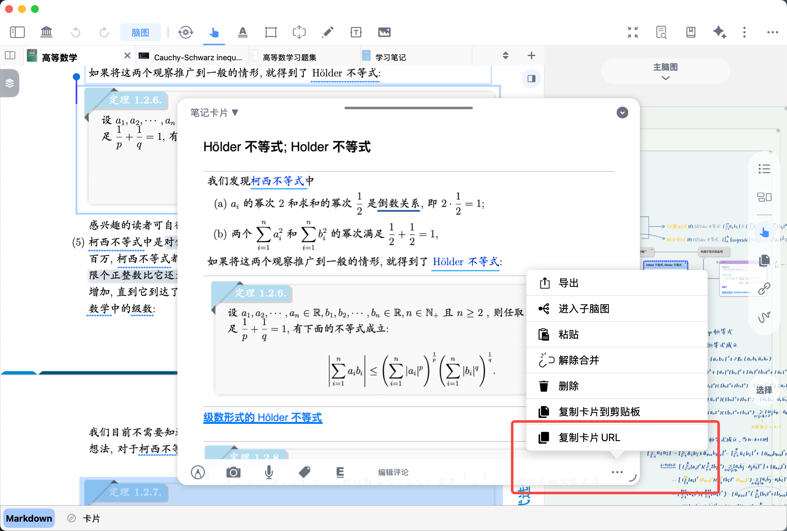
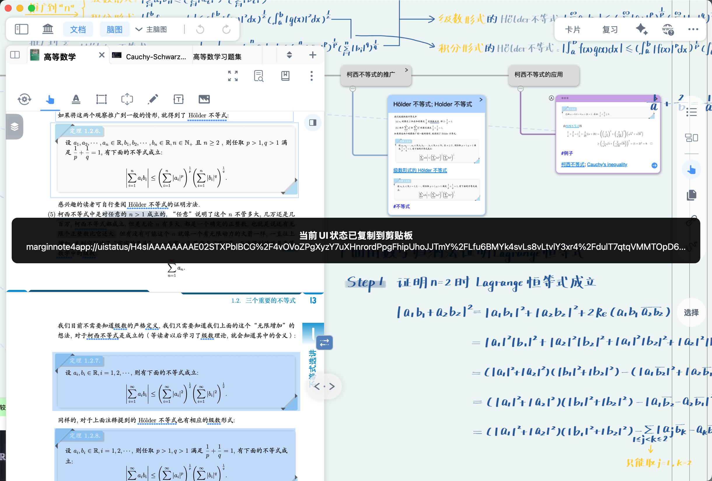
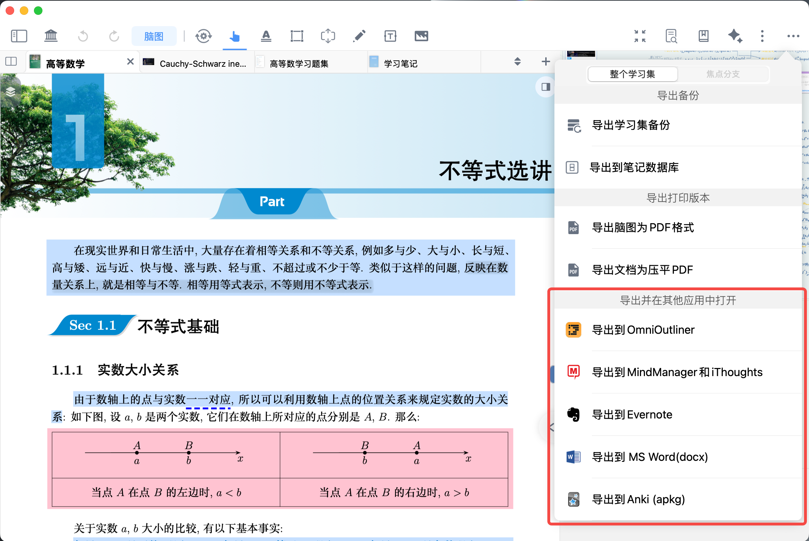
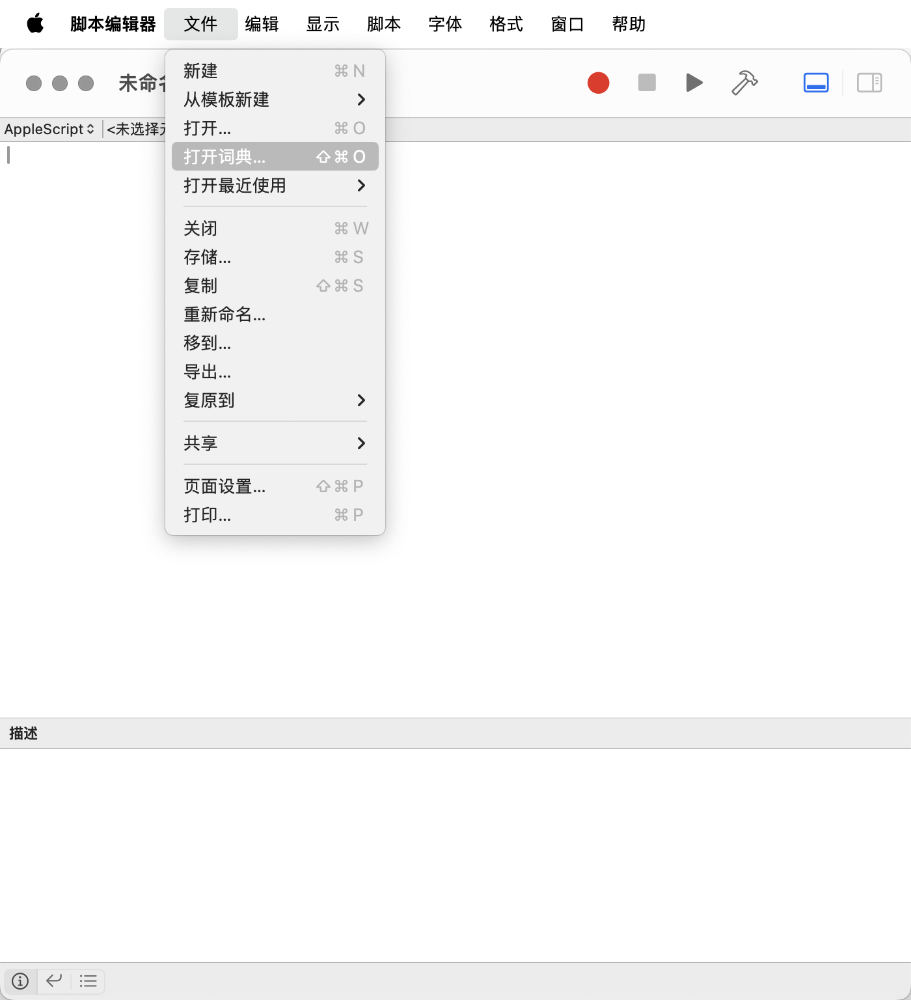
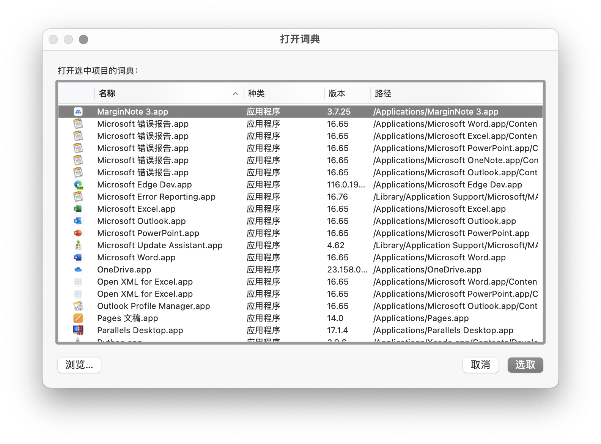

# 第三方应用联动①：认识笔记回源链接

> 💡MarginNote 4 支持生成两种专属 URL：卡片URL、操作界面URL，来实现与第三方应用的跨平台联动，方便笔记分享与协同使用。

# 1 生成&获取URL

## 1.1 笔记卡片URL生成&获取&#x20;

MarginNote 4卡片所拥有的唯一ID对应的URL，同样在第三方软件中受到支持，同样是苹果系统的底层规则，一般称为 URL Scheme。

卡片的URL获取方法：

1. 选中脑图卡片，通过快捷键`Shift+Command+C`，将当前卡片的URL复制到剪贴板。
2. 打开[卡片编辑器](https://www.wolai.com/rdhVCYTJL3YakoYW4QxtzC "卡片编辑器")→…更多→`复制卡片URL`

   

## 1.2 操作界面URL生成&获取

MarginNote 4支持获取当前操作界面的固化效果，与卡片URL所区别。卡片URL仅是对笔记内容的跳转；而界面URL，将同时保留使用者的窗口大小、比例、各开关的状态，甚至部分视图的默认值，以确保观看者的界面与使用者点击URL后跳转所获得的界面高度一致。

界面URL通常用于教程演示，讲师在学习集里记录UI界面状态URL分享给学习者，后者便可通过URL来到与讲师相同的界面。

但注意，若学习者本身有一定的视图配置，将被讲师的默认值所覆盖，从而需要重新调整恢复（官方教程所采用的界面URL则通过检测为教程阅读状态，而在教程学习完毕后做了用户自有配置的恢复）

UI界面状态URL获取:
通过快捷键`Command+Option+0`，将当前UI的状态URL复制到剪贴板。

# 2 导出到第三方应用中打开

> 💡导出包括Word、PDF在内的多种格式，均包含一个MarginNote4超链接文本，在第三方软件中点击打开链接，或经由Safari打开链接，界面均会跳转至MarginNote 4笔记内容的对应位置，帮助你回忆上下文知识点。

图例为Word，其他格式与此类似：

> 💡你的笔记属于你，转换成多种格式，利用Url-Scheme 双向跳转，使多个APP之间能够互相跳转原文。与Devonthink、Omnioutliner、Tinderbox、印象笔记，OmniFocus等强大工具联动，建构个人知识管理系统。
>
> 

一个笔记系统 —— 如何把MarginNote3、DEVONThink3、TheBrain11 和 nvALT当一个App使用

[一个笔记系统——如何把MarginNote3, DEVONThink3, TheBrain11 和 nvALT当一个App使用\_哔哩哔哩\_bilibili https://github.com/John15263/note-taking-system, 视频播放量 11178、弹幕量 4、点赞数 111、投硬币枚数 69、收藏人数 306、转发人数 46, 视频作者 john15263, 作者简介 ，相关视频：John的阅读工作流的第一步——信息从MarginNote3流入nvALT，香料与武器-1-安装Marginnote，DEVONThink，K https://www.bilibili.com/video/av90220643/](https://www.bilibili.com/video/av90220643/ "一个笔记系统——如何把MarginNote3, DEVONThink3, TheBrain11 和 nvALT当一个App使用_哔哩哔哩_bilibili https://github.com/John15263/note-taking-system, 视频播放量 11178、弹幕量 4、点赞数 111、投硬币枚数 69、收藏人数 306、转发人数 46, 视频作者 john15263, 作者简介 ，相关视频：John的阅读工作流的第一步——信息从MarginNote3流入nvALT，香料与武器-1-安装Marginnote，DEVONThink，K https://www.bilibili.com/video/av90220643/")

MarginNote与OmniFocus —— 如何用MarginNote与OmniFocus进行阅读任务GTD

[ MarginNote与OmniFocus-如何用MarginNote与OmniFocus进行阅读任务GTD\_哔哩哔哩\_bilibili 幌金绳1.0：如何用MarginNote与OmniFocus进行阅读任务GTD, 视频播放量 1652、弹幕量 0、点赞数 14、投硬币枚数 2、收藏人数 24、转发人数 0, 视频作者 john15263, 作者简介 ，相关视频：John的阅读工作流的第一步——信息从MarginNote3流入nvALT，MarginNote-DeepL，香料与武器-1-安装Marginnote，DEVONThi https://www.bilibili.com/video/av64216865/](https://www.bilibili.com/video/av64216865/ " MarginNote与OmniFocus-如何用MarginNote与OmniFocus进行阅读任务GTD_哔哩哔哩_bilibili 幌金绳1.0：如何用MarginNote与OmniFocus进行阅读任务GTD, 视频播放量 1652、弹幕量 0、点赞数 14、投硬币枚数 2、收藏人数 24、转发人数 0, 视频作者 john15263, 作者简介 ，相关视频：John的阅读工作流的第一步——信息从MarginNote3流入nvALT，MarginNote-DeepL，香料与武器-1-安装Marginnote，DEVONThi https://www.bilibili.com/video/av64216865/")

MarginNote与Typora-如何用MarginNote写读书笔记-1.0-如何快速输入

[MarginNote与Typora-如何用MarginNote写读书笔记-1.0-如何快速输入\_哔哩哔哩\_bilibili 如何使用MarginNote和Typora写读书笔记, 视频播放量 1546、弹幕量 0、点赞数 11、投硬币枚数 4、收藏人数 18、转发人数 1, 视频作者 john15263, 作者简介 ，相关视频：MarginNote-DeepL，【Readings读物】为什么一个笑话重复很多遍就不好笑了，小约翰更新：搬运网页到MarginNote，如何优雅地阅读英文论文 | 鸠摩罗什（自动翻译）与Key https://www.bilibili.com/video/av63440619/](https://www.bilibili.com/video/av63440619/ "MarginNote与Typora-如何用MarginNote写读书笔记-1.0-如何快速输入_哔哩哔哩_bilibili 如何使用MarginNote和Typora写读书笔记, 视频播放量 1546、弹幕量 0、点赞数 11、投硬币枚数 4、收藏人数 18、转发人数 1, 视频作者 john15263, 作者简介 ，相关视频：MarginNote-DeepL，【Readings读物】为什么一个笑话重复很多遍就不好笑了，小约翰更新：搬运网页到MarginNote，如何优雅地阅读英文论文 | 鸠摩罗什（自动翻译）与Key https://www.bilibili.com/video/av63440619/")

Keyboard Maestro —— Marginnote骚操作

[ Marginnote骚操作\_哔哩哔哩\_bilibili Marginnote骚操作共计8条视频，包括：新建粘贴板、新建Macro、Copy Content\&Link等，UP主更多精彩视频，请关注UP账号。 https://www.bilibili.com/video/av27670825/](https://www.bilibili.com/video/av27670825/ " Marginnote骚操作_哔哩哔哩_bilibili Marginnote骚操作共计8条视频，包括：新建粘贴板、新建Macro、Copy Content\&Link等，UP主更多精彩视频，请关注UP账号。 https://www.bilibili.com/video/av27670825/")

# 3 跨软件笔记同步插件

这里以Obsidian和Flomo插件为例，将同时产生一个笔记卡片在两个或多个APP当中， 并且同样附带一个全局可用的上下文回源链接

[ 【第三方MN插件】Obsidian-Bridge（Markdown动态导出）——连接两个知识星球 #Ver.3.0.0 已获官方签名# - 插件发布区｜允许不受限制地编辑更新主帖 - MarginNote 中文社区 Obsidian BridgeObsidian Bridge 插件架起了 MarginNote 通往 Obsidian 的桥梁，通过它，我们可以把在 MarginNote 中积累的写作素材/创作灵感导入到 Obsidian 中，使用 Ma\&hellip; https://bbs.marginnote.com.cn/t/topic/21235](https://bbs.marginnote.com.cn/t/topic/21235 " 【第三方MN插件】Obsidian-Bridge（Markdown动态导出）——连接两个知识星球 #Ver.3.0.0 已获官方签名# - 插件发布区｜允许不受限制地编辑更新主帖 - MarginNote 中文社区 Obsidian BridgeObsidian Bridge 插件架起了 MarginNote 通往 Obsidian 的桥梁，通过它，我们可以把在 MarginNote 中积累的写作素材/创作灵感导入到 Obsidian 中，使用 Ma\&hellip; https://bbs.marginnote.com.cn/t/topic/21235")

[ 【第三方MN插件】写了个flomo的插件，有在用flomo的同学吗 #Ver.0.0.2 已获官方签名# - 插件发布区｜允许不受限制地编辑更新主帖 - MarginNote 中文社区 v 0.0.2版本发布做了以下支持 支持切换flomo的位置(主要参考deepl的代码，想请教下怎么直接刷新位置，现在是再次开关插件后生效) 笔记增加了笔记id ,为打开marginNote做准备 预览图    \&hellip; https://bbs.marginnote.com.cn/t/topic/18381](https://bbs.marginnote.com.cn/t/topic/18381 " 【第三方MN插件】写了个flomo的插件，有在用flomo的同学吗 #Ver.0.0.2 已获官方签名# - 插件发布区｜允许不受限制地编辑更新主帖 - MarginNote 中文社区 v 0.0.2版本发布做了以下支持 支持切换flomo的位置(主要参考deepl的代码，想请教下怎么直接刷新位置，现在是再次开关插件后生效) 笔记增加了笔记id ,为打开marginNote做准备 预览图    \&hellip; https://bbs.marginnote.com.cn/t/topic/18381")

# 4 Apple Script

Coming Soon

AppleScript自动化 Javascript插件扩展，增强MN与诸多专业研究软件的整合，进行数据转换、高级导出、自动制卡规则、函数计算等用途。

MarginNote 4所支持的最新Apple Script规则和语法，均可通过系统自带APP —— "脚本编辑器" 的词典功能查阅

