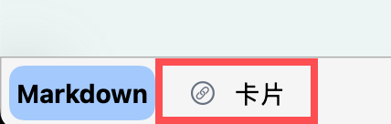
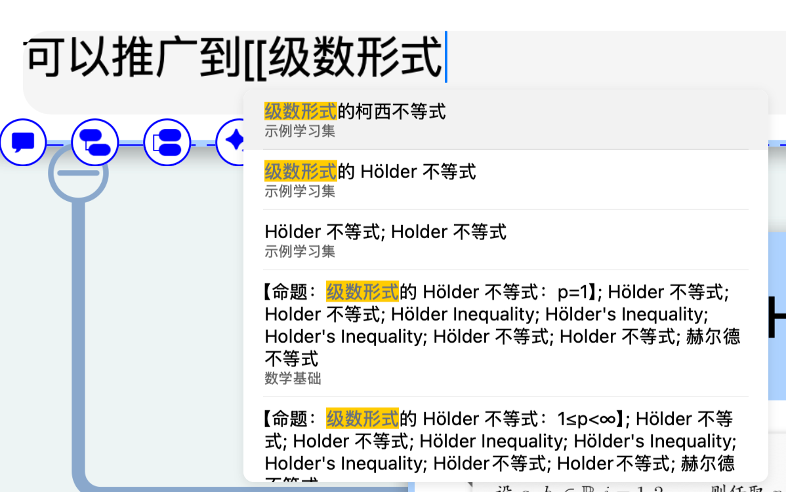
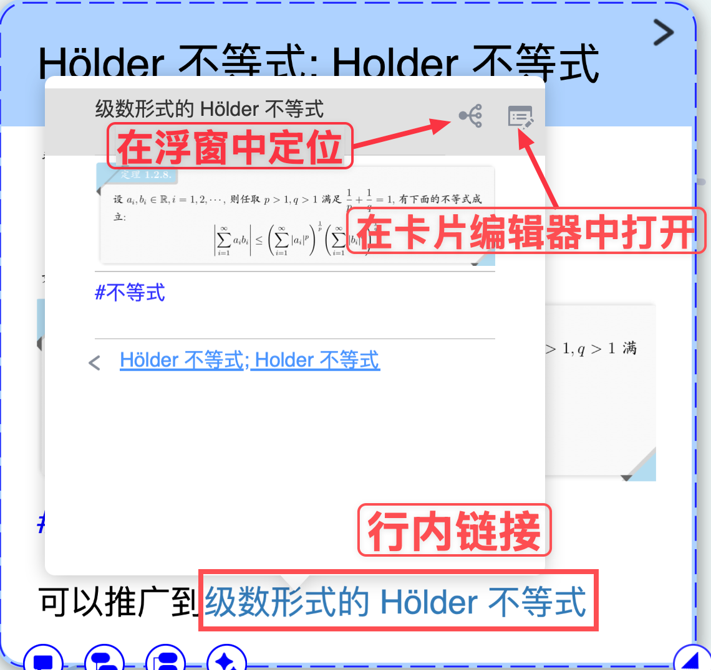

# 卡片链接⑤|行内链接

> 💡`行内链接`能够实现更加精准的[卡片链接④|关键词标题链接：打造你的个人字典](https://www.wolai.com/aBEbDgL6oDgDT4CeXotdbS "卡片链接④|关键词标题链接：打造你的个人字典")，并且能优化[卡片链接①|单双向链接：跨越层级的自由关联](https://www.wolai.com/mGz8BQh6r1ad6wv1jqDo1G "卡片链接①|单双向链接：跨越层级的自由关联")造成的冗长评论视效，更灵活。

> 💡建议先掌握[卡片链接②|卡片唯一ID、URL：跨脑图、学习集关联](https://www.wolai.com/tg7V1E5VRtGvse2ndVgNXx "卡片链接②|卡片唯一ID、URL：跨脑图、学习集关联")和[卡片链接④|关键词标题链接：打造你的个人字典](https://www.wolai.com/aBEbDgL6oDgDT4CeXotdbS "卡片链接④|关键词标题链接：打造你的个人字典")的功能，再来学习行内链接，对这三种链接的理解会更好。

# 1 为什么用行内链接？

> 💡你是否遇到过以下场景：
>
> - 在卡片中撰写文本类型评论时，需要链接其他卡片，此时需要“退出卡片编辑器”—“查找卡片进行链接”—“打开卡片编辑器继续写”，甚至可能再反复。打乱写作思路，造成学习的低效。
> - 发现[卡片链接④|关键词标题链接：打造你的个人字典](https://www.wolai.com/aBEbDgL6oDgDT4CeXotdbS "卡片链接④|关键词标题链接：打造你的个人字典")覆盖面太广，无法精确地在评论中链接到自己想要的那一张卡片。
>
> `行内链接`就是解决上面使用过程中的痛点的“利器”！

行内链接本质上就是 Markdown 的 ``语法下的链接，单从这个角度而言，行内链接只是作为[Markdown与公式](https://www.wolai.com/eShEtotNTstcUnT6o3FLAP "Markdown与公式")的一部分，不需要单独拿出来介绍。但目前此语法**已支持 MarginNote 原生卡片URL 链接！** 并且可以通过手动输入`[[`来直接查找卡片进行链接。

# 2 如何实现行内链接？

> 💡准备工作：
>
> [添加评论](https://www.wolai.com/9crA3NNf4jcGJSjE1uYaSB "添加评论")
>
> 1\. 点击脑图卡片的`添加评论`图标或者是打开`卡片编辑器`，进行文本评论的输入
> 2\. 使用行内链接前，请点击`键盘输入栏`上方的 `Markdown`，确保开启了 Markdown 模式。

## 2.1 点击图标输入

[行内链接](https://www.wolai.com/5zjHtY9AyAc8EhdGoDPWu6 "行内链接")

1. 在开启了`Markdown`后，`键盘输入栏`上方会出现`行内链接`按钮（如上方图标所示）

   
2. 键盘的输入光标移动到要输入的位置，点击`行内链接`图标，输入端会出现 `[[`，并且触发一个`卡片搜索框`

   
3. 类似于如何在卡片盒中进行搜索，输入关键词后会弹出卡片的搜索结果供用户选择

   
4. 选择目标卡片，点击后会出现行内链接，显示文本默认是卡片的标题。

   

## 2.2 手动输入`[[`

在上面点击图标输入的方法中，我们可以看到，在点击图标后，输入端键盘的输入光标移动到要输入的位置，点击`行内链接`图标，输入端会出现 `[[`，并且触发一个`卡片搜索框`。事实上用户可以通过手动两个左方括号来触发行内链接的搜索功能，后续步骤完全相同。

## 2.3 直接输入 ``的 Markdown 链接

事实上，上述两种方法本质上都是等效地插入了`[<卡片标题>](<卡片 URL>)`的 Markdown 链接，这便是我们前面所提及的：行内链接本质上就是 Markdown 的 ``语法下的链接，单从这个角度而言，行内链接只是作为[Markdown与公式](https://www.wolai.com/eShEtotNTstcUnT6o3FLAP "Markdown与公式")的一部分，不需要单独拿出来介绍。但目前此语法**已支持 MarginNote 原生卡片URL 链接！** 并且可以通过手动输入`[[`来直接查找卡片进行链接。。于是我们便可以通过手动输入 Markdown 格式的链接来实现行内链接，其中怎么样获取卡片URL

> 💡此方法的经典场景：
>
> 在脑图中已经找到了需要链接的卡片，这个时候就不需要手动输入`[[`来“远程”查找了。

# 3 行内链接的效果

行内链接的视觉效果和[卡片链接④|关键词标题链接：打造你的个人字典](https://www.wolai.com/aBEbDgL6oDgDT4CeXotdbS "卡片链接④|关键词标题链接：打造你的个人字典")基本一致：

1. 文字有**高亮**，但**无下划线**（而[卡片链接④|关键词标题链接：打造你的个人字典](https://www.wolai.com/aBEbDgL6oDgDT4CeXotdbS "卡片链接④|关键词标题链接：打造你的个人字典")的效果有下划线）
2. 点击后（或者Mac端的鼠标悬浮）出现卡片的预览弹窗，可以选择在浮窗中定位或者是打开`卡片编辑器`进行编辑

   

但行内链接最大的特点是

1. **显示自定义输入的文本，而非卡片的标题。**
2. 并非卡片链接的截断效果，而是和标题链接一样的 wiki 链接效果，和正文的内容

# 4 进阶：插件辅助

也许你会觉得上面提到的直接输入 ``的 Markdown 链接 的方式比较麻烦，事实上，我们可以通过**插件**来辅助我们封装行内链接，比如通过弹窗来快捷输入引用词，但插件开发已经脱离了本页内容的范畴，感兴趣的用户可以学习 MarginNote 的插件开发。

