# 卡片链接②|卡片唯一ID、URL：跨脑图、学习集关联

> 作者：夏大鱼羊

***

## 1 同一个脑图的链接已不再满足需求

在中，学习者了解到单向链接和双向链接的基础操作，但随着使用的深入，学习者可能会遇到下面的情形（子脑图功能参见）：

- 同一个学习集中不同子脑图中的卡片需要链接
  - 比如“高等数学”学习集中，“第一章”和“第二章”分别是两个子脑图用以整理章节知识点，第一章的定理卡片 A 应用到了第二章的例题卡片 B 上，这时候想将卡片 A 链接到卡片 B 上
- 两个不同的学习集中的卡片需要链接
  - 比如“高等数学”和“线性代数”分别是两个不同的学习集，在学习的过程中发现，“高等数学”学习集中的定理卡片 A 可以应用到“线性代数”学习集中的定理卡片 B 中，这时候想将卡片 A 链接到卡片 B 上

也就是说像中演示的同一脑图中的链接已不再满足需要，但对于上述两种情形的链接需求，MarginNote4 中仍然可以满足，而其中的核心就是卡片的ID 与 URL。

## 2 卡片 ID 与卡片 URL

### 2.1 什么是卡片 ID&#x20;

卡片 ID 简单理解就是每一张卡片的身份证号，和卡片是一一对应的。

ID 一般的结构为`*-*-*-*-*`，其中`*`表示一定数量的大写字母和数字，比如`E097A792-4E65-46B5-834B-BDDC8A71E254`

### 2.2 什么是卡片 URL

卡片的 URL 就是卡片的 ID 加上`marginnote4app://note/`的前缀。比如上面提到的 ID 对应的 URL 是`marginnote4app://note/E097A792-4E65-46B5-834B-BDDC8A71E254`。

从卡片 ID 和卡片 URL 的概念可以看到卡片的 ID 和卡片 URL 本质上是相同的，获取其中任何一个都可以得到另一个，MarginNote4 提供了复制卡片 URL 到剪切板的方法。

### 2.3 怎么样获取卡片URL

#### 2.3.1 iPad 端

##### 2.3.1.1 从卡片编辑器中获取

点击目标卡片，打开卡片编辑器，点击右下角的`...`，在弹出的菜单框中选择`复制卡片 URL`

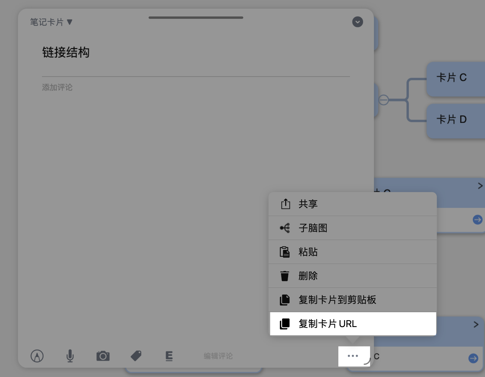

此时会提示`卡片链接已经复制到剪切板：`

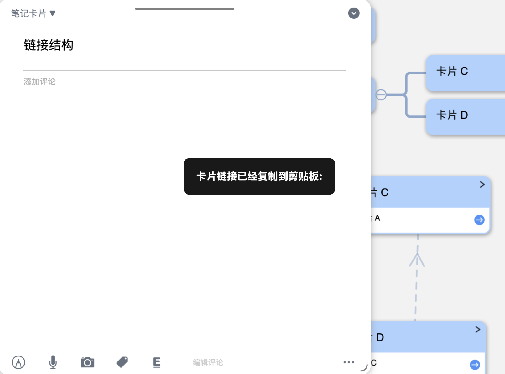

##### 2.3.1.2 通过快捷键获取

若 iPad 连接了外部键盘，可以通过 `command`+`shift`+`c`的快捷键复制卡片 URL，此时会提示`卡片链接已经复制到剪切板：`。

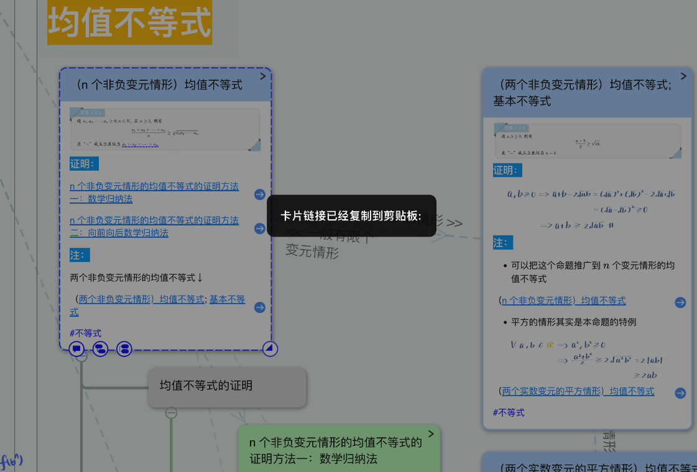

#### 2.3.2 Mac 端

Mac 端除了有上述相同的两种方式外，还可以通过 MarginNote4 的上方菜单栏获取，具体操作如下：

1. 在脑图中点击选择目标卡片
2. 在软件上方菜单栏中选择`卡片`
3. 点击第三行的`复制卡片 URL`

   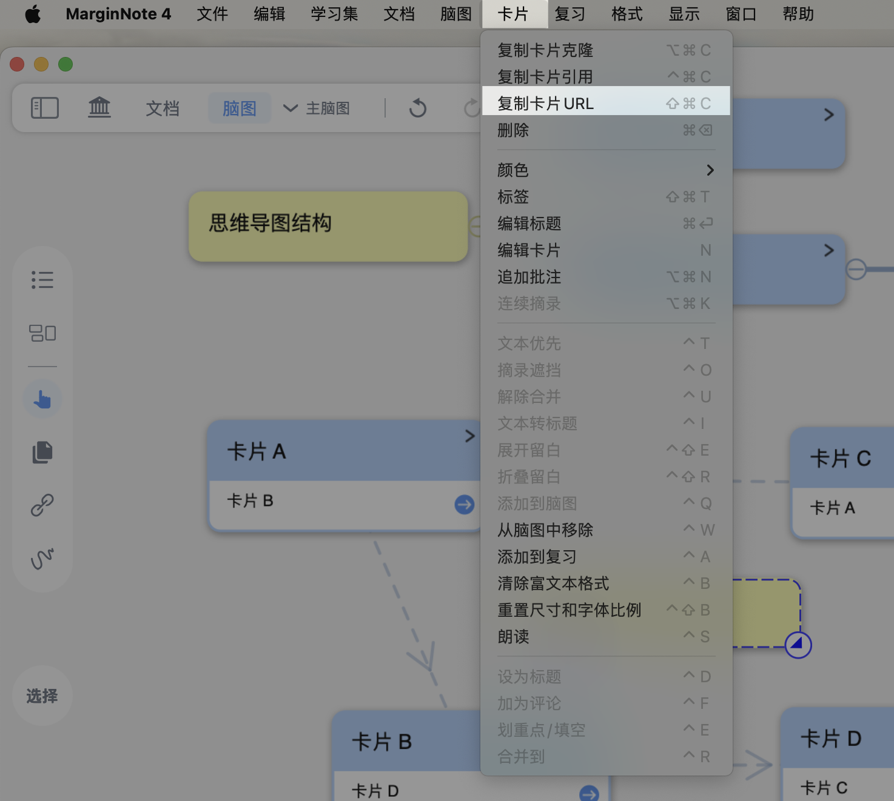
4. 若提示`卡片链接已经复制到剪切板：`则为复制卡片 URL成功

## 3 链接的本质

> 注意我们下面讨论的是从链接功能在 MarginNote4 中的实现的本质，而非讨论链接在学习环节中的作用

从上面的介绍中学习者可以了解到，卡片和 ID 是一一对应的。从卡片中我们可以获取卡片的URL，而通过卡片的URL我们可以定位到这张卡片，而这个定位就是通过链接实现的。

> 链接功能的本质就是某张卡片 URL的文本，只不过它被 MarginNote4渲染成了学习者看到的链接样式。

学习者便可以理解拖拽卡片进行链接和链接球进行链接的本质：在中，我们介绍了两种方式来进行链接：拖拽卡片和链接球，其中链接球产生双向链接。通过我们上述的分析可以知道，拖拽卡片 A 到卡片 B 生成单向链接，本质上就是**复制卡片 A 的 URL 并且粘贴到卡片 B 的评论中**，然后这个 URL 被渲染成了链接的样式。同理可以理解拖拽生成双向链接以及链接球链接。

## 4 实现任意两张卡片之间的链接

知道了链接的本质其实是一个卡片的 URL 文本，我们便可以实现任意两张卡片之间的链接。

### 4.1 方法一：两张卡片需要同时出现

这个方法首先需要让两张卡片在“同一屏幕中”，比如同一脑图的视图，或是开启两个 MarginNote4 进行分屏，具体可以参见下面的图文。

#### 4.1.1 首先先让两张卡片出现在同一屏幕中

任意两张卡片，可以概括为三种情况：

##### 4.1.1.1 相同学习集，相同脑图

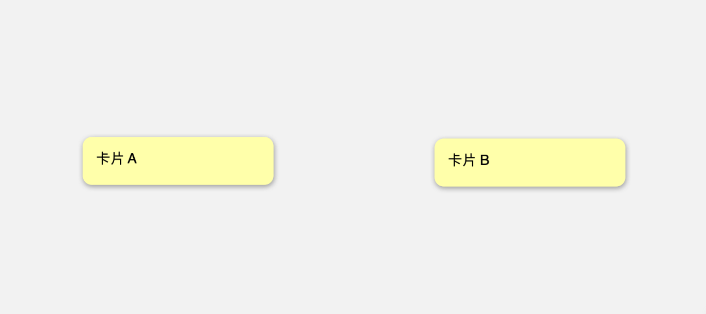

##### 4.1.1.2 相同学习集，不同子脑图

- 方法一：通过子脑图的`在浮动视图中打开`功能

  
- 方法二：iPad 端可以开启两个 MarginNote4 进行分屏

  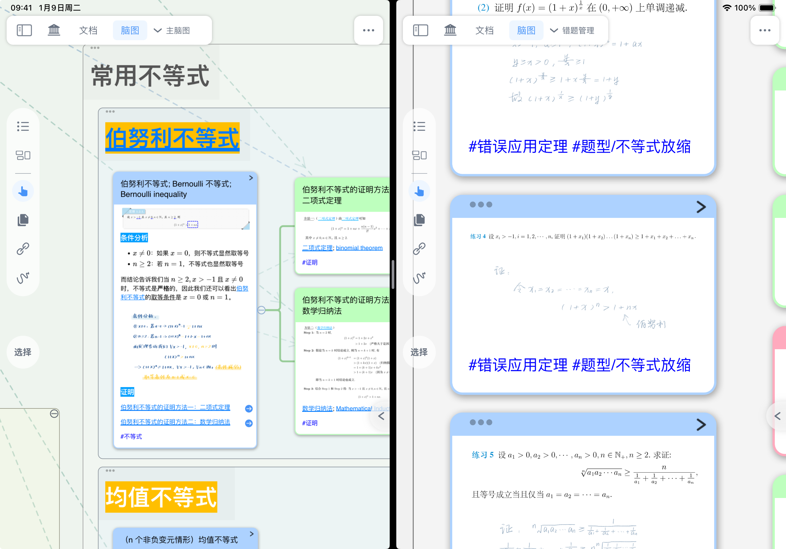
- 方法三：Mac 端可以开启两个 MarginNote4 放在屏幕两端

  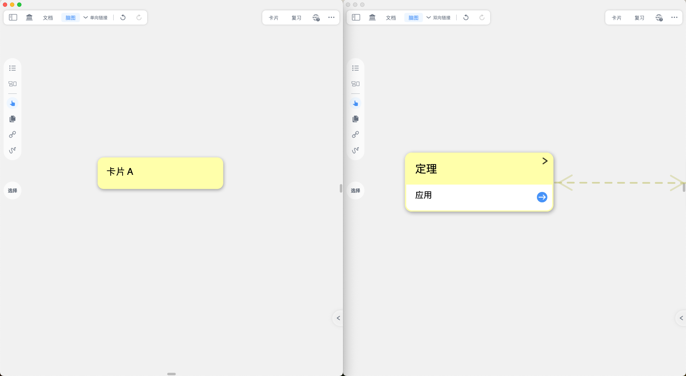

##### 4.1.1.3 不同学习集

此时脑图所在肯定不同，所以不再细分。

- 方法一：通过卡片盒找到另一张卡片，并在浮动视图中打开

  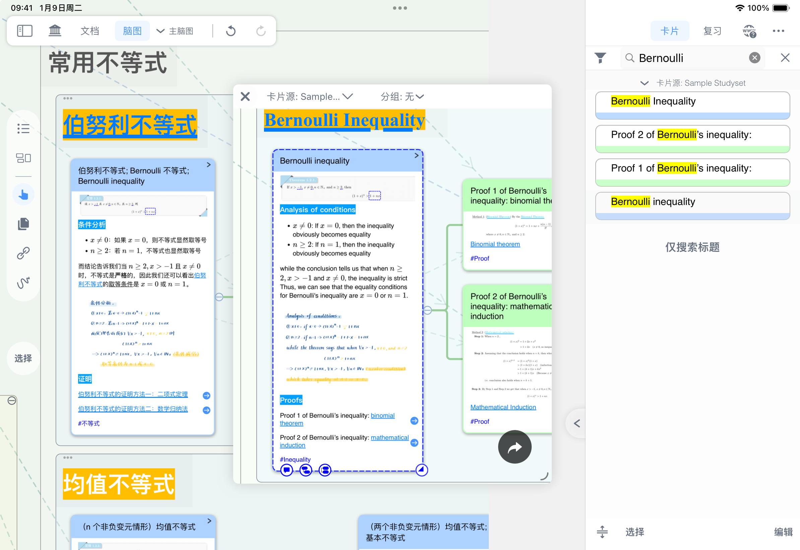
- 方法二：iPad 端可以开启两个 MarginNote4 进行分屏

  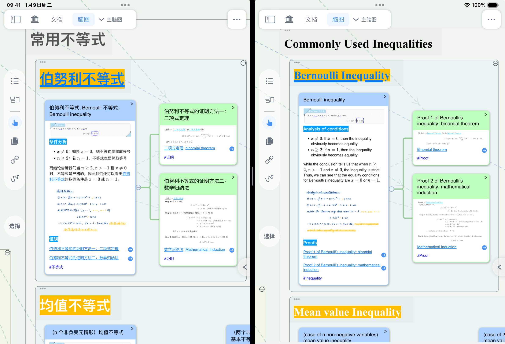
- 方法三：Mac 端可以开启两个 MarginNote4 放在屏幕两端

  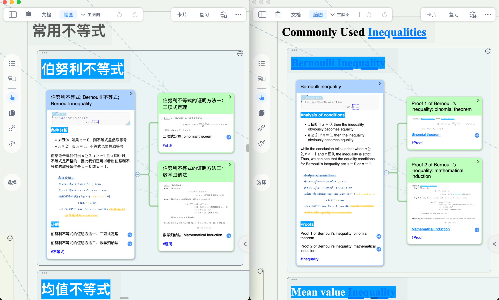

#### 4.1.2 然后链接两张卡片

在中介绍的链接球、拖拽卡片和拖拽卡片仍然适用，但要注意对于上面提到的 iPad 和 Mac 端开启两个 MarginNote4分屏时无法通过链接球进行链接：

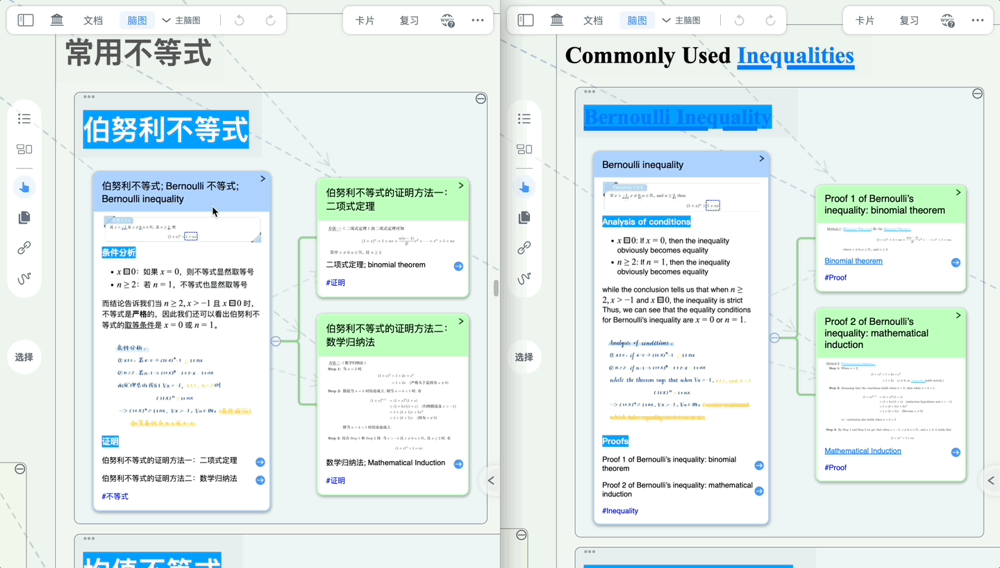

但拖拽卡片仍然可行：

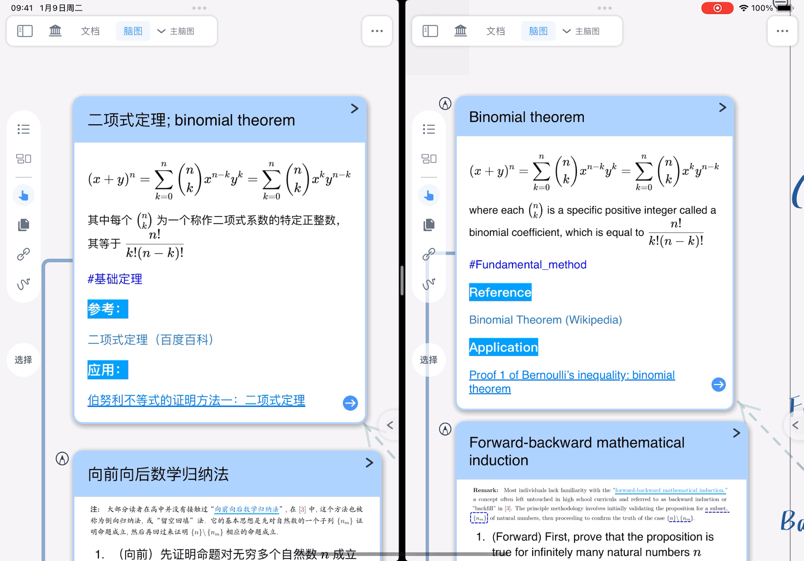

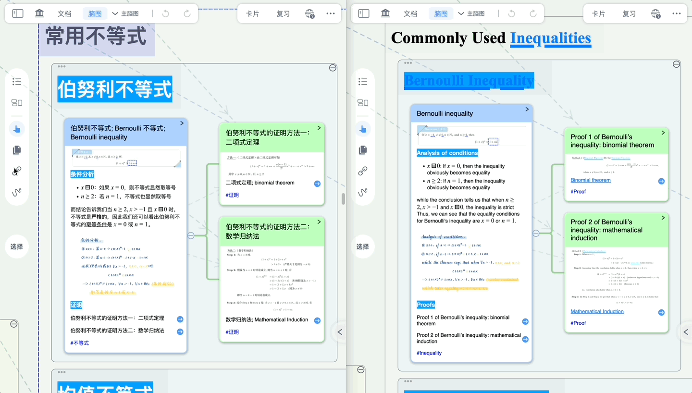

### 4.2 方法二：不需要同时出现两张卡片

#### 4.2.1 首先复制卡片的 URL

通过怎么样获取卡片URL一节的内容先复制卡片的 URL。

#### 4.2.2 然后粘贴到另一张卡片的评论中

通过切换学习集或脑图等方式找到目标卡片（此时获取 URL 的卡片可以不出现在屏幕中），然后

- 方法一：点击目标卡片，在弹出的卡片菜单栏中点击粘贴或者通过键盘的 `command`+`v` 粘贴至目标卡片的评论中

  
- 方法二：直接在目标卡片的评论输入中粘贴 URL

  
