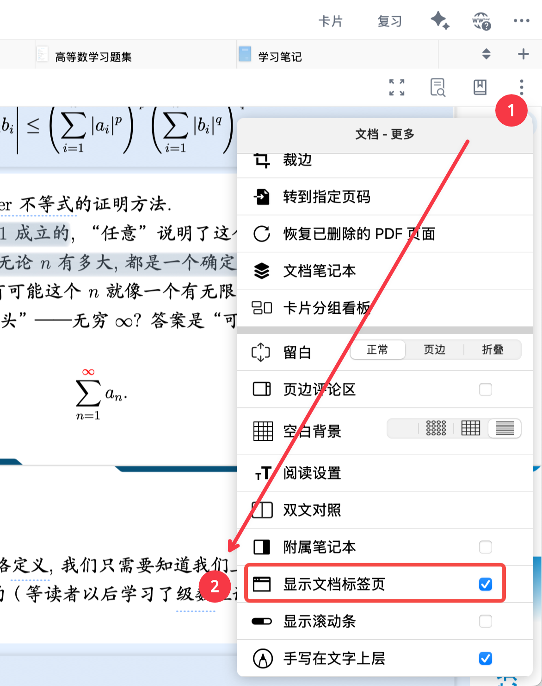
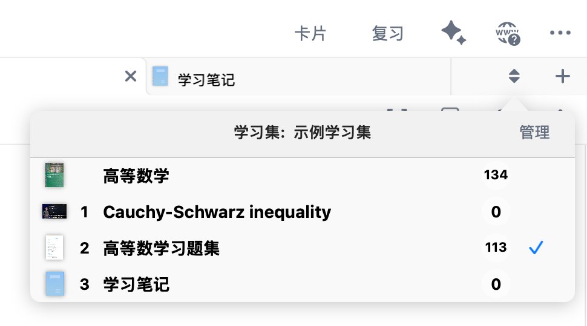
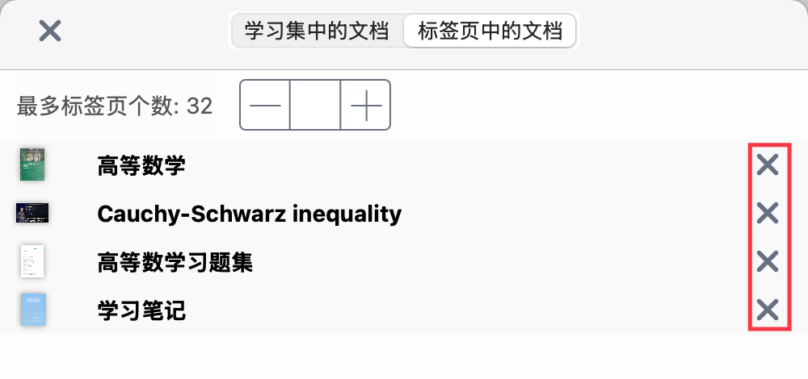
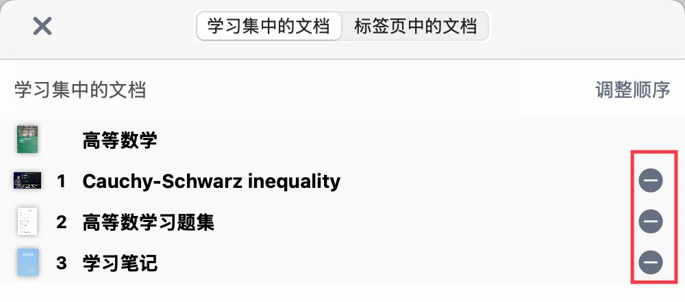

# 文档标签页管理

> 💡**使用场景：**
> 当您学习集中文档过多，标签页栏放不下时；
> 想隐藏当前不学习的文档，减少干扰时；
> 想把常用文档放在标签页前面时。

> ❗本页面基于标签页功能，除了标签页管理以外，还有其他高级使用方法。详情见页面新建空白笔记本，对照①：双文对照窗口。

# 1 什么是文档标签页？

**学习集**包含您导入的所有文档，而**标签页栏**只显示您选择打开的文档。

就像浏览器标签页一样，每个标签页对应一个打开的文档，方便您快速切换。

**显示与隐藏标签页栏**：

点击右上角`文档-更多`（竖向三点）→ `显示文档标签页`，即可显示或隐藏标签页栏。

# 2 文档标签页的具体操作

## 2.1 浏览和打开文档

通过点击右侧的文档列表按钮进入到文档列表。

- 在该界面中，您可以速览学习集内的全部文档。
- 点击文档可快速在标签页栏打开文档。

## 2.2 关闭文档

点击标签页右侧的**x**即可关闭该标签页的文档。

## 2.3 导入文档

点击标签页栏右侧的`➕`可以向学习集内**导入文档**，导入的文档将自动在标签页栏打开。

导入文档的具体操作请参考：[向学习集导入文档](https://www.wolai.com/vtjSQ6LvQv1TbbjdctzroM#i9iQjcNnZPZ75FEo2BqXBA "向学习集导入文档")

# 3 管理文档标签页

点击`管理`，您将跳转至标签页管理界面。

## 3.1 从标签页关闭文档

在`标签页中的文档`栏，点击标签页右侧的**x**即可关闭该标签页的文档。也可直接在标签页栏关闭，见：关闭文档。

> ❗关闭标签页不会删除文档，您随时可以在学习集中的文档里重新打开（详见：浏览和打开文档）

## 3.2 从学习集中移除文档

如下图所示，点击标签页管理界面的`⛔️`即可将文档从`学习集`中移除。

> ❗注意，该操作将会抹去脑图与该文档的所有链接，并可能无法恢复。
> 但不会将文档从MarginNote中删除，您可以从文档库中恢复已从学习集中关闭、但没有删除的文档。

## 3.3 调整标签页顺序

在标签页管理界面，点击右上角`调整顺序`来调整标签页的显示顺序：

单击`调整顺序`后，按住“三横杠”即可自由拖动排布文档`标签页`的显示顺序，调整完成后点击`完成`即可。

## 3.4 管理标签页展示数量

有时学习集中可能有数量众多的文档，不便于管理。此时，您可以在标签页管理界面-`标签页中的文档`，设置`最多标签页个数`，来调整标签页栏展示的文档数量。超过数量限制的文档将被隐藏，但仍然在`学习集`内。

> 💡推荐设置为3-7个，根据屏幕尺寸和文档数量调整。

