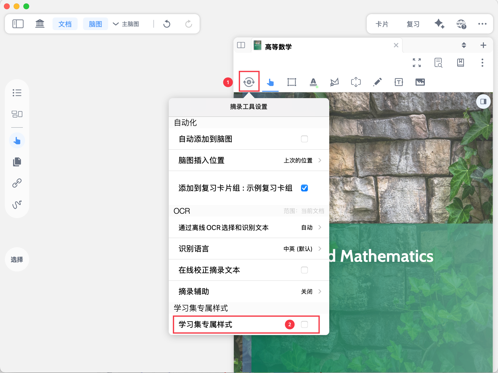
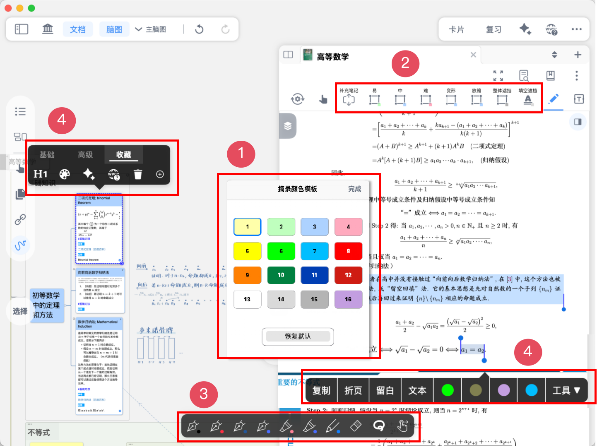
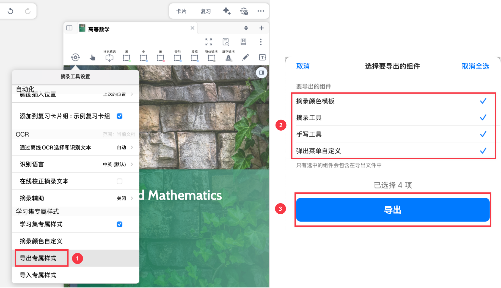
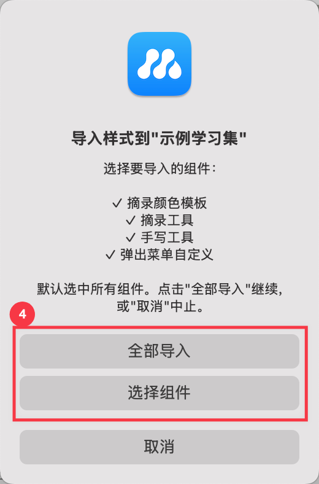

# 学习集专属样式：打造你的专属学习空间

> 💡**开启`学习集专属样式`，为每一个学习集定制专属学习空间，保存和复用学习习惯**：
>
> MarginNote 的功能配置是高度定制化的，您在不同的学习集中都可以挑选最趁手、最符合当前需求的功能配置。
>
> 无论是手写工具、摘录颜色，还是你最常用的菜单栏按钮，这些个性化配置都支持**保存、导出和导入**。切换学习集，工具配置自动切换，无需重复设置。你还可以将配置一键导出分享，也可导入配置、快速复用他人的高效学习环境，降低学习的启动成本。

# 1 开启学习集专属样式

- [🖼️ 图片](image/image_bVmE7WE01k.png "🖼️ 图片")，
- [🖼️ 图片](image/image_DW9L0Ifklh.png "🖼️ 图片")
  1. `摘录颜色模板`：卡片/摘录的颜色，支持自定义。详见：[自定义卡片摘录颜色](https://www.wolai.com/6b7GJnTDfs2kkNsBWT7AhG "自定义卡片摘录颜色")
  2. `摘录工具`：包括文本/矩形/套索/留白工具及其自定义设置。详见：[摘录工具及其自动化](https://www.wolai.com/5DiLYYJjNeZ4rQmBpDkRwQ "摘录工具及其自动化")
  3. `手写工具`：手写工具栏及其自定义设置。详见：手写工具栏
  4. `弹出菜单自定义`：卡片弹出菜单栏的**收藏栏**设置、手形工具弹出菜单栏的**自定义**设置。详见：[摘录弹出菜单栏及其自定义](https://www.wolai.com/4vrB2FPT9V6q9wzucefFBc "摘录弹出菜单栏及其自定义")、[手形工具弹出菜单栏及其自定义](https://www.wolai.com/iLGrRDRMEQepittcNY4Bun "手形工具弹出菜单栏及其自定义")

# 2 导出专属样式

`摘录工具设置`-点击`导出专属样式`，选择您要导出的组件（默认全部选中），最后点击导出，生成一个`.mbtoolstyle` 格式的样式文件，将它存储在合适的位置以备下次复用，或分享给其他人。

> 💡之后再新建一个学习场景高度相似的学习集时，可以直接导入该配置文件，沿用之前的学习习惯，而不必手动重复设置。

# 3 导入专属样式

`⚙️ 摘录工具设置`-`学习集专属样式`-`导入专属样式`，选择样式文件（.mbtoolstyle），选择要导入的组件。

> 💡导入组件不可撤销！请谨慎导入。

