# 翻译及保存译文

> 💡本页介绍在 MarginNote 中获取并保存译文的四种方式：文档即时翻译、AI 翻译与 AI OCR、研究侧栏（含自定义 URL）和插件翻译。你可以将译文插入为留白、复制到剪贴板或保存为卡片，用于并排对照与后续整理。
>
> 选择建议：
>
> - 分屏侧拉：用使用内置研究→ 翻译侧栏翻译长篇文本，侧栏自动刷新。
> - 最快上手：用内置翻译（max功能）→ 插入为留白（适合边读边对照）
> - 高质量/自动化：用DeepL 等插件 → 翻译或AI翻译，结合AI OCR识别→翻译→整理，提升长句和语感的可靠性。
> - 术语权威：用使用内置研究→ 字典搜索或接入使用内置研究→ 自定义URL的权威站点，保证精准释义与例句。

# 1 内置翻译（max功能）

> 💡文本与留白场景下最易上手的翻译方式。

## 1.1 翻译

[手形工具-文档](https://www.wolai.com/9ZgrQpKfNxW3HUkKiH6jfS "手形工具-文档")

用`手形工具`选择文本（如上图所示），点击`弹出菜单栏`中的`翻译`，则可将选中的文本翻译为目标语言。

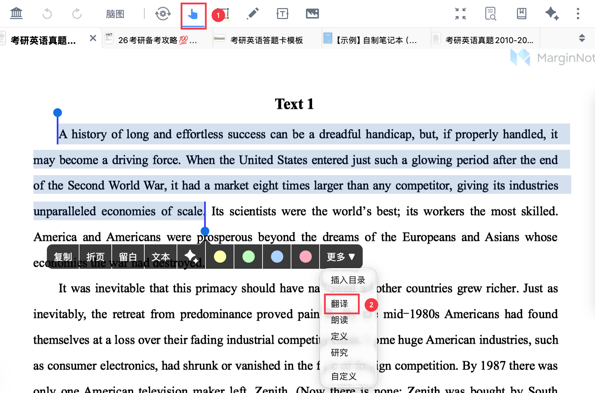

## 1.2 更改目标语言

点击`语言`更改目标语言

> 💡翻译有误时，请先确认目标语言。

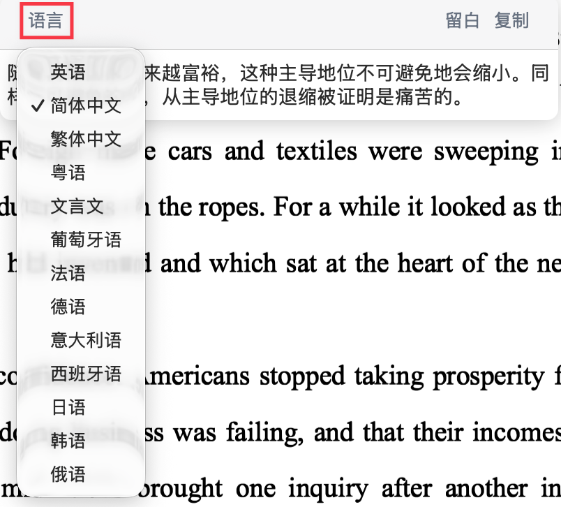

内置翻译支持13 种目标语言：英语、简体中文、繁体中文、粤语、文言文、葡萄牙语、法语、德语、意大利语、西班牙语、日语、韩语、俄语

> 💡内置**翻译经常用到？**
>
> 推荐在`弹出菜单栏`-`更多`-`自定义`中勾选`翻译`，将`翻译`加入一级菜单，一键直达。
>
> 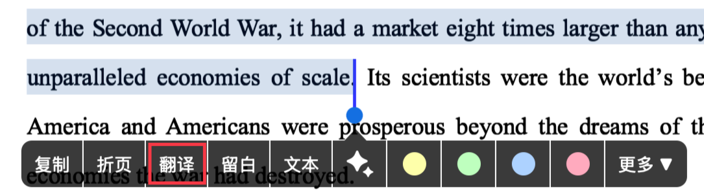

## 1.3 保存译文

翻译后的结果支持直接创建为留白或复制。

### 1.3.1 添加译文到留白

生成译文后，点击`留白`，译文将以`留白`形式插入文档，与原文并排对照。

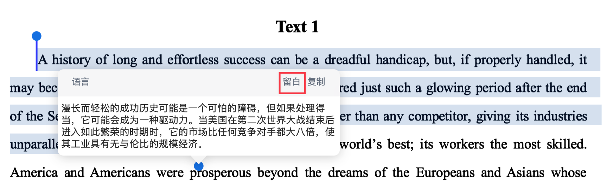

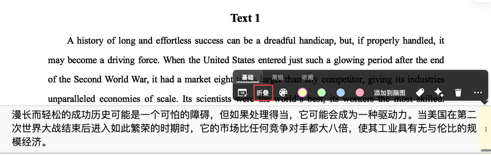

> 💡直接加入`留白`，方便与原文并排对照。`留白`可以`折叠`，阅读时按需展开，便于复盘与标注。更多留白相关操作见：[留白①|基础操作：字里行间自由开辟笔记空间](https://www.wolai.com/vYi6Yu4oCudNCr2zDuNQkj "留白①|基础操作：字里行间自由开辟笔记空间")。
>
> 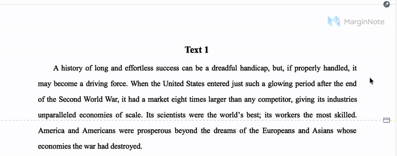

### 1.3.2 复制翻译文本到剪贴板

点击`复制`，译文会自动复制到剪贴板，直接在文档空白处粘贴会保存为`文本框`。

> 💡`复制`用于跨页/跨应用粘贴与整理。

# 2 AI翻译

## 2.1 在AI对话中翻译

调用 MarginNote4的内置 AI 功能进行翻译（需4.2.0及以上版本），适合长句与自然表达优化。生成结果同样可复制或保存为卡片。

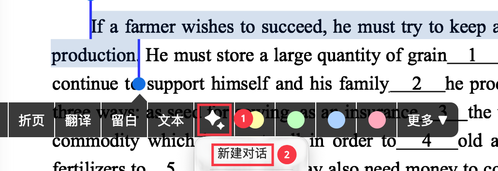

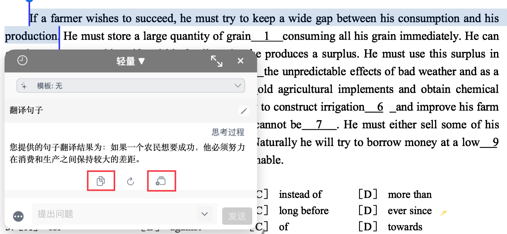

## 2.2 使用AI OCR翻译

在文档界面中，通过以下方式 ：

- 双击**手形工具**或**任一摘录工具**；
- 在弹出的设置面板中勾选`AI OCR`功能，此后在摘录制卡时，AI 将自动识别摘录内容并转为可编辑的文本；
- `AI制卡模板（Max 功能）`中输入提示词或选择预设提示词，可让 AI 在识别内容后自动整理、翻译、总结、制作闪卡等。

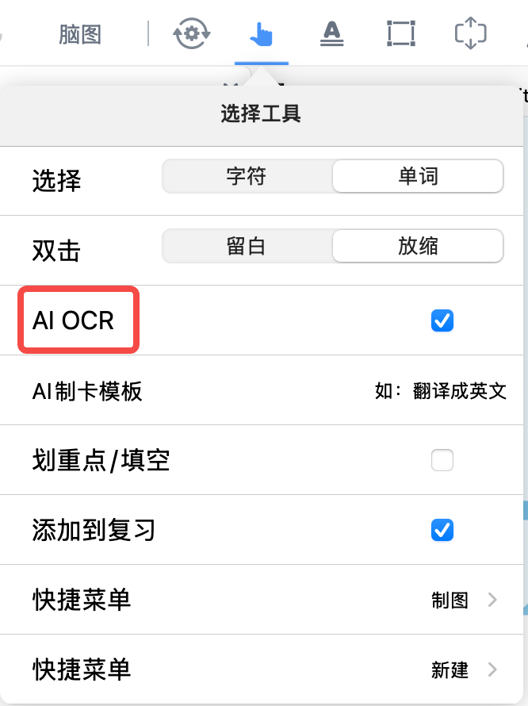

操作效果：

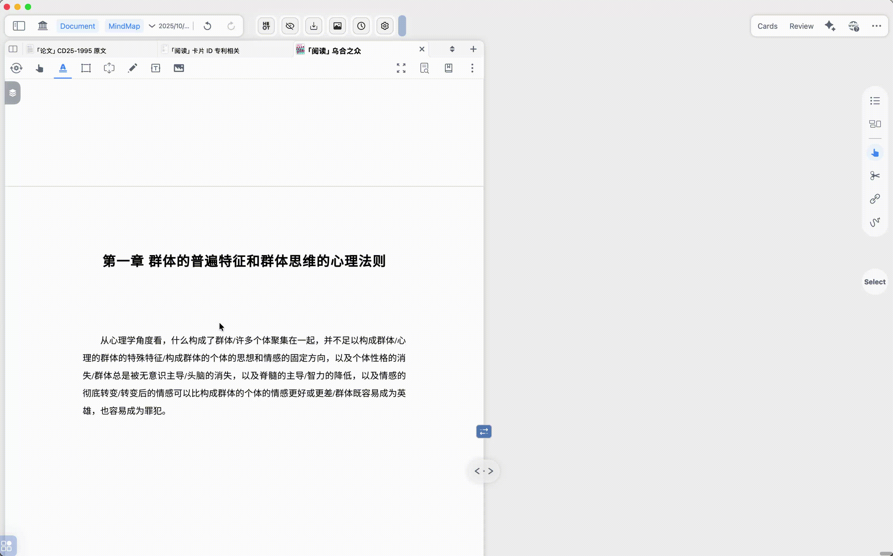

# 3 研究 → 翻译

## 3.1 使用内置研究→ 翻译

[研究](https://www.wolai.com/7AXUEU5B5UUuEGW1m7oZ9z "研究")

1. 在学习集-更多内点击`研究`（如上方图标所示），打开研究浏览器。

   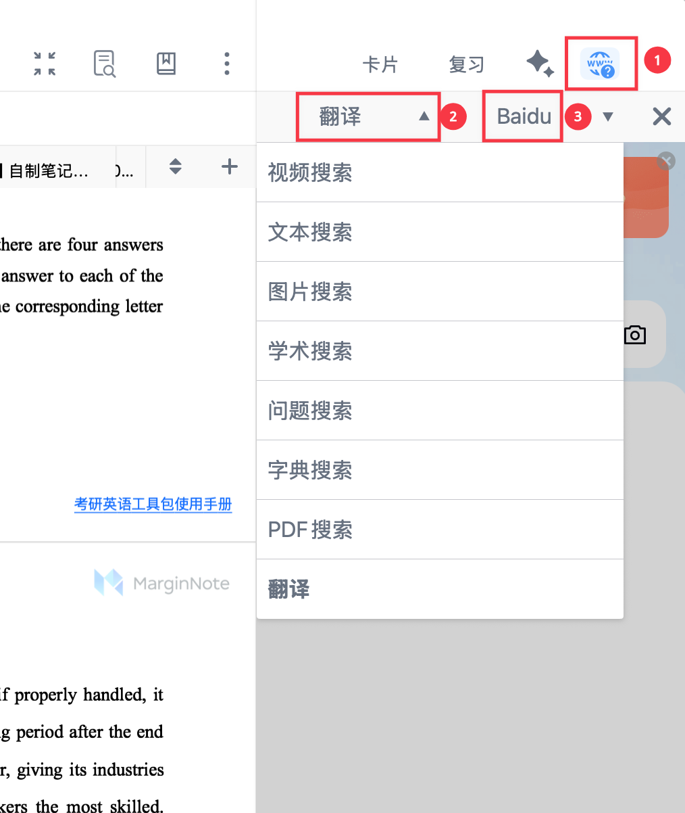
2. 选择`翻译`与翻译引擎（Baidu 或 Google），在文档中继续选取不同文本，侧栏会实时刷新对应翻译结果。

   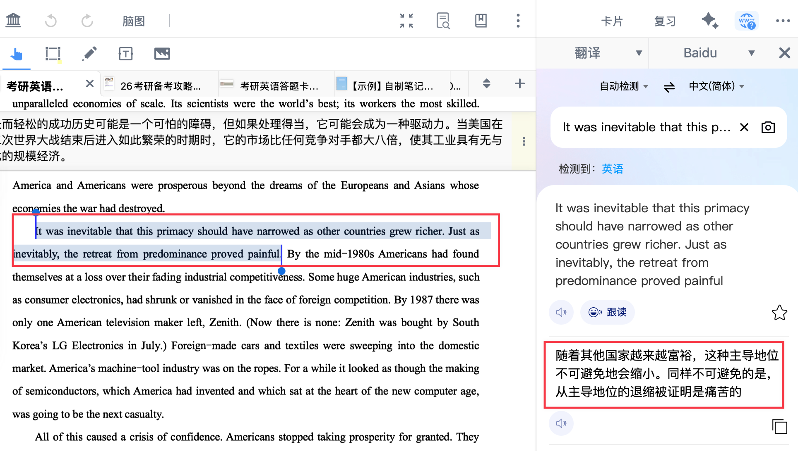

   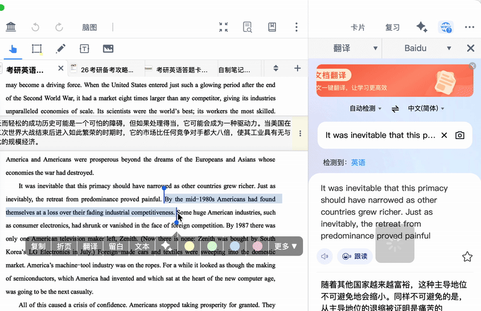

## 3.2 使用内置研究→ 字典搜索

MarginNote支持多种权威词典接口，适合术语精准释义与例证对照。

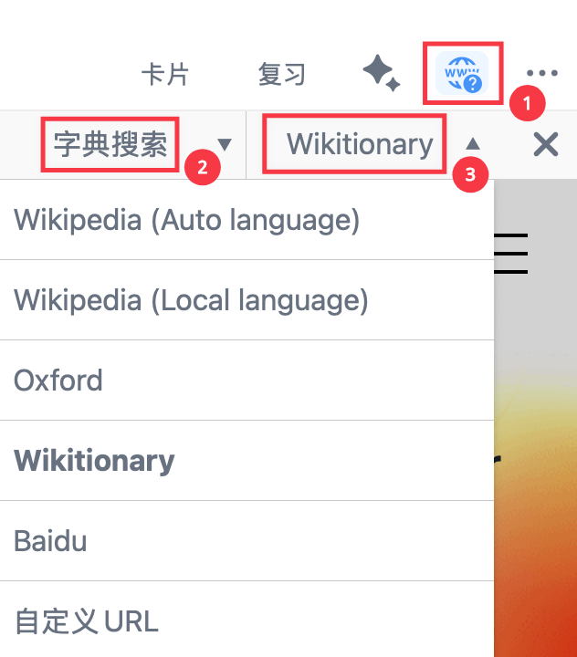

字典搜索支持多种内置接口：Wikipedia (Auto language)、Wikipedia (Local language)、Oxford、Wikitionary、Baidu 和使用内置研究→ 自定义URL。

## 3.3 使用内置研究→ 自定义URL

> 💡除了原生[研究](https://www.wolai.com/7AXUEU5B5UUuEGW1m7oZ9z "研究")功能自带的`翻译`功能，`自定义 URL` 是指把常用的翻译/词典网站接到研究侧栏，选词即查。

### 3.3.1 自定义URL（网页地址）设置教程

1. 在MarginNote 主页面左上角选择`设置`；
2. 选择`研究` - `自定义 URL` - 修改`自定义 URL`。

   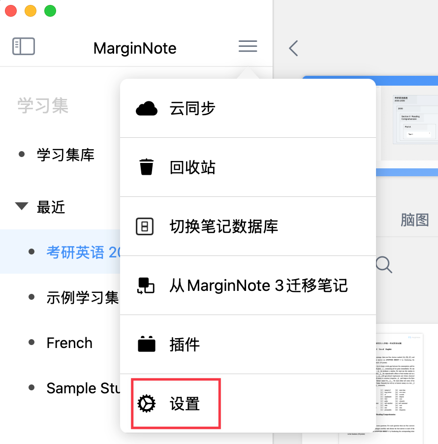

   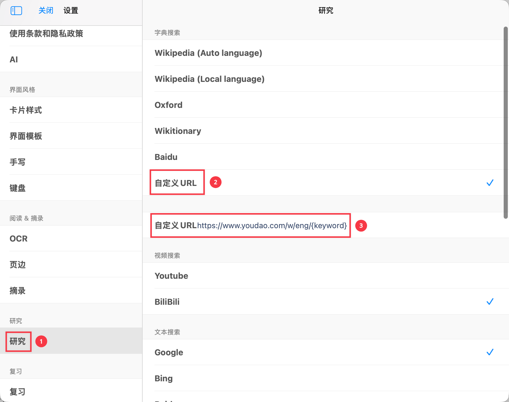
3. 在研究处选取`自定义 URL`。

   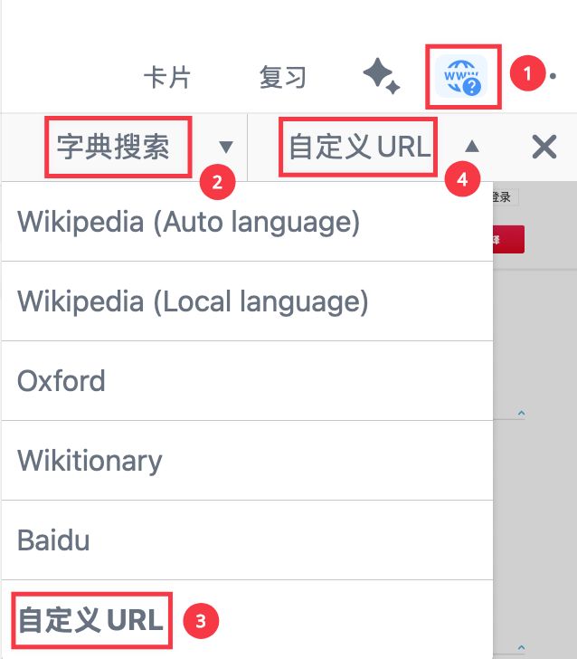

   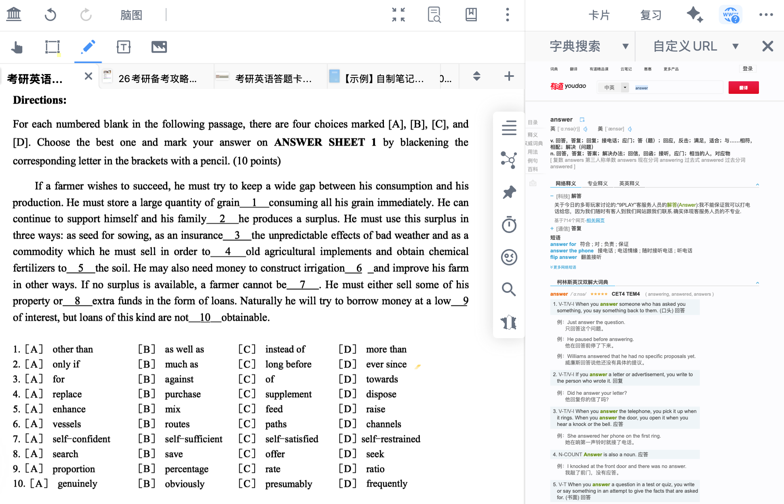

- 更多可用的翻译 URL，直接复制粘贴入 MarginNote`自定义 URL` 处使用。
  > 💡网页地址规则：把网站的“搜索词”替换为 {keyword}，MarginNote 会把你在文档里选中的文本自动填入这个位置并发起查询。适合连接翻译、词典、术语库与双语语料站点。
  > 葡萄牙语 → 中文 ：[https://fanyi.baidu.com/#pt/zh/{keyword}](https://fanyi.baidu.com/#pt/zh/{keyword} "https://fanyi.baidu.com/#pt/zh/{keyword}")
  法语 → 中文 ：[https://fanyi.baidu.com/#fra/zh/{keyword}](https://fanyi.baidu.com/#fra/zh/{keyword} "https://fanyi.baidu.com/#fra/zh/{keyword}")

  德语 → 中文 ：[https://fanyi.baidu.com/#de/zh/{keyword}](https://fanyi.baidu.com/#de/zh/{keyword} "https://fanyi.baidu.com/#de/zh/{keyword}")

  意大利语 → 中文 ：[https://fanyi.baidu.com/#it/zh/](https://fanyi.baidu.com/#it/zh/ "https://fanyi.baidu.com/#it/zh/")[{keyword}](https://fanyi.baidu.com/#spa/zh/{keyword} "{keyword}")

  西班牙语 → 中文 ：[https://fanyi.baidu.com/#spa/zh/{keyword}](https://fanyi.baidu.com/#spa/zh/{keyword} "https://fanyi.baidu.com/#spa/zh/{keyword}")

  日语 → 中文 ：[https://fanyi.baidu.com/#jp/zh/](https://fanyi.baidu.com/#jp/zh/ "https://fanyi.baidu.com/#jp/zh/")[{keyword}](https://fanyi.baidu.com/#spa/zh/{keyword} "{keyword}")

  韩语 → 中文 ：[https://fanyi.baidu.com/#kor/zh/](https://fanyi.baidu.com/#kor/zh/ "https://fanyi.baidu.com/#kor/zh/")[{keyword}](https://fanyi.baidu.com/#spa/zh/{keyword} "{keyword}")

  俄语 → 中文 ：[https://fanyi.baidu.com/#ru/zh/](https://fanyi.baidu.com/#ru/zh/ "https://fanyi.baidu.com/#ru/zh/")[{keyword}](https://fanyi.baidu.com/#spa/zh/{keyword} "{keyword}")

> 💡高阶选读：更多研究功能详见教程。
>
> [ 🔍 研究功能，全面揭秘（下） - 小红书  MarginNote自带的研究功能，除了支持内置的wikipedia/Oxford/Wikitionary…外，还可以添加✨自定义URL✨。 	  以“百度百科”为实例，逐步讲解：  在百度百科里搜索“心理学”，并拷贝该词条链接；  研究“⚙ 设置”里，修改字典搜索为“自定义URL”；  把拷贝的链接填入自定义URL，将搜索部分的“心理学”改为“{keyword}”；  自定义URL则完成修改并 https://www.xiaohongshu.com/explore/6583075d0000000038022894?xsec\_token=ABoIq7bm5DQzExwsbG14kRhauO93s9MyU6GsmCq6ZCFaY=\&xsec\_source=pc\_search\&source=unknown](https://www.xiaohongshu.com/explore/6583075d0000000038022894?xsec_token=ABoIq7bm5DQzExwsbG14kRhauO93s9MyU6GsmCq6ZCFaY=\&xsec_source=pc_search\&source=unknown " 🔍 研究功能，全面揭秘（下） - 小红书  MarginNote自带的研究功能，除了支持内置的wikipedia/Oxford/Wikitionary…外，还可以添加✨自定义URL✨。 	  以“百度百科”为实例，逐步讲解：  在百度百科里搜索“心理学”，并拷贝该词条链接；  研究“⚙ 设置”里，修改字典搜索为“自定义URL”；  把拷贝的链接填入自定义URL，将搜索部分的“心理学”改为“{keyword}”；  自定义URL则完成修改并 https://www.xiaohongshu.com/explore/6583075d0000000038022894?xsec_token=ABoIq7bm5DQzExwsbG14kRhauO93s9MyU6GsmCq6ZCFaY=\&xsec_source=pc_search\&source=unknown")

# 4 插件 → 翻译

> 💡插件安装教程：[用插件高效处理 MN工作](https://www.wolai.com/coBAV38vuTcUbTdHwnNNL5 "用插件高效处理 MN工作")

## 4.1 翻译类插件

- DeepL 插件：侧重自然表达与长句准确度。

  [ 【MN插件】DeepL实时选句动态翻译器——号称强过谷歌的AI翻译 #5月7日Ver.1.1.3# - 插件发布区｜允许不受限制地编辑更新主帖 - MarginNote 中文社区 :partying\_face: 我该如何安装一款插件？  :lollipop::lollipop:简介  1，采用DeepL作为翻译后端，使用“手型工具”选择文字后，插件会进行动态实时翻译（类似“研究”功能中的翻译引擎） 2，Dee\&hellip; https://bbs.marginnote.com.cn/t/topic/6113](https://bbs.marginnote.com.cn/t/topic/6113 " 【MN插件】DeepL实时选句动态翻译器——号称强过谷歌的AI翻译 #5月7日Ver.1.1.3# - 插件发布区｜允许不受限制地编辑更新主帖 - MarginNote 中文社区 :partying_face: 我该如何安装一款插件？  :lollipop::lollipop:简介  1，采用DeepL作为翻译后端，使用“手型工具”选择文字后，插件会进行动态实时翻译（类似“研究”功能中的翻译引擎） 2，Dee\&hellip; https://bbs.marginnote.com.cn/t/topic/6113")
- SearchInEudic / SearchInEudicPlus+ 插件：调用欧路词典，分屏查权威词典。

  [ 【第三方MN插件】SearchInEudic——自动在欧路词典中搜索选中单词，哪里不会点哪里 #Ver 1.0 已获官方签名# - 插件发布区｜允许不受限制地编辑更新主帖 - MarginNote 中文社区 :partying\_face: 我该如何安装一款插件？  :lollipop::lollipop:简介插件开启（需要同时在MarginNote 3的插件面板开启，并且确保文档界面的放大镜图标已被激活）后，选中任何英文单词（3个单词以内）\&hellip; https://bbs.marginnote.com.cn/t/topic/8143](https://bbs.marginnote.com.cn/t/topic/8143 " 【第三方MN插件】SearchInEudic——自动在欧路词典中搜索选中单词，哪里不会点哪里 #Ver 1.0 已获官方签名# - 插件发布区｜允许不受限制地编辑更新主帖 - MarginNote 中文社区 :partying_face: 我该如何安装一款插件？  :lollipop::lollipop:简介插件开启（需要同时在MarginNote 3的插件面板开启，并且确保文档界面的放大镜图标已被激活）后，选中任何英文单词（3个单词以内）\&hellip; https://bbs.marginnote.com.cn/t/topic/8143")

  [ Search In Eudic Plus+插件——自动在欧路词典中搜索选中单词，在plus插件基础上增加了对含有标题链接的卡片默认搜索第一个标题的功能、增加对含有特殊字符的单词的支持 - #13，来自 jann - 插件与自动化 - MarginNote 中文社区 插件功能： 改进了Eudic查词的体验 Feature： 可以包含标题别名，含标题别名的情况下只查询第一个标题可以是摘录生成的卡片，也可以是自己建立的卡片可以查询中文和法文，中文字数上限是六个字；英文的字数上限是5个词支持英\&hellip; https://bbs.marginnote.com.cn/t/topic/33391/13](https://bbs.marginnote.com.cn/t/topic/33391/13 " Search In Eudic Plus+插件——自动在欧路词典中搜索选中单词，在plus插件基础上增加了对含有标题链接的卡片默认搜索第一个标题的功能、增加对含有特殊字符的单词的支持 - #13，来自 jann - 插件与自动化 - MarginNote 中文社区 插件功能： 改进了Eudic查词的体验 Feature： 可以包含标题别名，含标题别名的情况下只查询第一个标题可以是摘录生成的卡片，也可以是自己建立的卡片可以查询中文和法文，中文字数上限是六个字；英文的字数上限是5个词支持英\&hellip; https://bbs.marginnote.com.cn/t/topic/33391/13")
- SearchInFrhelper+ 插件：调用法语助手查词。

  [ SearchInFrhelper+ - 法语助手点击搜索 适配MN4+iOS18 - 插件与自动化 - MarginNote 中文社区 由于Search In Frhelper——法语学习者福音 增加对法语助手的支持，功能与改进版Search in Eudic plus+完全相同 不支持MN4 于是在SearchInEudic的适配iOS18基础上 【第三方MN插件】S\&hellip; https://bbs.marginnote.com.cn/t/topic/61154](https://bbs.marginnote.com.cn/t/topic/61154 " SearchInFrhelper+ - 法语助手点击搜索 适配MN4+iOS18 - 插件与自动化 - MarginNote 中文社区 由于Search In Frhelper——法语学习者福音 增加对法语助手的支持，功能与改进版Search in Eudic plus+完全相同 不支持MN4 于是在SearchInEudic的适配iOS18基础上 【第三方MN插件】S\&hellip; https://bbs.marginnote.com.cn/t/topic/61154")
- OhMyMN 插件：自动填写词卡翻译。
  - AutoComplete模块

    [ AutoComplete | OhMyMNGitHubGitHub MarginNote 插件开发框架 https://ohmymn.marginnote.cn/guide/modules/autocomplete.html](https://ohmymn.marginnote.cn/guide/modules/autocomplete.html " AutoComplete | OhMyMNGitHubGitHub MarginNote 插件开发框架 https://ohmymn.marginnote.cn/guide/modules/autocomplete.html")
  - AutoTranslate 模块

    [ AutoTranslate | OhMyMNGitHubGitHub MarginNote 插件开发框架 https://ohmymn.marginnote.cn/guide/modules/autotranslate.html](https://ohmymn.marginnote.cn/guide/modules/autotranslate.html " AutoTranslate | OhMyMNGitHubGitHub MarginNote 插件开发框架 https://ohmymn.marginnote.cn/guide/modules/autotranslate.html")
- MdxDict插件：内置 mdx 格式词典。

  [ 【第三方MN插件】MdxDict——内置 MDX 格式词典、集成官方 DeepL 插件，选中单词/段落可自动弹出释义/翻译 #Ver.1.0.5 已获官方签名# - 插件发布区｜允许不受限制地编辑更新主帖 - MarginNote 中文社区 :thinking: 我该如何安装一款插件？ :warning: 本插件需要【MarginNote 3.7.11 或更新版本】 :crystal\_ball: 最新版本下载 (48.5 MB) :desert\_island:\&hellip; https://bbs.marginnote.com.cn/t/topic/19815](https://bbs.marginnote.com.cn/t/topic/19815 " 【第三方MN插件】MdxDict——内置 MDX 格式词典、集成官方 DeepL 插件，选中单词/段落可自动弹出释义/翻译 #Ver.1.0.5 已获官方签名# - 插件发布区｜允许不受限制地编辑更新主帖 - MarginNote 中文社区 :thinking: 我该如何安装一款插件？ :warning: 本插件需要【MarginNote 3.7.11 或更新版本】 :crystal_ball: 最新版本下载 (48.5 MB) :desert_island:\&hellip; https://bbs.marginnote.com.cn/t/topic/19815")
- MN Toolbar插件：高阶卡片操作。

  [ 【第三方MN插件】MN Toolbar，为特定操作提供手动快速触发 - 插件发布区｜允许不受限制地编辑更新主帖 - MarginNote 中文社区 插件反馈如果你对插件有任何反馈，都可以通过以下链接：MN插件文档说明测试版下载：插件下载常见问题：常见问题（先看这里）也可以加入qq群：539305227插件下载：所有功能都支持iPad和Mac 除官方签名版本外，安装插件\&hellip; https://bbs.marginnote.com.cn/t/topic/45185](https://bbs.marginnote.com.cn/t/topic/45185 " 【第三方MN插件】MN Toolbar，为特定操作提供手动快速触发 - 插件发布区｜允许不受限制地编辑更新主帖 - MarginNote 中文社区 插件反馈如果你对插件有任何反馈，都可以通过以下链接：MN插件文档说明测试版下载：插件下载常见问题：常见问题（先看这里）也可以加入qq群：539305227插件下载：所有功能都支持iPad和Mac 除官方签名版本外，安装插件\&hellip; https://bbs.marginnote.com.cn/t/topic/45185")

> 💡插件属于高阶功能，适合追求质量/自动化的深度用户；初学者建议先用内置翻译（max功能）或研究 → 翻译。
