# 留白①|基础操作：字里行间自由开辟笔记空间

> 💡**留白——**扩展PDF笔记空间**：**
>
> `留白`功能允许在 PDF 的任意位置插入一块可展开的笔记区域，用于补充解释、记录思考、放入关联资料或提出问题，而不会改变原文的排版结构。
>
> 无论是长段落的理解、跨页知识的整理，还是对关键内容的延伸记录，都可以在原文旁边即时扩展并随时更新，让阅读与笔记保持紧密结合。
>
> 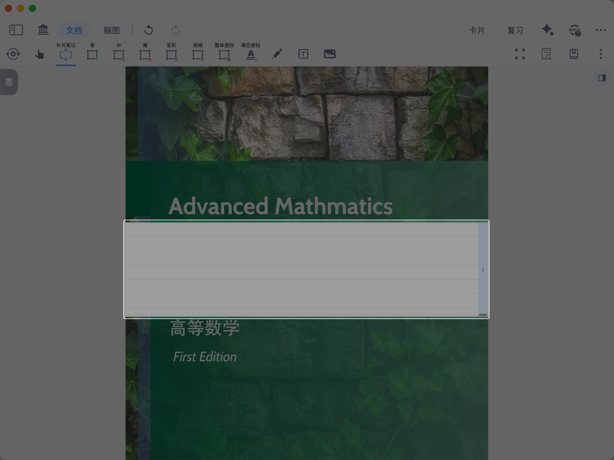

> 💡如果你已熟练掌握`留白`的基础操作，可跳过本页面，继续阅读应用案例：[留白②|使用场景：分层管理阅读笔记](https://www.wolai.com/91LaezjY5SXvoCRie5UsJQ "留白②|使用场景：分层管理阅读笔记")

# 1 什么是留白

留白有以下三种显示效果：

- `嵌入（正常）：`是留白的默认模式，视觉上与教材宛如一体，适合课堂补充完善教材知识点，增加标注说明等。
- `页边：`在页面边缘产生独立的评论区效果，从而不干扰主体阅读，如同一张张便利贴在书的旁边，适合保持论文排版，或快速补充评论，
- `折叠：`折叠后留白会省略为一条线，从而不干扰主体阅读，有需要时再点击查看。如在定理证明中，一些步骤不是很详细，利用留白补充的同时又不会干扰主要证明框架。

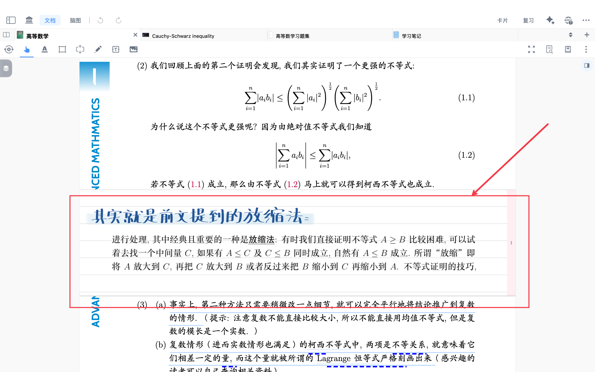

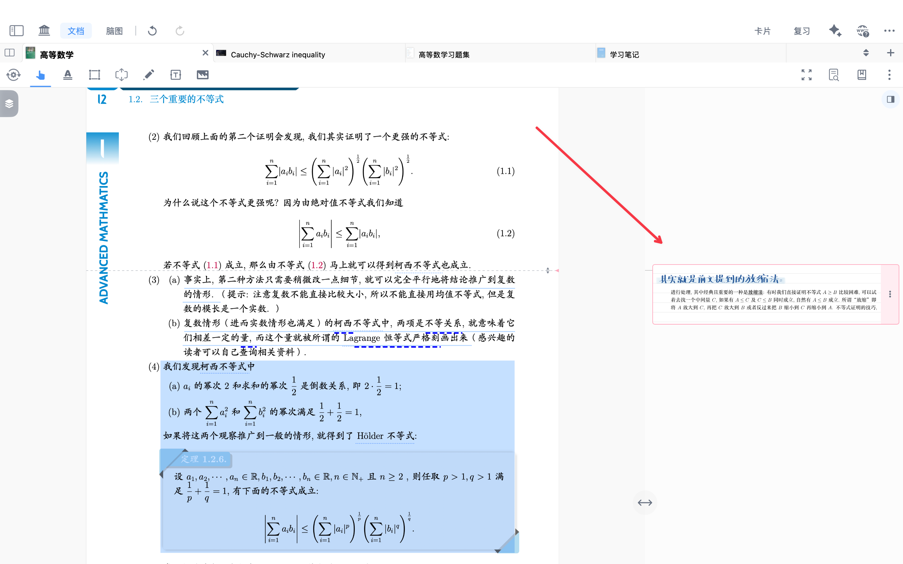

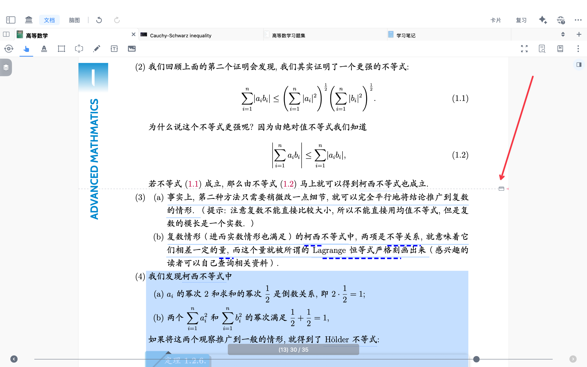

# 2 新建留白（以正常模式为例）

## 2.1 在文档界面内创建留白

[留白工具](https://www.wolai.com/7fTP7HqwGwQ7kNe17kLPtp "留白工具")

单击选中工具栏的留白工具（如上方图标所示），有3种创建留白方式：

1. 在**空白区域**点击形成`留白`。也可通过`手型工具`设置`双击创建留白`（如此栏第二张图片所示）

> 💡用于在 PDF 中新增笔记位置。
>
> 适合在原文旁补充见解、总结要点、记录思路或加入补充资料，不依赖原文选区，灵活度最高。

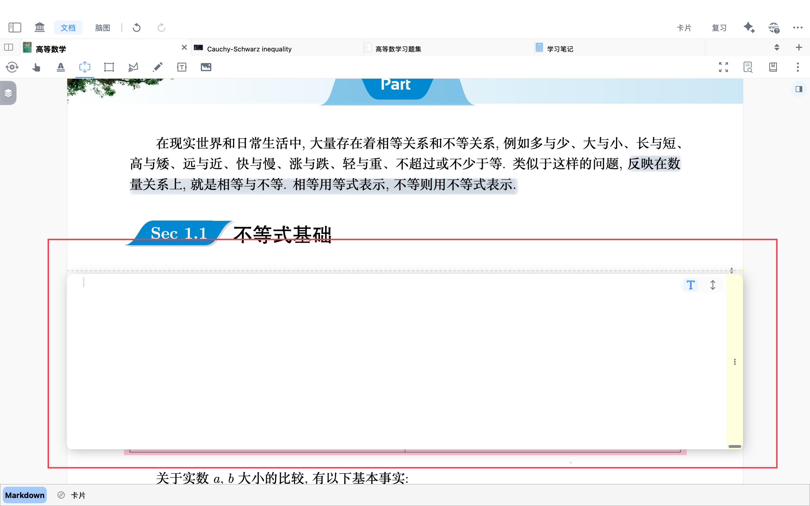

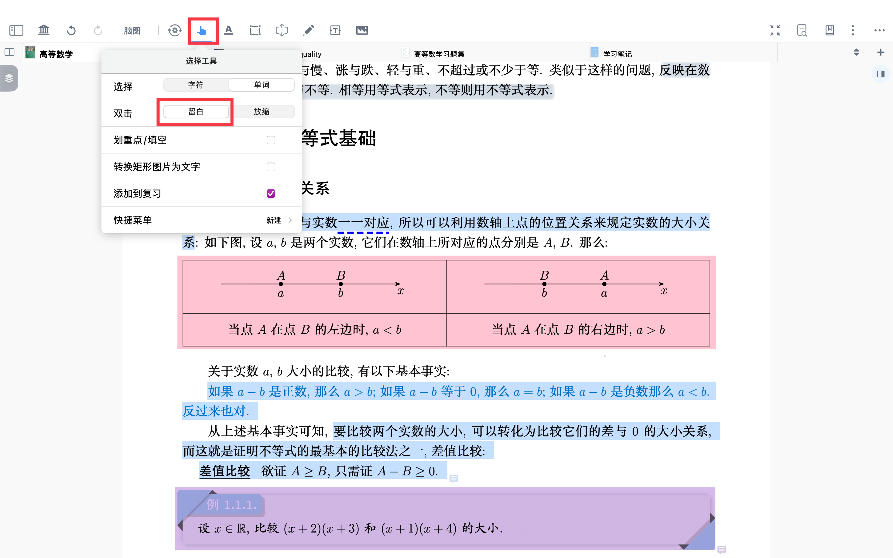

1. 在**文字区域**选择文字生成`文字摘录留白`。

> 💡用于在文档文字基础上展开解释或延伸内容。
>
> 适合处理名词解释、概念梳理、例句翻译、公式或观点的讲解等场景，可将选中内容与补充说明明确关联。

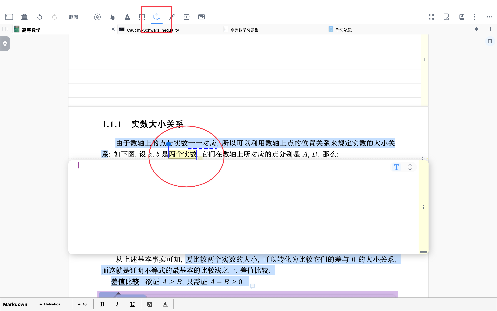

1. **非文字区域**拖动选择生成`矩形摘录留白`。

> 💡用于为图片、图表、公式截图、表格等非文本区域添加关联笔记。
>
> 适合在视觉材料旁补充说明、做结构解析、标注关键点或添加进一步信息。

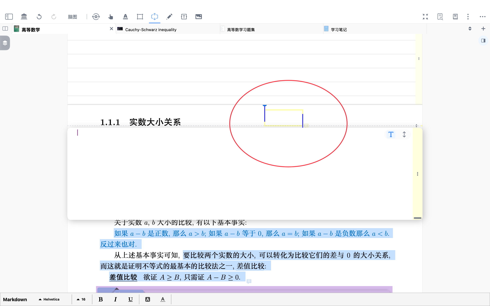

## 2.2 在`页边评论区`创建留白

- 点击文档右上角`...(文档-更多`
- 将`留白`切换到`页边`模式，同时`页边评论区`会自动打开

- 此时创建`留白`，`留白`默认于`页边评论区`展开（效果如下图所示）

# 3 编辑留白

## 3.1 编辑留白内容

- 创建`留白`后，可编辑`留白`内容
  - 可进行Apple Pencil手写（点击`T`键切换为全文本模式键入）

    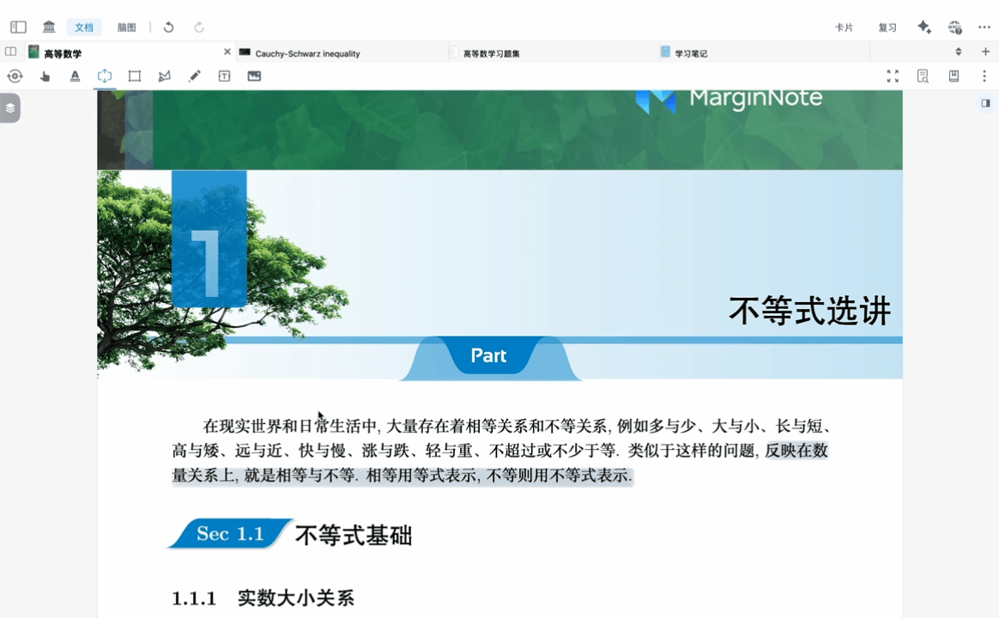
  - 在`手写模式`下单击留白内部空白处，可转换为全文本模式（同`T`键）、粘贴内容、插入局部文本框、图片（拍摄、插入相册图片）、以及取消留白

- 单击留白右侧三点，唤出菜单栏

> 💡卡片弹出菜单包含基础、高级和收藏栏：三类工具，主要用于编辑、管理和扩展卡片功能。完整按钮说明请见：[卡片弹出菜单栏及其自定义](https://www.wolai.com/6QJHeJqZghQKQ4PcEA3w5u "卡片弹出菜单栏及其自定义")

- [基础栏](https://www.wolai.com/vYi6Yu4oCudNCr2zDuNQkj#9jLoynYLRf139EU8LSt2Su "基础栏")**：** 对该卡片进行简单的操作，其中`折叠`是与`留白`紧密关联的功能。

> 💡启用`折叠`后，可将选中`留白`折叠成一条虚线，用于简化pdf页面、隐藏细节、保持阅读连贯性，适合在处理留白笔记或段落扩展内容时维持页面整洁。

- [高级栏](https://www.wolai.com/vYi6Yu4oCudNCr2zDuNQkj#uvbVqA7dLdbkXGvjQNW87g "高级栏")：对该卡片进行较为复杂的操作，包含`朗读`、`研究`（在MN内置浏览器中搜索）、`导出`
- [收藏栏](https://www.wolai.com/vYi6Yu4oCudNCr2zDuNQkj#6mcitXCZMiKisfadvFu9Mx "收藏栏")：`基础`和`高级`中的常用功能，可以在`收藏`中进行汇总，无需来回切换。

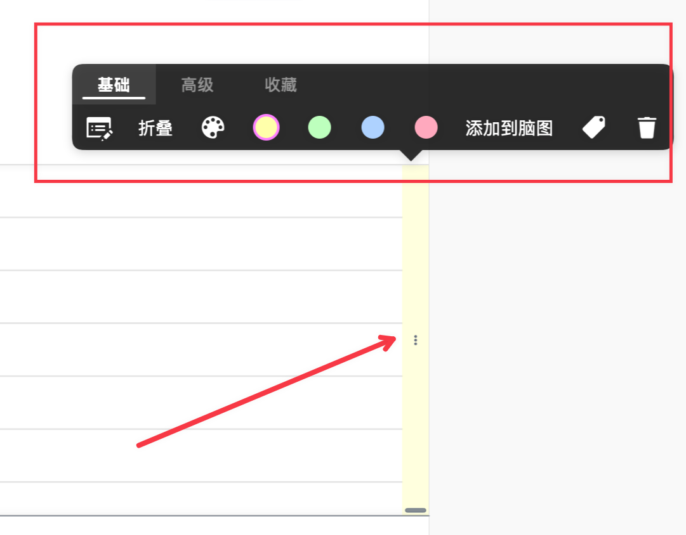

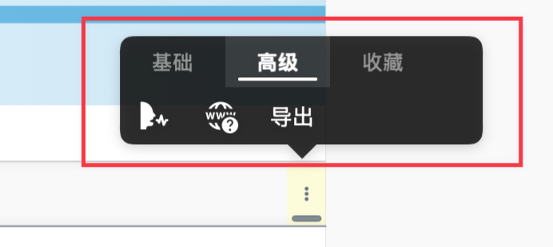

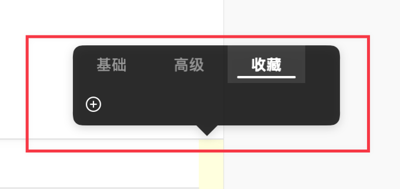

## 3.2 改变留白样式

### **展开留白**

- 留白在`折叠`状态下，单击`展开留白`按键，即可展开留白。

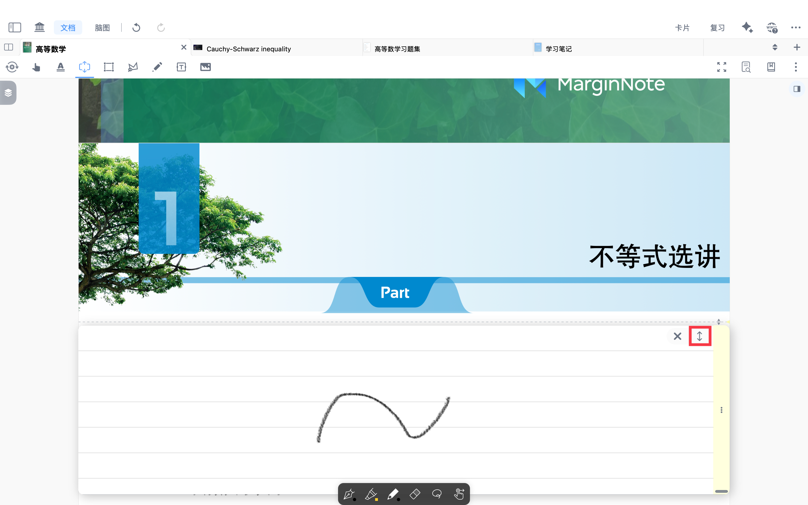

- 点击`自动展开`按钮，即会开启/关闭留白的自动展开。

  [自动展开](https://www.wolai.com/p7ocDzsU4X43nGW6dZun94 "自动展开")

在留白手写模式下，单击`自动展开`按钮，按键变为蓝色，留白以`正常`模式展开于PDF中

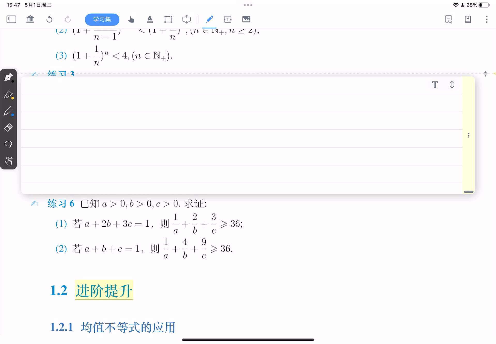

在留白手写模式下，单击`自动展开`按钮，按键变为灰色，留白以`折叠`模式呈现于PDF中

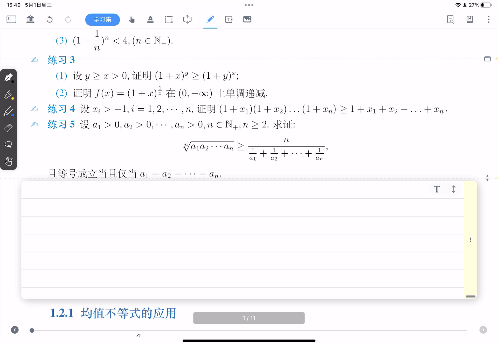

### 3.2.2 上下移动留白位置

- 长按并拖拽留白右上角小箭头/`右侧三点`，可将留白上下移动

  

### 3.2.3 调整留白的高度

- 拖拽`右下角横线`，可调整留白的上下高度。

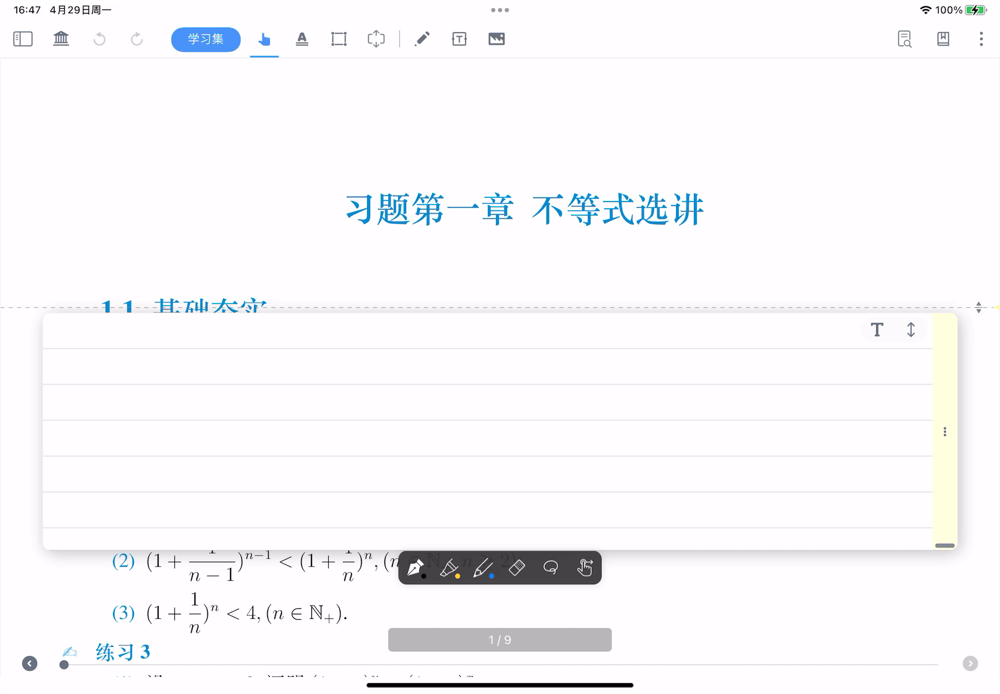

## 3.3 切换留白呈现方式

### 3.3.1 三种留白样式

1. 正常（嵌入文档）
   - 点击[文档-更多](https://www.wolai.com/sXcbPqE5bY2h9Y6UWxv8F3 "文档-更多")按钮
   - 勾选设置为`正常`模式
   - 创建留白后，留白以`正常`模式展开于PDF中
     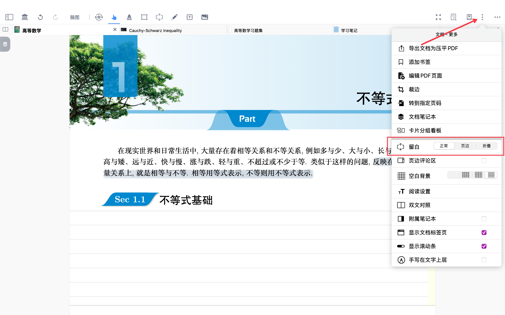
2. 页边
   - 点击[文档-更多](https://www.wolai.com/sXcbPqE5bY2h9Y6UWxv8F3 "文档-更多")按钮，勾选设置为`页边模式`，自动开启`页边评论区`
   - 创建留白后，留白会于`页边评论区`展开
     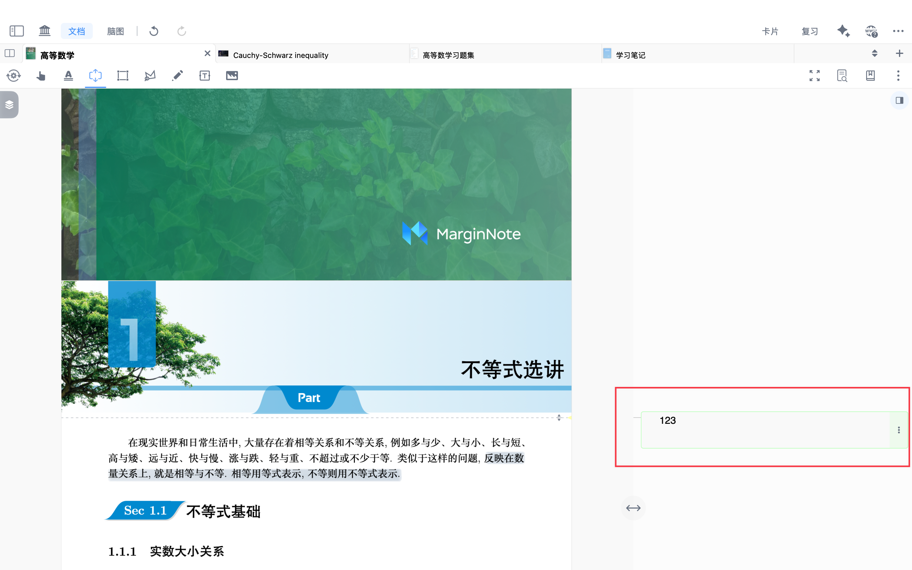
3. 折叠
   - 点击[文档-更多](https://www.wolai.com/sXcbPqE5bY2h9Y6UWxv8F3 "文档-更多")按钮，勾选设置为**折叠**模式
   - 创建留白输入内容后，单击文档处，留白以`折叠模式`呈现
     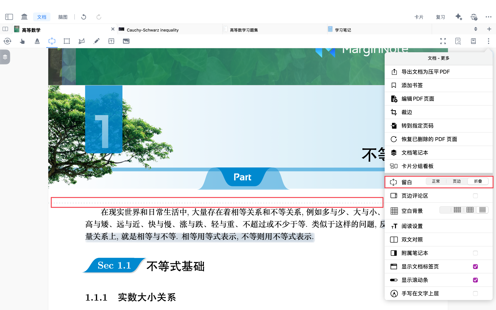

***

> 💡继续阅读`留白`的应用案例：[留白②|使用场景：分层管理阅读笔记](https://www.wolai.com/91LaezjY5SXvoCRie5UsJQ "留白②|使用场景：分层管理阅读笔记")
