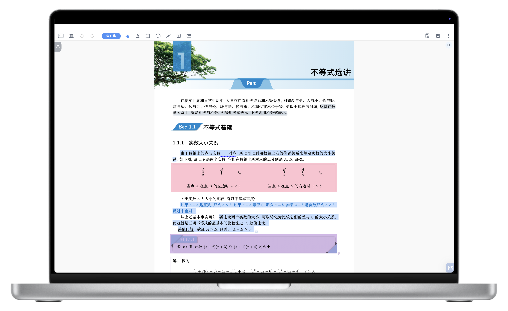
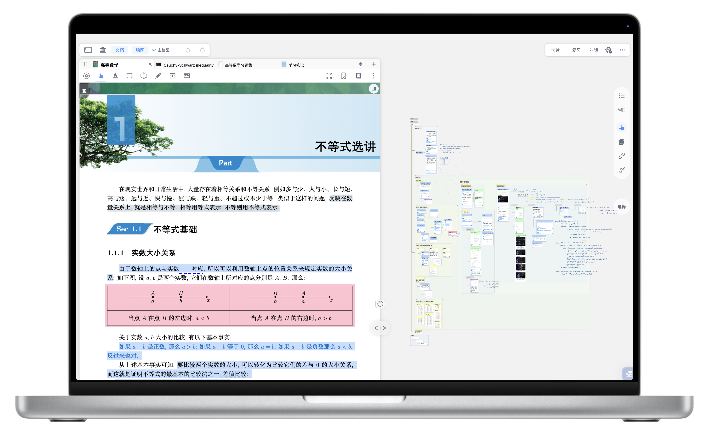
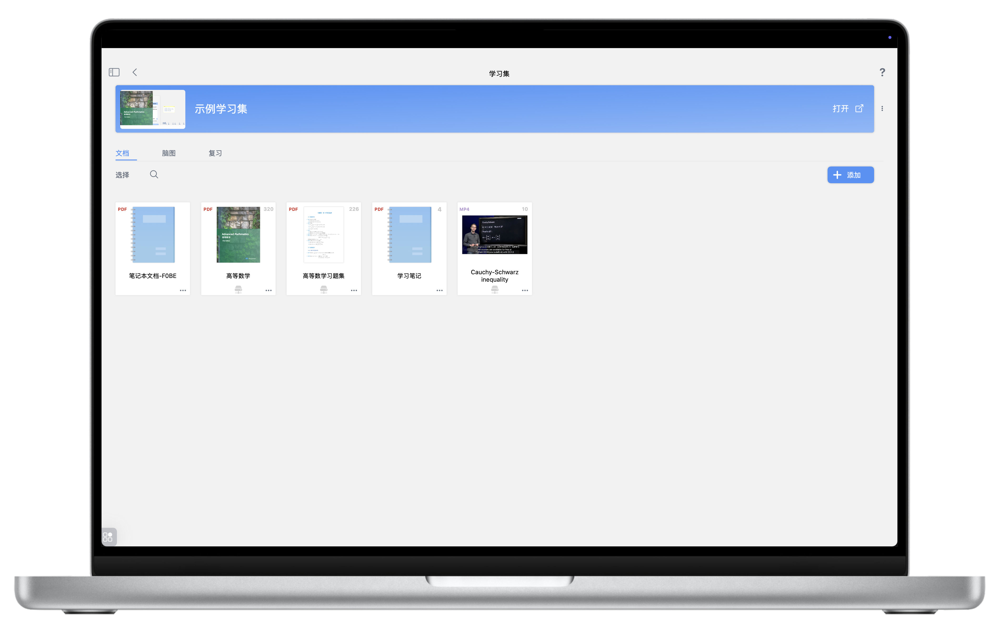
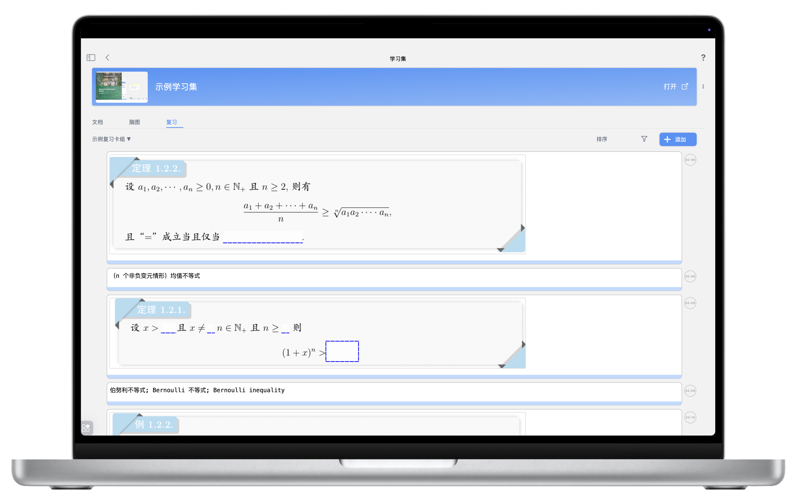
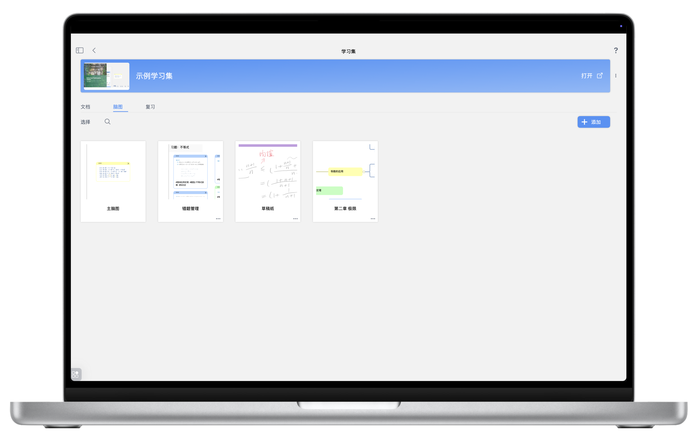
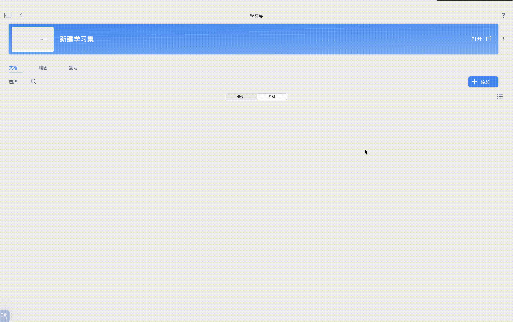
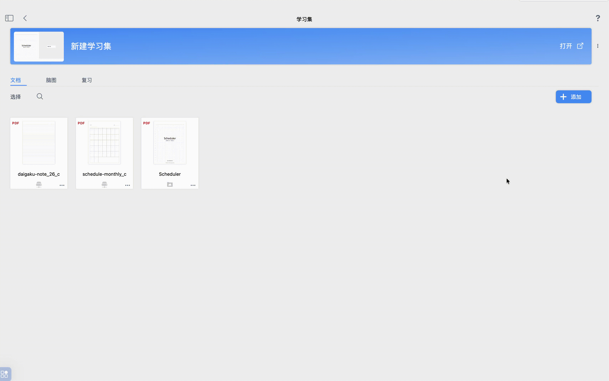
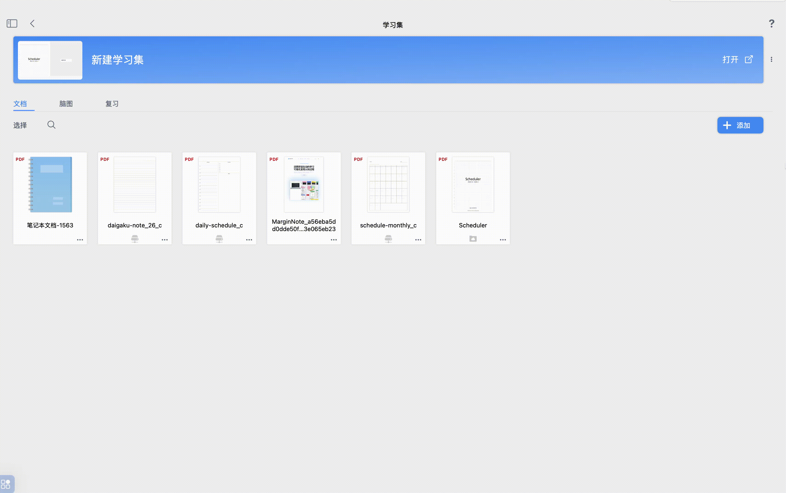
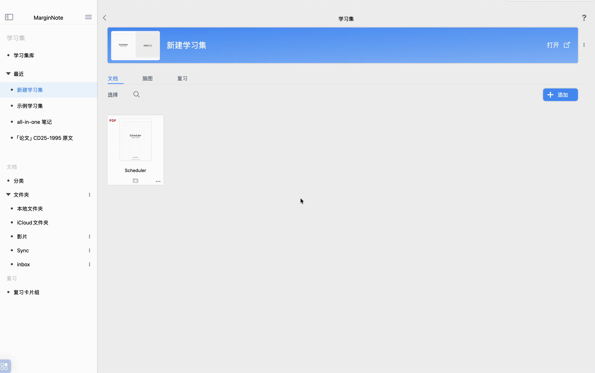
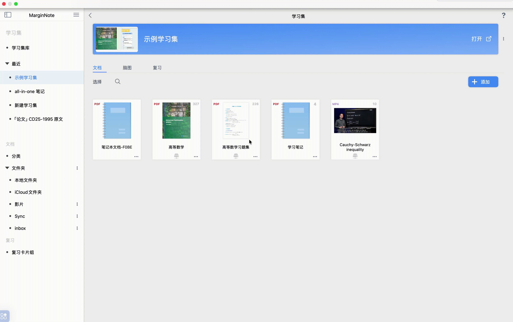

# 新建学习集：开启主题式学习

> 💡在前面的章节中，你已经学会了在文档上做各种笔记——摘录重点、留白批注、手写标记、检索定位、多文档对照。这些功能让你能高效地阅读和标注单篇文档。
>
> 但真实的学习场景往往更复杂：备考一门课程，你可能同时在读教材、刷习题、看视频讲义；研究一个课题，你会翻阅多篇论文和参考书。你不仅需要在每份材料上做笔记，更需要把散落在不同文档中的知识点提取出来、串联成体系、定期复习巩固。
>
> 这就是\*\*`学习集`\*\*要解决的问题。
>
> 学习集是你围绕一个学习主题创建的专属空间。在这个空间里，MarginNote\*\*把阅读、整理、记忆三个环节整合成了一个连贯的工作流：
>
> -**文档：**你需要阅读**的**PDF、EPUB、视频等学习材料，都集中在这里
>
> -**脑图**：阅读时摘录的重点会自动生成卡片，你可以在脑图中拖拽、组织，搭建出这个主题的知识框架
>
> -**复习**：需要记忆的卡片可以直接进入间隔重复复习，不用离开当前界面
>
> 文档和脑图在学习集中是动态联动的——点击文档中的摘录，脑图自动定位到对应卡片；点击脑图中的卡片，文档自动翻到原文位置。你不再需要在"阅读"和"整理笔记"之间来回切换，而是边读边建构知识体系。

# 1 学习集界面与功能模式

你可能注意到了：前面章节中使用的文档阅读界面，只有文档本身，并没有脑图编辑区域。那是**MarginNote**4的"纯文档阅读模式"——适合快速浏览和临时标记。

而学习集提供的是另一种界面：文档与脑图并排显示、实时联动。这才是**MarginNote**4的核心学习模式。要进入这个模式，你需要先创建一个学习集。

## 1.1 纯文档阅读界面（无脑图编辑功能）

- **特点**：此界面主要用于**纯粹的文档阅读和基础批注**。您可以在文档上进行高亮、划线、添加简单批注和摘录文字，但无法基于摘录直接创建或编辑脑图。
- **适用场景**：当您只想快速浏览文档、做一些临时标记，或者不需要构建复杂知识体系时，可以选择此模式。

## 1.2 文档+脑图编辑界面（有脑图编辑功能）

- **特点**：这是MarginNote 4的**核心学习模式**。在此界面下，您不仅可以进行文档阅读和批注，更重要的是，您可以将文档中的摘录内容直接转化为“摘录卡片”，并在右侧的脑图区域构建和编辑您的知识框架。（详见：[脑图与文档联动视图](https://www.wolai.com/7PQUHR2ZsY58z128y6KtoW "脑图与文档联动视图")、[手动摘录生成脑图](https://www.wolai.com/5sY7oXw6U88xhJnKA6ChUr "手动摘录生成脑图")）
- **适用场景**：当您需要深入学习、整理知识结构、制作思维导图、进行知识关联和复习时，此模式是您的最佳选择。

> ❗脑图依附于学习集存在——没有学习集，就无法创建脑图。所以，想要在阅读时同步构建知识框架，第一步就是创建学习集，再把文档导入其中。下面介绍具体的创建方法。

# 2 新建学习集

创建学习集是您在MarginNote 4中开始高效学习的第一步。这里有2种主要方法。

## 2.1 方法一：从0开始新建学习集

- **打开学习集库**：在MarginNote 4的左侧边栏中，点击 `学习集库`进入学习集管理页面。
- **点击新建**：在学习集库页面的右上角，找到并点击 `新建`按钮。
- **输入名称**：在弹出的对话框中，为您的新学习集输入名称
- **确认创建**：点击 `确定`按钮，您的新学习集就创建完成了。

## 2.2 方法二：从文档组建学习集

正在学习的文档，可以基于这个文档直接建立学习集，新学习集将自动包含这个文档。

- **打开文档**：首先，打开一个您想要学习的文档，进入“纯文档阅读界面”。
- **点击工具栏“学习集”按钮**：在文档阅读界面的顶部工具栏中，找到并点击 `学习集`按钮。
- **选择“在新学习集中打开”**：在弹出的菜单中，点击 `在新学习集中打开`选项。
- **自动或自定义命名**：此时，MarginNote 4会自动创建一个与当前文档同名的学习集，并将该文档添加到其中。您也可以选择自定义输入学习集名称。

# 3 学习集内各板块介绍

创建学习集后，你会看到它包含三个核心板块：

- 文档：你导入的所有学习材料（PDF、EPUB、视频、空白笔记本等）
- 脑图：在阅读过程中，通过摘录生成的思维导图——它是你知识框架的可视化呈现
- 复习：你标记需要记忆的卡片，配合间隔重复算法进行科学复习

这三个板块并非彼此独立，而是相互贯通的：文档中的摘录会变成脑图中的卡片，卡片可以加入复习计划，复习时又能一键回溯到原文位置。这种贯通性正是学习集区别于普通文件夹的关键。

## 3.1 向学习集导入文档

- **选择学习集**：首先，在学习集库中点击进入您想要操作的学习集。
- **进入“文档”板块**：在学习集界面的顶部，点击 `文档`板块。
- **点击“添加”按钮**：在文档板块中，找到并点击 `添加`按钮。
- **选择导入方式**：提供多种导入文档的方式：`从文件`、`新建文档做为笔记本`、`从Web 网页`、`从文档库`

  

### 3.1.1 从文件

- **功能**：允许您从设备上的**外部文件夹**中选择文档文件（如PDF、EPUB、mp4等）导入到当前学习集。
- **操作**：点击 `从文件`，然后浏览并选择您要导入的文档。

> ❗**临时打开**
> 在MarginNote4中，添加的文档会先被导入到您的“文档库”，并**临时加入**当前学习集。只有当您开始对该文档进行摘录、批注，或手动点击“添加”键将其正式加入学习集后，它才会成为学习集的一部分。
>
> 

### 3.1.2 新建空白笔记本

- **功能**：在当前学习集的 `文档`板块中直接创建一个**空白的笔记本文件**。这个笔记本可以用于自由书写、绘图或粘贴内容，作为一个独立的学习资料。
- **操作**：点击`添加`，选择 `新建笔记本`，一个空白笔记本就会立即生成。

### 3.1.3 从web网页

- **功能**：通过MarginNote 4内置的浏览器，您可以直接搜索网页内容并将其作为文档导入到学习集中。导入的网页文件会自动保存在您的设备本地文件夹中的 `WebDownloads`目录。
- **操作**：点击 `从 web 网页`，在内置浏览器中输入网址或搜索关键词，找到目标网页后导入。

> 💡**临时打开**
> 在MarginNote4中，添加的文档会先被导入到您的“文档库”，并**临时加入**当前学习集。只有当您开始对该文档进行摘录、批注，或手动点击“添加”键将其正式加入学习集后，它才会成为学习集的一部分。

### 3.1.4 从文档库

> 💡文档库是您所有导入文件的中央存储地。

- **功能**：允许您从MarginNote 4的**文档库**中选择已导入的文档，将其添加到当前学习集。
- **操作**：点击 `从文档库`，然后选择您想要添加的文档。

## 3.2 添加子脑图

- **功能**：子脑图是主脑图下的一个独立分支，可以看作是主脑图中的一个节点，但它拥有自己独立的脑图编辑空间。当您的学习主题非常庞大，需要将某个部分独立出来进行更详细的梳理时，子脑图会非常有用。（详见：创建子脑图）
- **操作**：在学习集界面的“脑图”板块中，点击 `添加`按钮，然后输入子脑图的名称，即可创建一个新的[新建和管理子脑图层级](https://www.wolai.com/wAZ8JuGD8M6EZu8qFjFXmD "新建和管理子脑图层级")[^1]。

## 3.3 复习板块

- **功能**：`复习`板块是您进行**知识点回顾和强化**的区域。您可以将学习过程中创建的摘录卡片添加到这里，进行定期复习。（复习相关内容详见：[闪卡复习①：基于FSRS抗遗忘算法的科学复习](https://www.wolai.com/31KwWufHLt8MUbyxQahbP3 "闪卡复习①：基于FSRS抗遗忘算法的科学复习")）
- **操作**：在学习集界面的“复习”板块中，点击 `添加`按钮，系统会显示您已摘录的卡片列表，您可以从中批量选择需要复习的卡片加入到复习计划中。

# 4 通过文档库向学习集添加文档

文档库是MarginNote 4中所有已导入文件（书籍、视频等）的中央存储区域。它方便您统一管理和访问所有学习材料。

> 💡相较于MarginNote 3，MarginNote 4的文档库在以下方面进行了增强：
>
> - **笔记与卡片复用**：您可以轻松地将文档从文档库拖入不同的学习集，实现同一份文档的笔记和卡片在多个学习集之间**无障碍复用**。这意味着您不需要为每个学习集重复导入文档或创建笔记。
> - **笔记卡片共享**：文档上已经积累的笔记卡片（包括摘录、批注等）会在学习集的“卡片盒”中共享，供脑图、记忆卡组、看板等工具**自由交换使用**，极大地提高了知识的利用率。

当您已经创建好学习集后，如果想从文档库中向现有学习集添加文档，有以下几种便捷方式：

## 4.1 拖拽导入

- **功能**：MarginNote 4支持直接将PDF文档从文档库拖拽到目标学习集，快速完成导入。
- **操作**：
  1. 在文档库中，找到您想要导入的PDF文件。
  2. 按住并拖动该文件到左侧边栏的目标学习集名称上，或者直接拖动到已打开的学习集界面中，详见：学习集边栏。
  3. 松开鼠标，文件即会导入到该学习集。

> ❗此拖拽导入功能**目前仅支持PDF文件类型**

## 4.2 从文档库添加

- **进入文档**库：点击左侧边栏的`文档`>`分类` 图标。
- **选择文件**：在文档库中，找到您想要添加的文件。
- **点击“学习集-更多”**：在文件的右下角，点击 [更多](https://www.wolai.com/i9EZnbxforWCdehq37ggK3 "更多") 按钮。

  [更多](https://www.wolai.com/i9EZnbxforWCdehq37ggK3 "更多")
- **选择“在学习集中打开”**：在弹出的菜单中，选择 `在学习集中打开`。
- **选择目标学习集**：系统会列出您的所有学习集，点击您想要导入的目标学习集名称，即可完成导入。

## 4.3 从文档阅读界面添加

- **打开文档**：在文档阅读界面，确保您已打开一个文档。
- **点击导入按钮**：在文档标签页栏的右侧，找到并点击 `导入`按钮。

  [导入](https://www.wolai.com/bAubaTbpTaq17bRcwv7GGK "导入")
- **选择文件**：在弹出的界面中，选择您需要导入的文档。
- **单击文件**：单击选中的文件，它就会被添加到当前的学习集中。

## 4.4 从其他学习集拖拽导入

您可以在不同的学习集之间拖拽文档，实现文档的快速共享和复制。

- **操作**：
  1. **进入源学习集**：打开包含您想要移动或复制文档的源学习集，并进入 `文档`板块。
  2. **选择文档**：找到并按住您想要导入的文档。
  3. **拖拽到目标学习集**：将该文档拖拽到左侧边栏的目标学习集名称上，或者直接拖拽到已打开的目标学习集界面中。
  4. 松开鼠标，文档即会添加到目标学习集。

# 5 导入现成的学习集文件

如果您之前备份或导出过MarginNote 4的学习集文件（.marginpkg），或者获得了他人分享的学习集文件.marginpkg，可以直接导入它们.

[导出备份](https://www.wolai.com/bBrANUQ45zu3a791sXmUnt "导出备份")

- **找到学习集文件**：在您的电脑或设备上找到学习集的备份文件。
- **选择打开方式**：双击该文件，或右键点击文件后选择 `选择打开方式`，然后选择 `使用MarginNote4打开`。
  - **新学习集**：如果导入的学习集名称与您已有的学习集不冲突，它将直接被导入并显示在学习集库中。
  - **学习集冲突**：如果导入的学习集与您已有的学习集名称相同，系统会提示您选择导入设置：
    - `替换`：新导入的学习集将完全覆盖并替换掉旧的学习集。请谨慎选择，这会丢失旧学习集中的所有内容。
    - `合并`：新导入的学习集内容将与旧的学习集内容进行合并，通常用于更新或整合学习资料。

[^1]: 子脑图类似于思维导图的分支，可以看做是主脑图下的一个节点。
