# 新建和管理子脑图层级

> 💡**子脑图**：用于把复杂的脑图分层整理，让主脑图保持简洁，并支持按主题聚焦学习
>
> 本页介绍：
>
> - [新建空白子脑图](https://www.wolai.com/wAZ8JuGD8M6EZu8qFjFXmD#9dvVqA5Be85R36YpyLzvNK "新建空白子脑图")：用于全新主题或独立章节的结构搭建。
> - [坍缩成子脑图](https://www.wolai.com/wAZ8JuGD8M6EZu8qFjFXmD#3jPDGdimQKvFeLWw1iCVbg "坍缩成子脑图")：当某个分支内容庞大、需单独空间深入整理时，将其坍缩为子脑图。
> - [在子脑图列表中切换](https://www.wolai.com/wAZ8JuGD8M6EZu8qFjFXmD#n7equn2j5Zwr8cAzuUAp9N "在子脑图列表中切换")、[重命名](https://www.wolai.com/wAZ8JuGD8M6EZu8qFjFXmD#skQ27ECczjrTSAGWWD8Zby "重命名")、[调整顺序](https://www.wolai.com/wAZ8JuGD8M6EZu8qFjFXmD#3f7ifQwyUD4LEaWPB4rtUX "调整顺序")、[在浮动视图打开](https://www.wolai.com/wAZ8JuGD8M6EZu8qFjFXmD#hu6bDr6yUr71wTYhsXbXJQ "在浮动视图打开")或[删除子脑图](https://www.wolai.com/wAZ8JuGD8M6EZu8qFjFXmD#fk1MtS1uXTC44ZNB6DeAWv "删除子脑图")

> 💡**本页内容适合以下用户**：
>
> - 你已经在使用脑图，并准备创建或整理分支到独立子脑图空间。
> - 你希望用子脑图把复杂内容分层整理（如“章节→小节→知识点”）。
> - 你想让主脑图更简洁，并在需要时聚焦到某个主题。

# 1 创建子脑图

新建子脑图有两种方式：

1. 新建空白子脑图（最简单）
2. 将分支坍缩为子脑图（适合已有内容），适用于主脑图规模较大时，将分支塌缩为子脑图；在主脑图原位置留下一张特殊的子脑图卡片。

## 1.1 新建空白子脑图（最简单）

> 💡用于新主题或空白结构的搭建

1. 打开`脑图`，点击顶部`主脑图`，展开`脑图层级`
2. 点击左侧`➕`创建子脑图

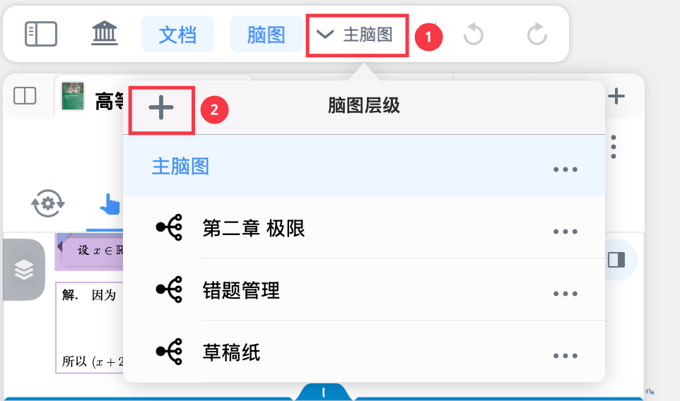

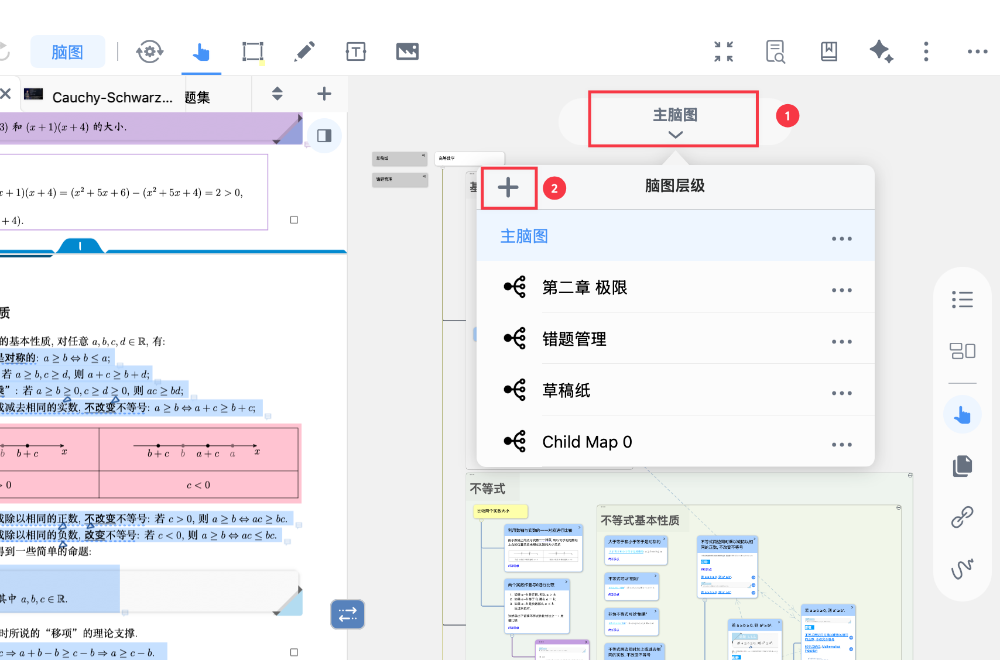

> 💡子脑图会自动命名为 `Child Map X`，添加在子脑图列表的底部。

## 1.2 将分支坍缩为子脑图（适合已有内容）

> 💡当主脑图某分支内容过大，或需要对某一主题深入展开时使用

在主脑图选中希望独立成章的卡片（及其子节点），点击`弹出菜单栏` → `高级` → `坍缩成子脑图`

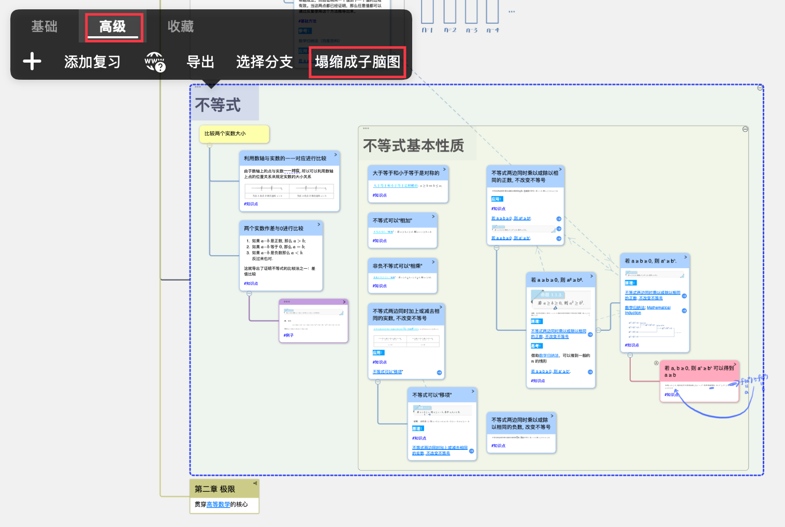

1. 原位置会留下`子脑图卡片`：颜色加深，右上角显示`子脑图`标识。

   

### 1.2.1 操作坍缩后的子脑图卡片

> 💡点击子脑图卡片，在`弹出菜单栏`里可选择`进入子脑图`和`展开`。

- `基础`- `进入子脑图`，直接进入该子脑图空间：

  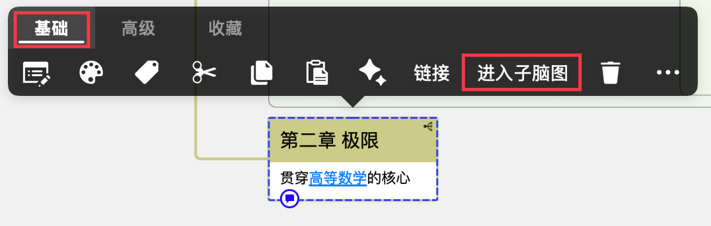

  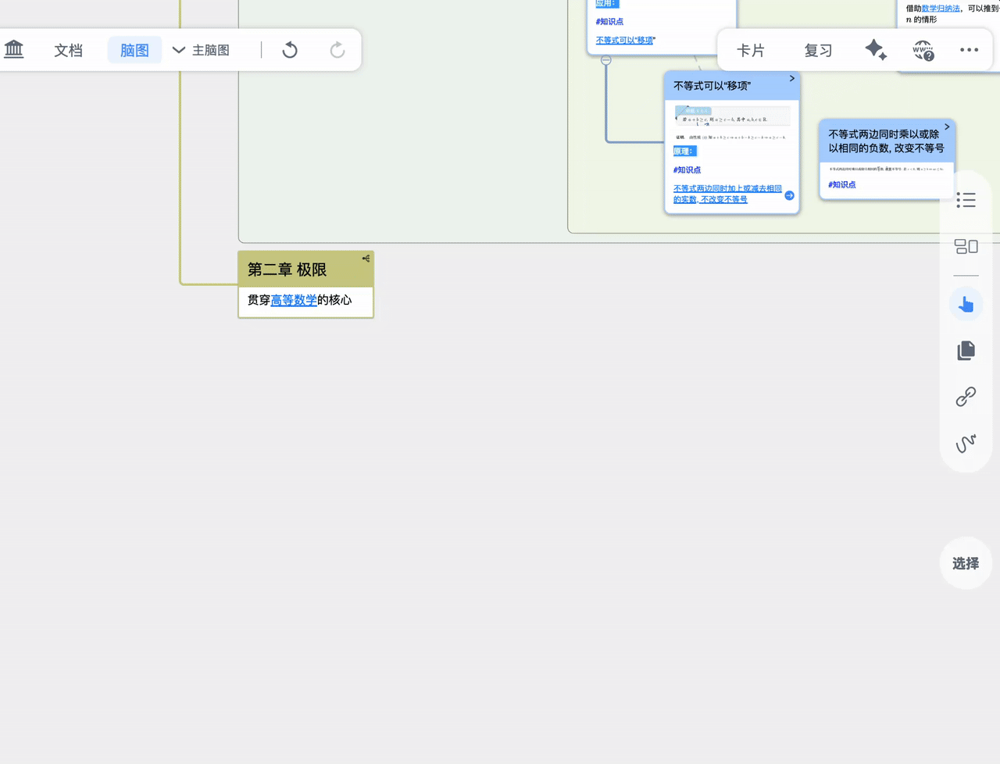
- `高级` - `展开`，展开已坍缩结构

  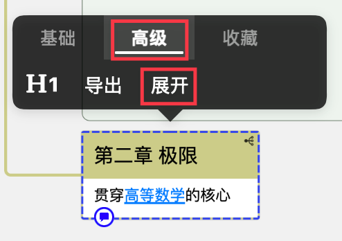

  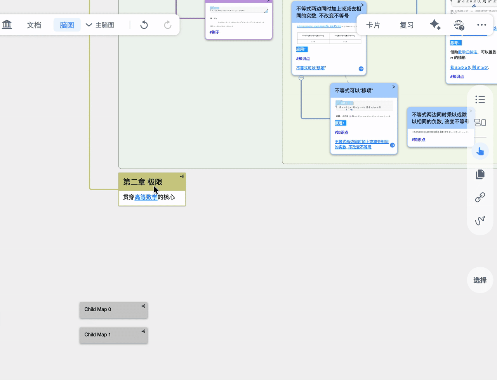

# 2 在子脑图之间切换

打开顶部`子脑图列表`，从列表中选择要进入的子脑图；可随时返回主脑图或切换到其他子脑图。

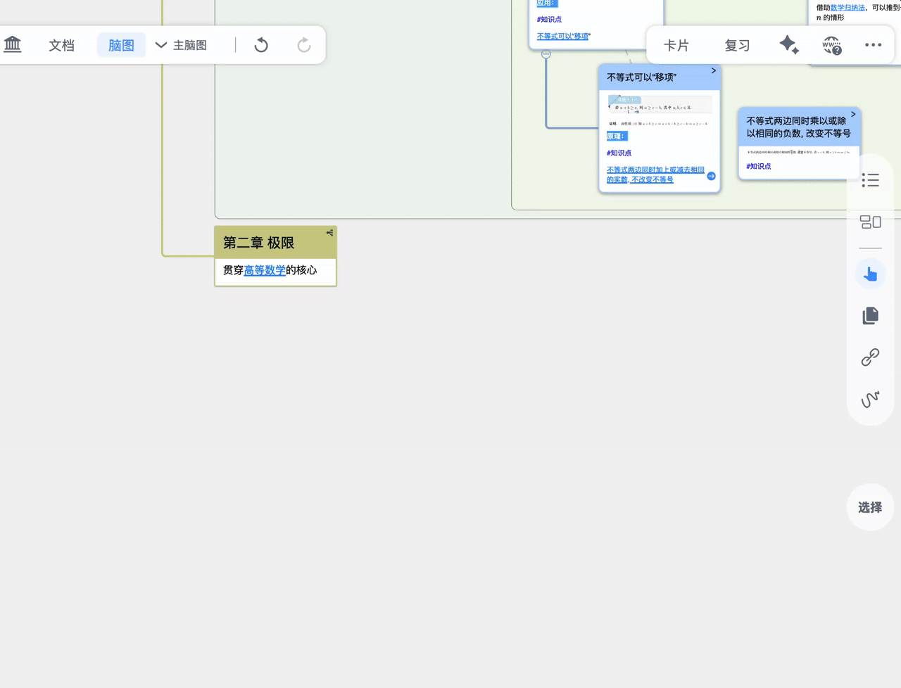

# 3 管理子脑图

1. 点击`脑图层级按钮`，展开`子脑图列表`，
2. 点击每个**子脑图右侧**的`...更多`按钮，可进行以下操作：
   1. 在浮动视图打开
   2. 调整顺序
   3. 重命名
   4. 恢复为分支
   5. 删除

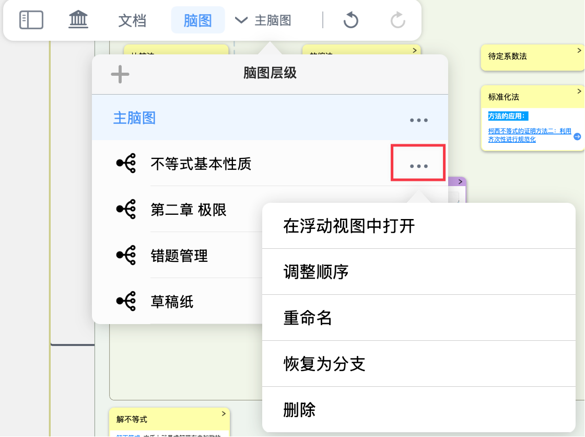

## 3.1 在浮动视图打开

此功能可以将子脑图悬浮于文档与主脑图之上，快速查看和编辑子脑图内容。

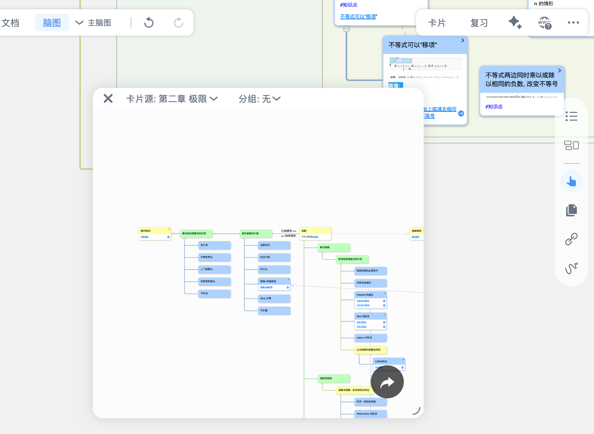

## 3.2 调整顺序

拖动调整脑图排列顺序。

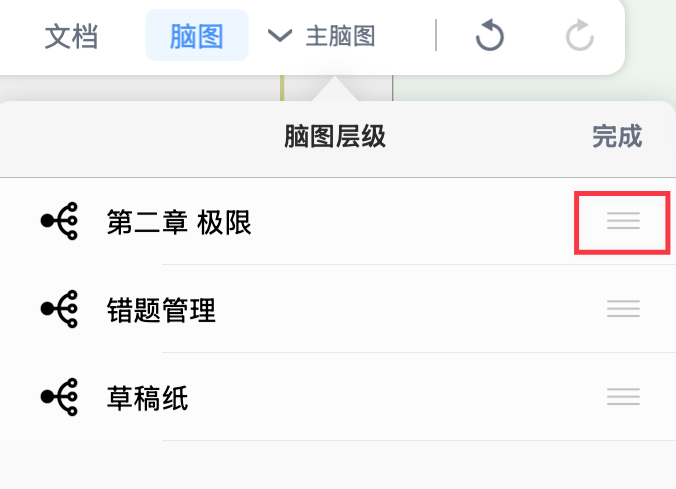

## 3.3 重命名

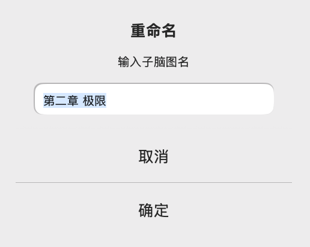

## 3.4 恢复为分支

可以将子脑图恢复为上/下级节点的分支形式。

## 3.5 删除

删除子脑图。

> ⚠️删除子脑图会连同其中的卡片一起删除。
