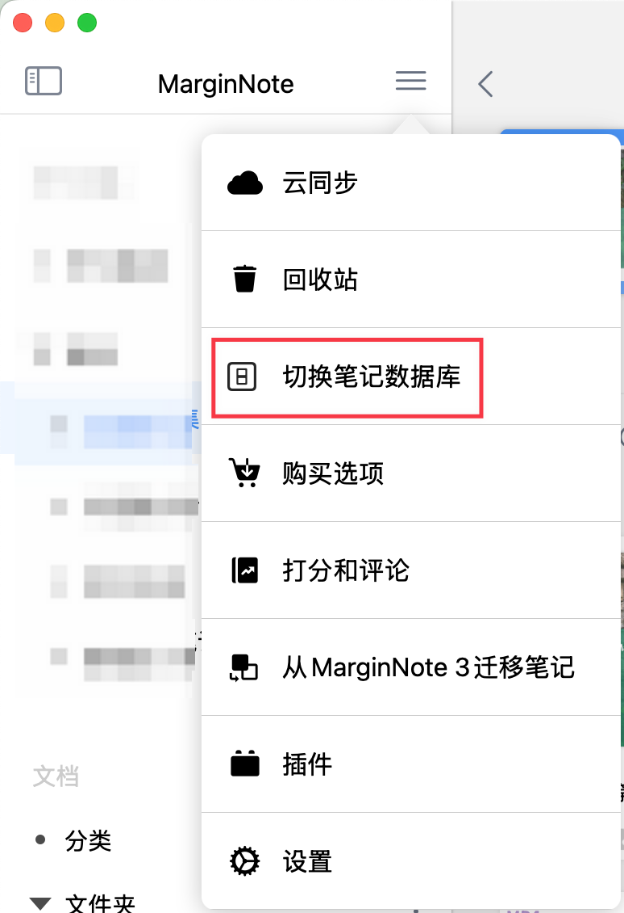
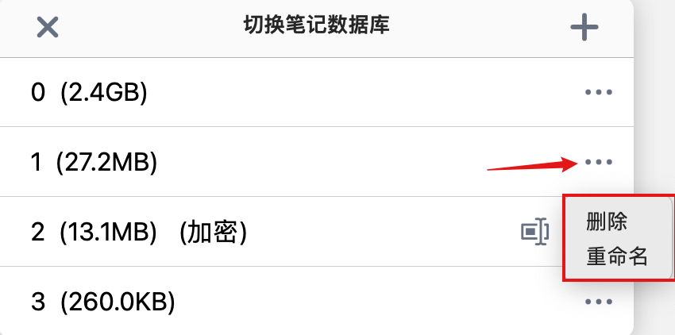
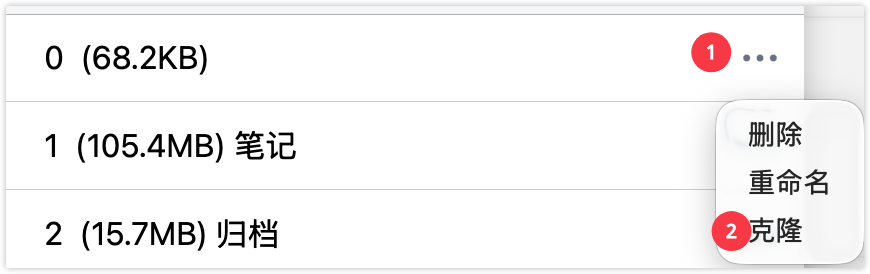

# 笔记数据库①：新建和管理数据库

> 💡**为什么需要笔记数据库？**
>
> 在使用 MarginNote 时，你可能会遇到这些场景：
>
> - 不同时期的学习笔记数据堆叠在一起（大一到大四，各科目考试）
> - 大量历史笔记占用存储空间，但暂时不需要浏览
> - 需要将笔记数据归档备份，或在多设备间同步
> - 想要在不同设备上使用不同的笔记集合
>
> 笔记数据库功能可以帮你灵活管理和隔离不同阶段的学习数据。

**笔记数据库系列导航**

本系列帮助你掌握 MN4 的笔记数据库功能。

① 新建和管理数据库（本页）

② 加密分享

**本页内容：**

1. 理解笔记数据库的核心概念
2. 创建新的笔记数据库
3. 在数据库之间切换
4. 管理数据库（重命名、删除）

# 1 理解笔记数据库

## 1.1 什么是笔记数据库

笔记数据库是 MarginNote 4 中用于隔离和管理笔记数据的容器。每个数据库：

- 拥有独立的学习集、脑图、复习卡片组
- 可以与其他数据库完全隔离（频道ID>10000,详见**频道 ID 的重要规则：**）
- 可以独立备份、导出、分享
- 可以设置是否与其他数据库共享文档库

> 💡**类比：** 笔记数据库就像不同的工作区，每个工作区存放不同阶段或类型的学习内容。
>
> 

## 1.2 核心概念：频道 ID

**什么是频道 ID？**

频道 ID 是笔记数据库的唯一标识符，是一个数字。创建数据库时需要输入频道 ID。

**频道 ID 的作用：**

- 区分不同的数据库
- 控制是否共享文档库
- 实现多设备同步

**频道 ID 的重要规则：**

| 频道 ID 范围 | 文档库                                                               |
| -------- | ----------------------------------------------------------------- |
| ≤ 10000  | 所有频道 ID ≤ 10000 的数据库共享同一个文档库（已添加的外部文件夹、本地文件夹及 iCloud 文件夹路径设置保持不变） |
| ＞10000   | 每个频道 ID > 10000 的数据库拥有独立的文档库                                      |

> 💡**什么是文档库隔离？**
>
> - **共享文档库**：多个数据库使用相同的 PDF/文档文件夹设置，添加的文档对所有数据库可见
> - **独立文档库**：每个数据库有独立的文档文件夹设置，互不影响

## 1.3 两种数据库类型

| 类型         | 特点                                | 适用场景                          |
| ---------- | --------------------------------- | ----------------------------- |
| **普通数据库**​ | - 可以自由分享 - 无需许可证 - 任何人获得数据库后都可以查看 | - 个人使用 - \&#x20;团队协作 - 公开分享笔记 |
| **加密数据库**​ | - 公私钥加密 - 需要许可证才能访问 - 可控制访问权限     | - 付费笔记分享 - 限制访问范围 - 保护知识产权    |

> 💡**如何选择？**
>
> - 个人使用或不需要控制访问权限 →**普通数据库**
> - 需要控制谁能访问笔记 →**加密数据库**

> ⚠️**注意：** 普通数据库和加密数据库的创建方法相同。关于加密数据库的使用，详见：笔记数据库②：加密分享

## 1.4 多设备同步规则

> ⚠️**重要：** 如果你需要在多台设备间同步笔记数据库，必须满足以下条件：
>
> **各设备使用的笔记数据库必须具有相同的频道 ID**

**示例：**

- Mac 端使用频道 ID 为`1` 的数据库
- iPad 端也必须使用频道 ID 为`1` 的数据库
- 才能实现两台设备的数据同步

如果设备使用不同的频道 ID，数据将无法同步。

# 2 新建笔记数据库

## 2.1 操作步骤

1. 在首页打开侧边栏，点击菜单按钮
2. 在弹出页面点击`切换笔记数据库`
3. 点击`➕`号按钮新建笔记数据库
4. 输入**频道ID**（数字）

## 2.2 如何设置频道 id

| 使用场景        | 推荐频道 ID   | 原因         |
| ----------- | --------- | ---------- |
| 日常主力数据库     | 1         | 简单易记       |
| 需要共享文档库的数据库 | 2-10000   | 与主数据库共享文档  |
| 需要完全隔离的数据库  | \\> 10000 | 独立文档库，互不干扰 |
| 多设备同步       | 各设备相同     | 必须相同才能同步   |

> 💡**示例场景：**
>
> **大学四年的学习**
>
> - 大一到大三：使用频道 ID`1`，共享文档库
> - 大四毕业论文：使用频道 ID`10001`，独立文档库，避免干扰

## 2.3 新建后的设置

创建新数据库后，建议：

1. **重命名数据库**：给数据库起一个有意义的名字（见 4.2）
2. **设置文档库**：添加你的 PDF 文件夹路径
3. **确认同步设置**：如果需要多设备同步，确保各设备使用相同的频道 ID

# 3 切换笔记数据库

> 💡**为什么需要切换数据库**
>
> 切换数据库可以：
>
> - 在不同阶段的学习内容之间切换
> - 将历史笔记归档，释放当前工作空间
> - 在不同项目或任务之间快速切换

**操作步骤**：

1. 在首页打开**侧边栏**，点击**菜单按钮**
2. 在弹出页面点击`切换笔记数据库`
3. 选择你需要切换的数据库
4. 点击确认，**重启应用**即可完成切换

# 4 数据库管理

## 4.1 切换笔记数据库

1. 在首页打开侧边栏，点击菜单按钮
2. 在弹出页面点击`切换笔记数据库`

## 4.2 重命名、删除数据库

> 💡**删除数据库操作不可逆❗❗❗❗❗不明白需求的情况下，不要轻易删除数据库❗❗❗❗**
>
> **删除前请务必：**
>
> 1. 确认你真的不需要这个数据库的任何内容
> 2. 如有需要，先进行数据备份
> 3. 仔细核对数据库名称和频道 ID

点击右侧`...`按钮，在弹出的页面即可对数据库进行`重命名`以及`删除`操作。

## 4.3 克隆数据库

> 💡普通数据库还支持克隆操作，相比于数据手动备份可以更方便的完成笔记版本控制
> ⚠️前提条件：必须是普通数据库，加密数据库不支持备份

点击右侧`...`按钮，在弹出的页面即可对数据库进行`克隆`操作。

# 5  常见问题

**Q1：频道 ID 可以修改吗？**

A：不可以。频道 ID 一旦创建就无法修改。如果需要使用不同的频道 ID，只能创建新的数据库。

**Q2：如何找回忘记的频道 ID？**

A：目前不支持一键显示所有使用过的频道ID，因此建议频道ID按顺序创建，比如1、2、3...10001、10002...

**Q3：可以同时使用多个数据库吗？**

A：不可以。在同一台设备上，同一时间只能使用一个数据库。但你可以随时切换。

**Q4：删除数据库后可以恢复吗？**

A：不可以。删除操作是不可逆的。建议删除前先导出备份。

**Q5：频道 ID 1 和 10001 可以共享文档库吗？**

A：不可以。频道 ID ≤ 10000 的数据库共享一个文档库，频道 ID > 10000 的数据库拥有独立文档库。

**Q6：多台设备使用不同频道 ID 会怎样？**

A：数据将无法同步。必须使用相同的频道 ID 才能实现多设备同步。

**Q7：新建数据库是空的吗？**

A：是的。新建的数据库是空的，你需要创建学习集、导入文档、制作笔记。

**Q8：切换数据库需要重启应用吗？**

A：是的。切换数据库后需要重启 MarginNote 应用才能生效。
