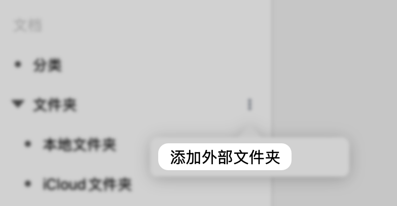

# 添加USB存储文档库

> 💡**MarginNote 4支持直接添加外部源目录**（如U盘或移动硬盘中的网课视频、文献PDF等），无需导入即可添加入学习集，在对应笔记本上记笔记、做卡片，保持原有文件结构的同时高效学习。

> 💡使用`USB储存文档库`的优势在于：
>
> - 不需要单独导入每一个文件，可以一次性添加整个文件夹，节省时间。
> - 可以直接在PDF等文件上做笔记和制作卡片，而不需要复制或重复存储PDF文件。
> - 保持了资料的原始组织结构，便于管理和查找。

# 1 添加USB储存文档库（适用于Mac & iPad ）

USB储存文档库可以分为**本地的大型文件夹**，以及**U盘/移动硬盘等外部储存设备中的文件夹**。两者添加方式和逻辑相同，此处以外部储存设备U盘为例。

1. 插入需要添加的USB设备（U盘、移动硬盘等）
2. 依此文件夹右侧三点- **`添加外部文件夹`**
3. 选择需要添加的文件夹，点击\*\*`打开`\*\*完成添加
4. 文档带有此图标表示为`外挂文件`

   [外挂文件](https://www.wolai.com/qAmqGB2jPfaNxBbRiemF46 "外挂文件")

[1761180405761.mp4](video/1761180405761_vAj7dKdGO0.mp4 "添加USB储存文档库")

# 2 移除USB储存文档库

[断开连接](https://www.wolai.com/rNTPeofayUi5jQwsi3zv7a "断开连接")

依次点击USB储存文档库右侧三点-`断开连接`，即可移除USB储存文档库

[ScreenRecording\_10-23-2025 08-53-08\_1.MP4](<video/ScreenRecording_10-23-2025 08-53-08_1_qnZIfF93N2.MP4> "移除USB储存文档库")

# 3 注意事项

> 💡1. **USB储存库文件**，在移除外挂储存设备后会断开连接。在重新插入移动储存设备后，断开连接的文件会自动链接。

> 💡2. **同一文件夹**不允许重复添加。

> 💡3.支持在MarginNote 4内修改文件名
>
> 注意：该操作将**同步修改源文档文件名**。

